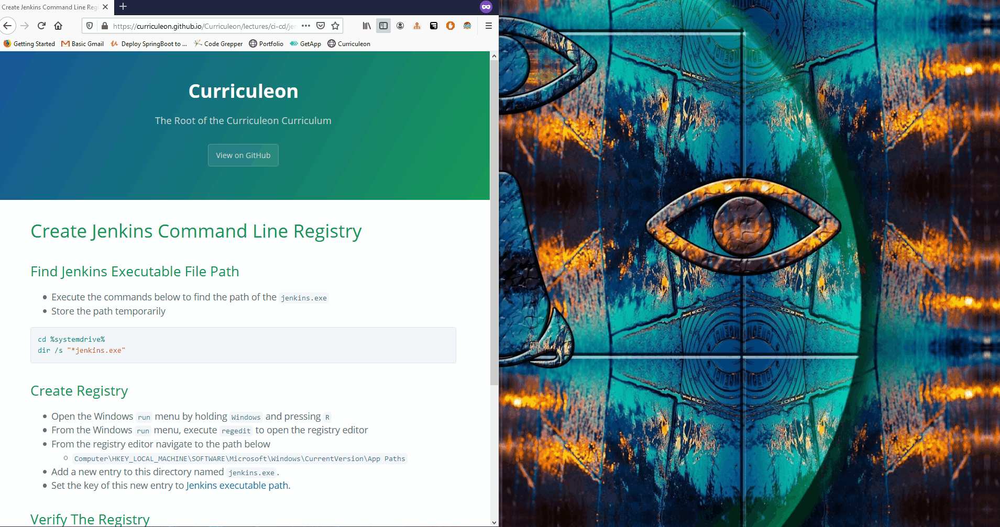
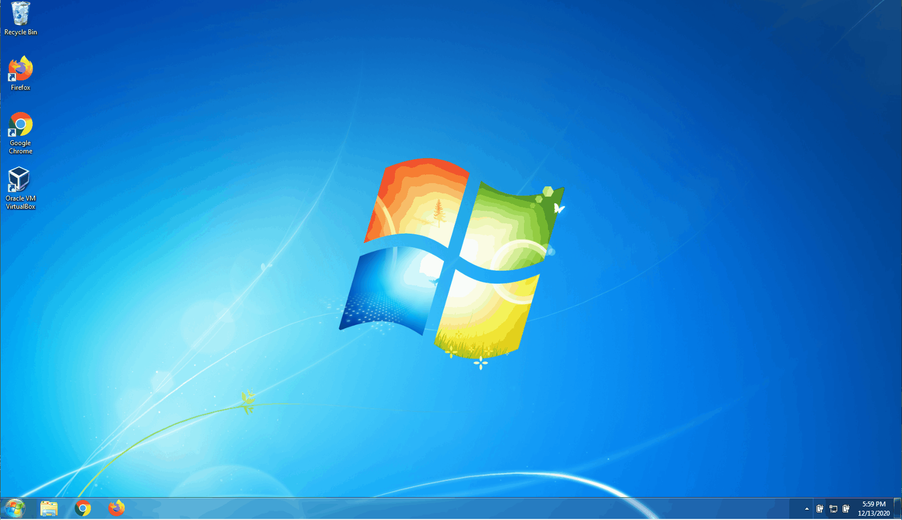
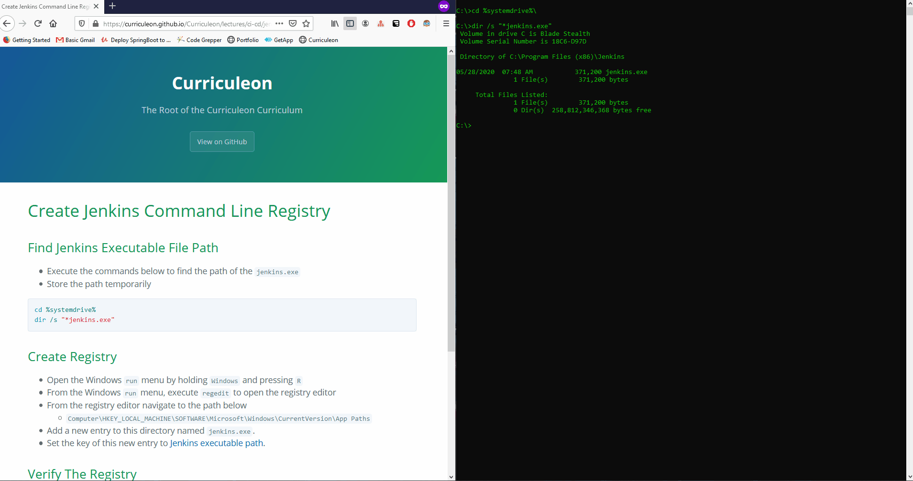

# Create Jenkins Command Line Registry

## Find Jenkins Executable File Path
* Execute the commands below to find the path of the `jenkins.exe`
* Store the path temporarily

```bat
cd %systemdrive%\
dir /s /b "*jenkins.exe"
```

[](./find-jenkins-executable.gif)


## Set Environment Variables

* Set the environment variable for this executable path by executing the command below from a command prompt.
    * `SETX JENKINS_HOME "C:\Program Files (x86)\Jenkins"`
        * to create jenkins home-path
    * `SETX JENKINS "%JENKINS_HOME%\jenkins.exe"`
        * to create jenkins path
    * `SETX /M PATH "%PATH%;%jenkins%"`
        * to add jenkins to path
    * `refreshenv`
        * to Update SessionEnvironment


[](./set-environment-variable.gif)


## Create Registry
* Open the Windows `run` menu by holding `Windows` and pressing `R`
* From the Windows `run` menu, execute `regedit` to open the registry editor
* From the registry editor navigate to the path below
    * `Computer\HKEY_LOCAL_MACHINE\SOFTWARE\Microsoft\Windows\CurrentVersion\App Paths`
* Add a new entry to this directory named `jenkins.exe`.
* Set the key of this new entry to [Jenkins executable path](#find-jenkins-executable-file-path).
    * `C:/Program Files (x86)/Jenkins/jenkins.exe`

[](./create-registry.gif)


## Verify The Registry
* From an Administrative Powershell execute the commands below:
    * `start jenkins start`
        * to start the Jenkins server
    * `start jenkins restart`
        * to restart the Jenkins server
    * `start jenkins stop`
        * to stop the Jenkins server

[](./verify-jenkins-registry.gif)