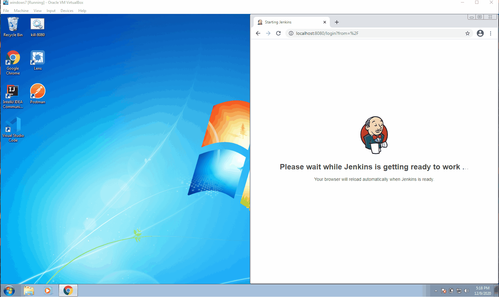

# Disabling Security Use
* _Ensure that you have created the_ [`jenkins command line registry and environment variable`](../create-commandline-registry) _prior to attempting the demonstration below_

## Overview
* To ensure that you are no longer prompted for `username` and `password` upon starting the jenkins service, follow the instructions below

### Modify `config.xml`
* Navigate to `%jenkins_home%\config.xml` to modify the file's `useSecurity` tag-value to `false`.

### Stop Service
* Stop the Jenkins service by executing `jenkins stop`

### Start Service & Verify Change
* Start the Jenkins service by executing `jenkins start` to verify the service no longer prompts for login information

