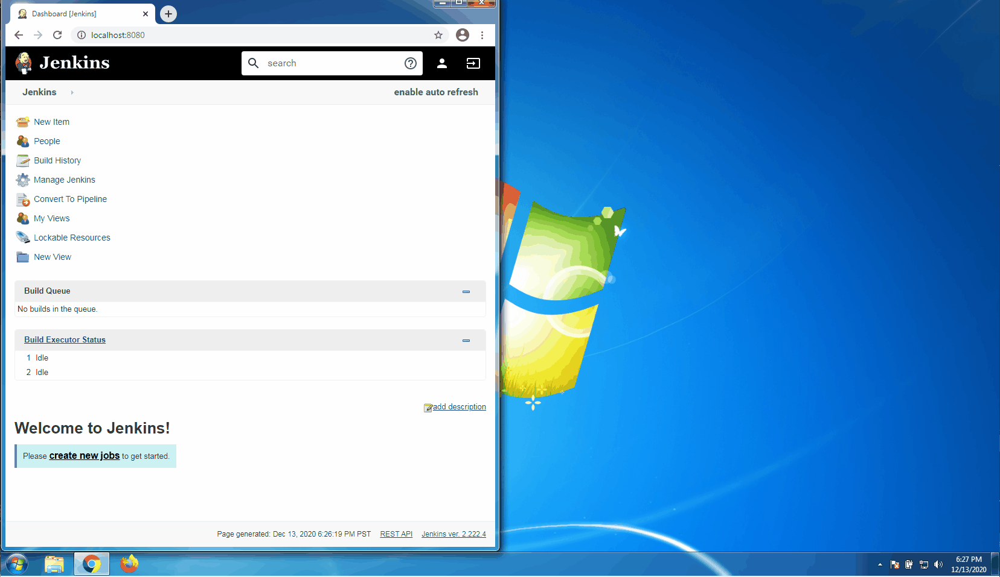

# Pipeline Maven Plugin
* The [Pipeline Maven Plugin](https://plugins.jenkins.io/pipeline-maven/) provides an advanced set of features for using Apache Maven in Jenkins Pipelines.
* The `withMaven` step configures a maven environment to use within a pipeline job by calling `sh "mvn ...​"` or `bat "mvn ..."`​.
* The selected maven installation is configured and prepended to the path.

