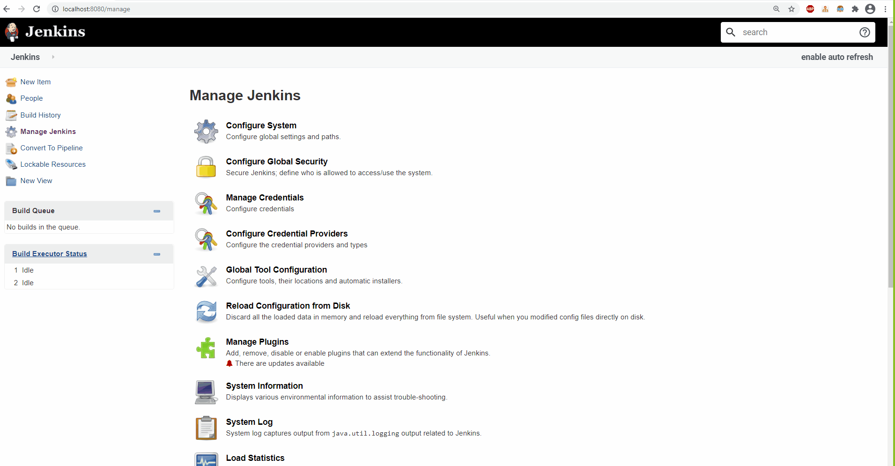

# Convert Jenkins Job to Pipeline
* The purpose of converting a Job to a Pipeline is to auto-generate a respective `Jenkinsfile` to be uploaded into source control to enforce IaC (infrastructure as a code) methodology

