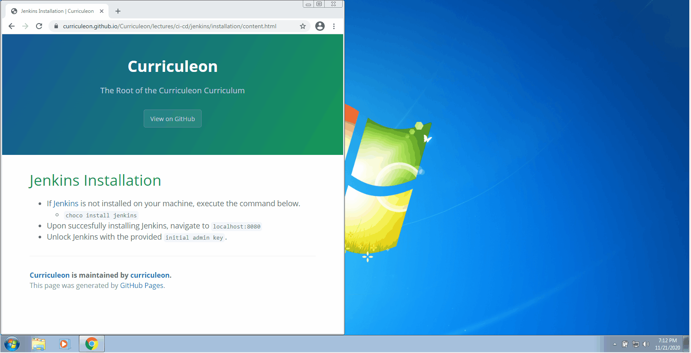
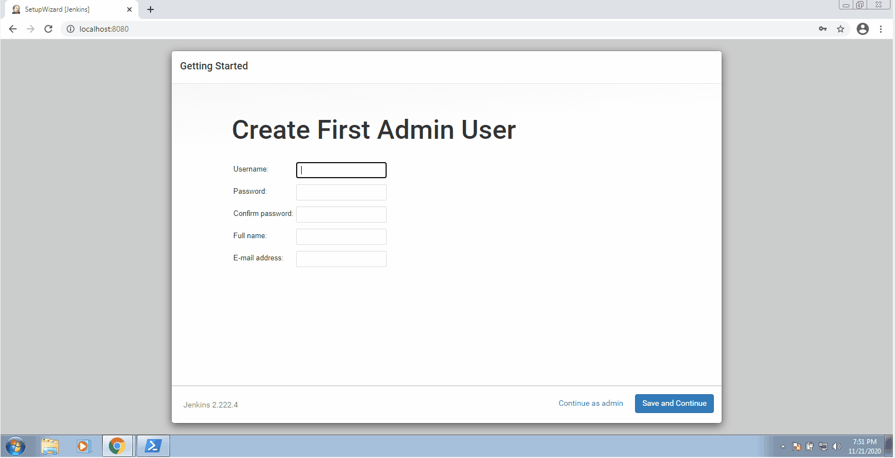

# Jenkins Installation

## Linux OS
* Execute the commands below to install Jenkins
    * `wget -q -O - https://pkg.jenkins.io/debian-stable/jenkins.io.key | sudo apt-key add -`
        * adds the repository key to the system
        * When the key is added, the system will return OK.
    * `sudo sh -c 'echo deb http://pkg.jenkins-ci.org/debian-stable binary/ > /etc/apt/sources.list.d/jenkins.list'`
        * appends the Debian package repository address to the server’s sources.list
    * `sudo apt update`
    * `sudo apt install jenkins`

## Mac OS
* Execute the command below to install Jenkins
    * `brew install jenkins`

## Windows

### Install Via Chocolatey
* If [Jenkins](https://www.jenkins.io/download/) is not installed on your machine, execute the command below.
    * `choco install jenkins`
* Upon succesfully installing Jenkins, navigate to `localhost:8080`
* Unlock Jenkins with the provided `initial admin key`.

