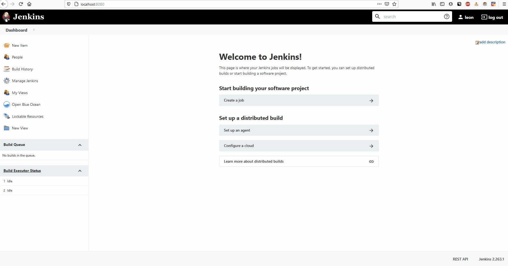
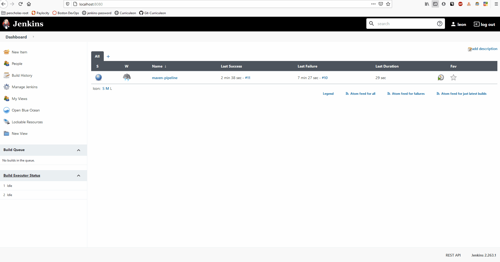

# Creating Docker, Git, Maven, Java Pipeline<br>From within Dockerized Jenkins 


### PreRequisite Software
* [Dockerized Jenkins](https://curriculeon.github.io/Curriculeon/lectures/containerization/docker/dockerizing-jenkins/content.html)


### Create Pipeline
* Select `New Item`
* Enter name of item.
* Select `Pipeline`
    * Click `OK`
* From the `Configuration` window, select the `Pipeline` tab and paste the `Jenkinsfile` below into the textbox.

```
pipeline {
    agent {
        docker {
            image 'jamesdbloom/docker-java8-maven:latest' 
            args '-v /root/.m2:/root/.m2' 
        }
    }
    stages {
        stage('Set Up') {
            steps {
                script {
                    sh 'rm -rf maven.java-fundamentals'
                }
            }
        }
        stage('SCM Checkout') {
            steps {
                sh 'git clone https://github.com/curriculeon-student/maven.java-fundamentals $PWD/maven.java-fundamentals'
            }
        }
        stage('Compile-Package-Test') {
            steps {
                script {
                    dir('$PWD/maven.java-fundamentals') {
                        sh "mvn package -Dmaven.test.failure.ignore=true"
                    }
                }
            }
        }
    }
}
```


[](./jenkins-create-maven-pipeline.gif)


### Build Pipeline

[](./jenkins-build-maven-pipeline.gif)


<!-- https://www.youtube.com/watch?v=pts8zdHel5E -->