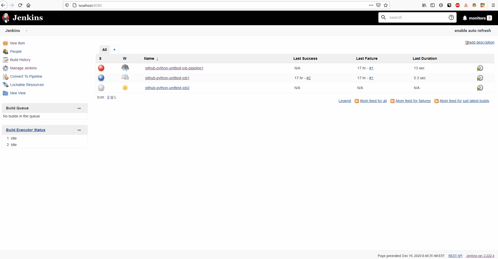
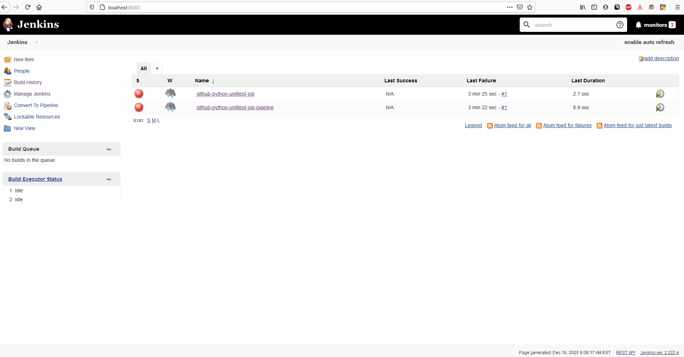
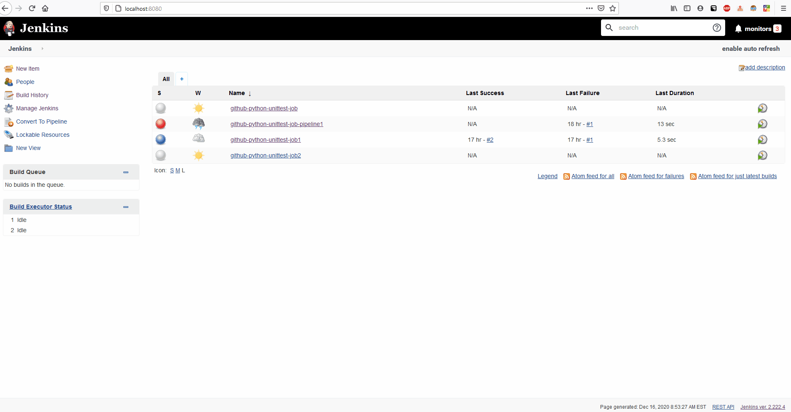
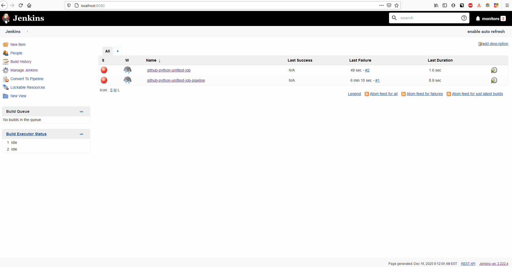

# My First Jenkins Python Unittest Pipeline

## Overview
1. Start Jenkins Server
2. Create new Jenkins Job
3. Run Job and View Build Output
4. Convert Job to Pipeline
5. Run Pipeline and View Build Output

## Part 1 - Start Jenkins Server
* Execute the commands below to start the Jenkins server

```
start chrome http://localhost:8080/
start jenkins start
```

[](./start-jenkins-server.gif)


## Part 2 - Create New Job
* Name project
* Select `Freestyle Project`

#### Source Control Management
* From the source control management section, select `Git`
* Paste the URL to your **your repository**
* Set the `Branches to build` field to have the following value:
    * `*/master`


#### Build
* From the `Build` section, select `add build step`
* In the `command` field, enter the text below to ensure python runs all the unittests in the project upon building.
    * `python -m unittest discover -s ./src/test/ -p '*_test.py'`


[](../my-first-python-job/jenkins-github-python-unittest-job.gif)


## Part 3 - Build Job and View Output

[](../my-first-python-job/jenkins-github-python-unittest-job-build.gif)


## Part 4 - Convert Job To Pipeline

[](./jenkins-github-python-unittest-job-pipeline.gif)


## Part 5 - Build Pipeline and View Output

[](./jenkins-github-python-unittest-job-pipeline-build.gif)