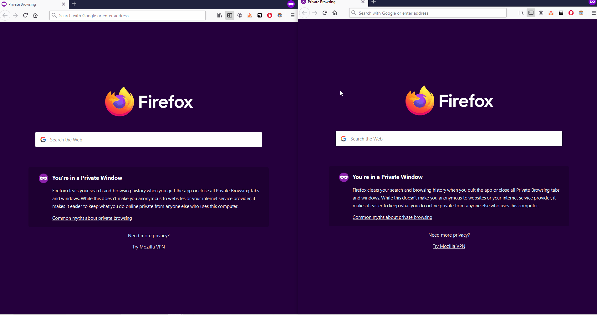
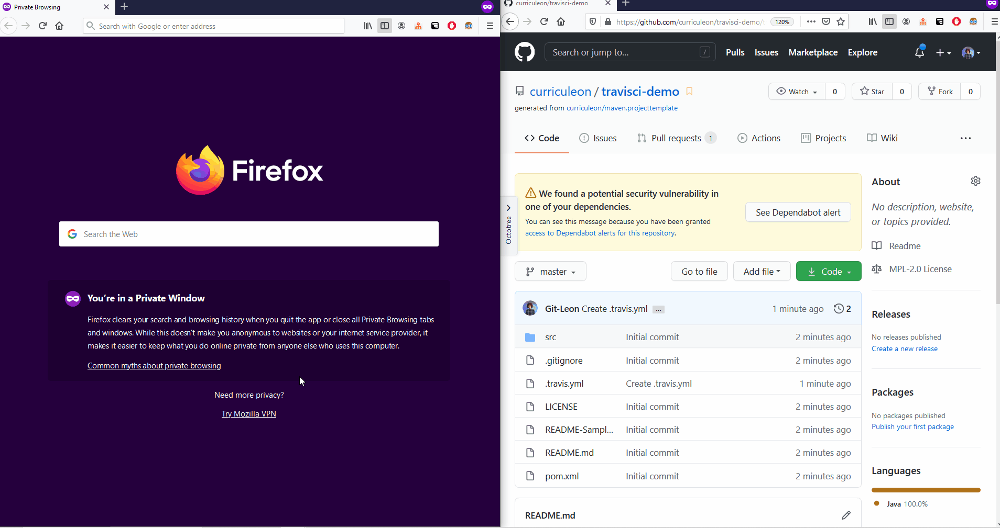
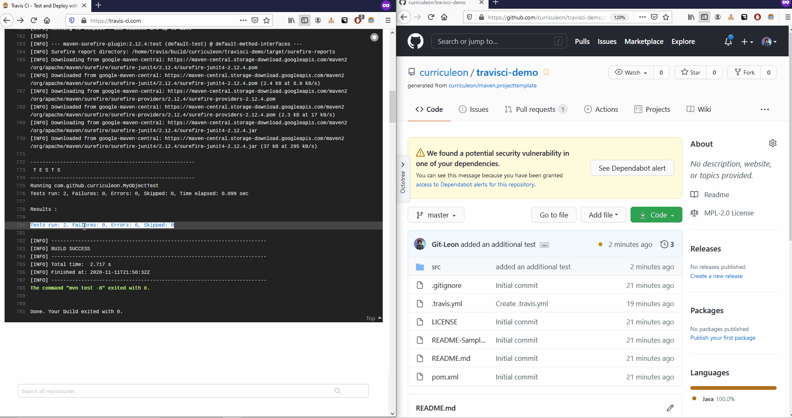

# Continuous Integration with TravisCI.com

## Overview
* How to Create TravisCI Pipeline
* How to View Build Output
* How to Trigger Build with Push

### How to Create TravisCI Pipeline
* Begin by creating a github repository with at least 1 Unit test.
    * In the animation below, we begin with a Maven project using `JUnit4.12`.
    * The project template can be found [here](https://github.com/curriculeon/maven.projecttemplate/).
* After creating the project, create a `.travis.yml` file at the root.
* Modify the `.travis.yml` file to reflect the application-language.
    * In the animation below, we modify the `.travis.yml` by adding `language: java` to line 1.

### How to view Build Output
* Navigate to `travisci.com` and sign in with `Github`.
* The most recent build output should display on the landing page.

* This behavior should be enabled by default.
* However, if the build fails to trigger, ensure you have made the repository active by
    * clicking `Settings` at the top right,
    * searching the repository by name,
    * clicking the toggle bar to make the repository active

### How to Trigger Build with Push
* By default, an active repository on TravisCI will trigger a build upon a `push` to the respective repository.
* In the animation below, we
    * `clone` the _remote_ repository to our _local_ machine
    * create an additional unit test
    * `push` the _local_ changes to our _remote_ repository
    * view the build output from `travisci.com`.

