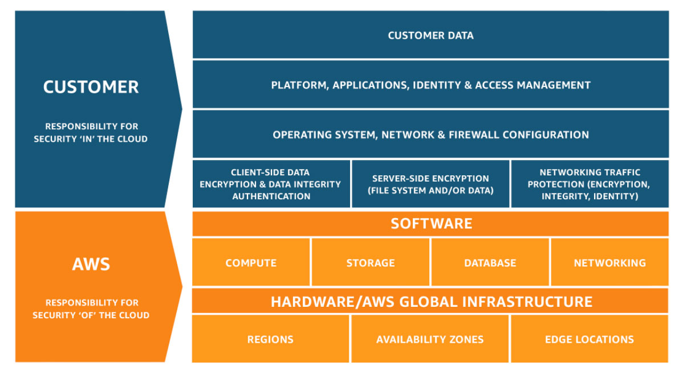

# Part 1 - Tour of AWS Console AWS Services

## Notable features:
* Region Selector
* Services Button
* Search Bar

## AWS Acceptable Use Policy
* No Illegal, Harmful, or Offensive Use or Content
* No Security Violations
* No Network Abuse
* No E-Mail or Other Message Abuse

## Other Notes

* This diagram depicts the roles and responsibilites of each party with respect to the AWS platform.
    * The blue is customer responsibility
    * The orange is aws responsibility

## Quizzes
1. [quiz](../quizzes/1_quiz.html)