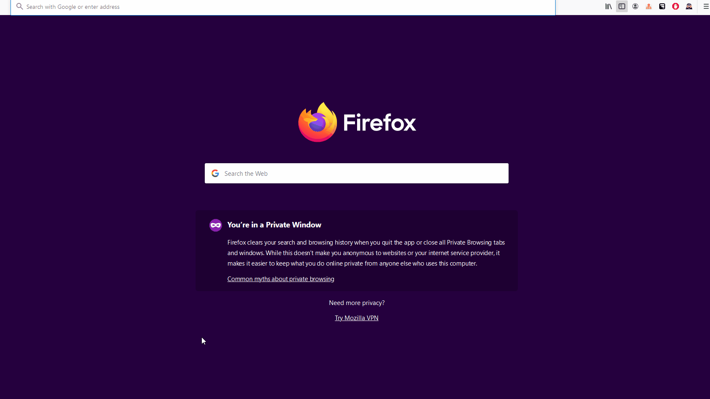

# Amazon Web Services
## Create a Lightsail Instance

* In just a few steps we 
    1. Navigate to `lightsail.aws.amazon.com`
    2. create the virtual machine instance (an image)
    3. Wait for image to be available
    4. connect to image
    5. wait for image to boot up to desktop.
    6. close the image
    7. stop the image