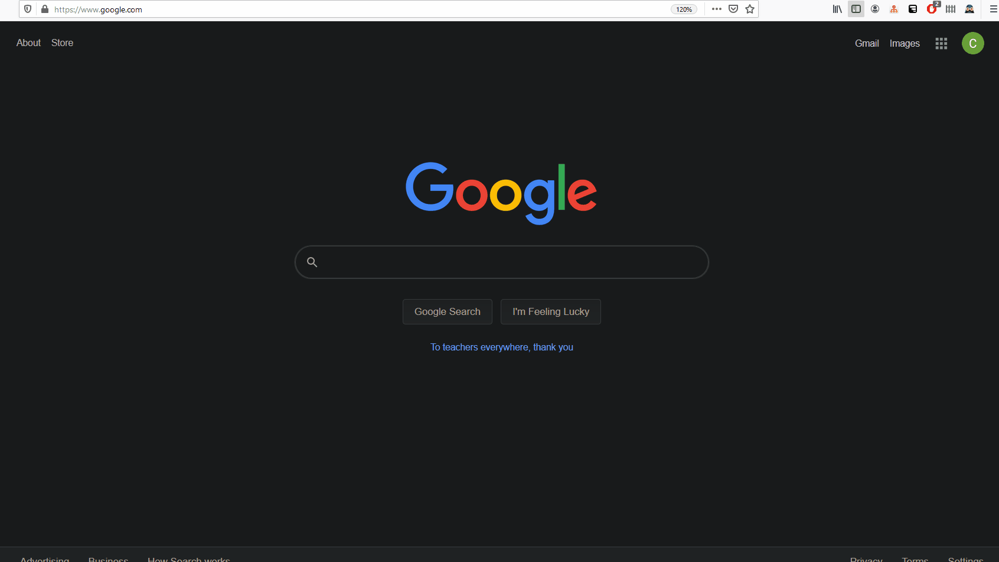
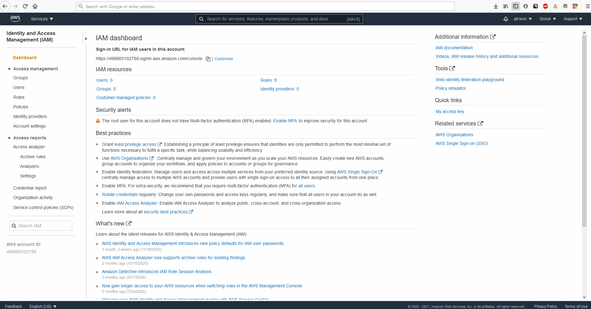
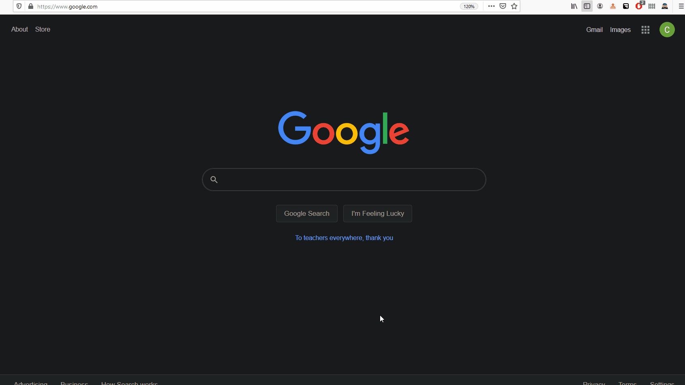

# Deploying Spring Boot to AWS Elastic BeanStalk
## Overview
1. Create Spring Boot Jar
2. Create IAM User
3. As IAM User, Upload SpringBoot jar to EBS Environment

### Create SpringBoot Jar

### Create IAM User
* Click [here](./../../iam/creating-user/content.md) to view the full article on creating IAM Users

## Upload SpringBoot jar to EBS Environment
