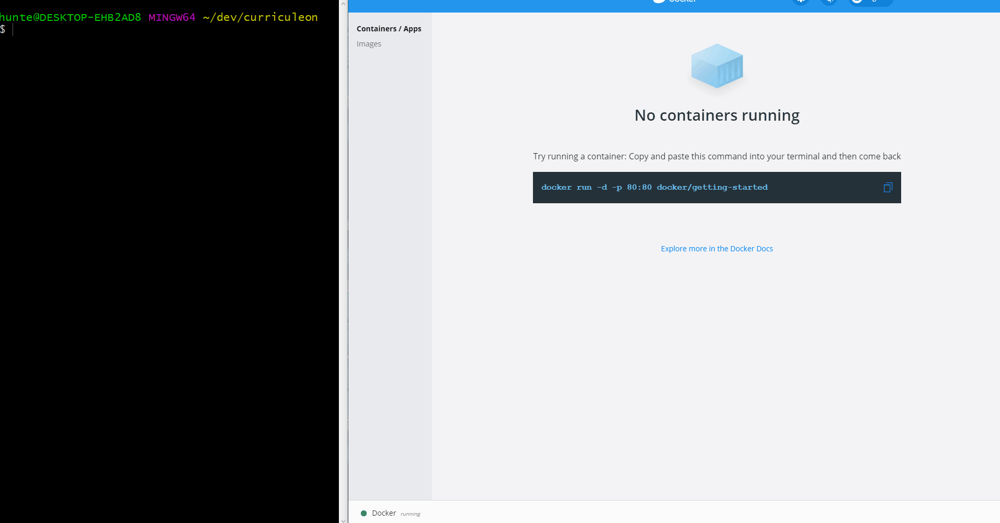
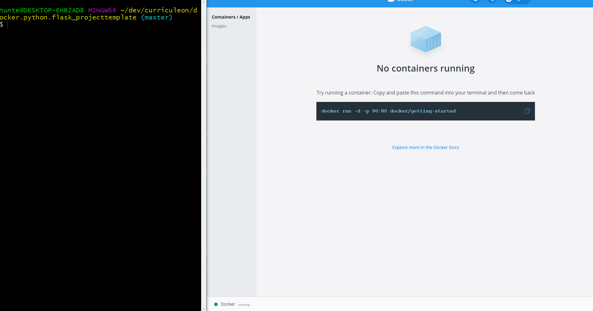

# AWS ECS Deploy Containerized Flask Application
* _Click [here](./troubleshooting.md) to view troubleshooting for document_

# Overview
1. Create an AWS Account
2. [Install and Configure AWS CLI](../../cli-installation/content.md)
3. [Install Docker](https://curriculeon.github.io/Curriculeon/lectures/containerization/docker/installation/content.html)
4. Create or [clone flask application](https://github.com/curriculeon/docker.python.flask_projecttemplate) with a `Dockerfile`
5. Create Docker Image from `Dockerfile`
6. Run and View Docker Image Locally
7. Create Repository in ECS Registry

## Create Docker Image from `Dockerfile`
* Execute the command below from the root directory of the newly created project `Dockerfile`
   * `docker build -t my-flask-app .`

## Run Docker Image
* Execute the command below from the root directory of the project
   * `docker run -p 80:80 my-flask-app`
* View the application by navigating the to the link below
   * [`http//localhost:8080/`](http//localhost:80/)

## Create Repository in Elastic Container Registry
Execute the command below to create a repository in the elastic container registry
* `aws ecr create-repository --repository-name my-flask-application-01.06.2021`

## Authenticate with newly created ECR repo
* Execute the command below to print a command used to log into the newly created ECR repository.
   * `aws ecr get-login --region us-east-1 --no-include-email`
* Copy the output of that command.
* Paste and run the output in the terminal.
* This will actually authenticate you with the ECR so you can push your Docker image into it.

## Push to newly authenticated repo
* Execute the commands below to `tag` and `push` the image to the AWS ECR (_where_ `ACCT_ID` _is your own AWS account ID_)
   * Execute command below to tag image
      * `docker tag my-flask-app:latest ACCT_ID.dkr.ecr.us-east-1.amazonaws.com/` 
   * Execute command below to push image up to AWS ECR
      * `docker push ACCT_ID.dkr.ecr.us-east-1.amazonaws.com/hello-world`