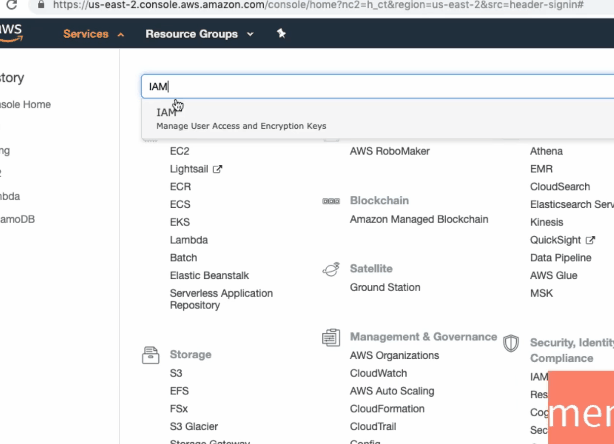

<!-- https://www.udemy.com/course/deploy-java-spring-boot-to-aws-amazon-web-service/learn/lecture/15443692#overview -->

# Amazon Web Services
## Identity and Access Management User

* In the previous step we created our AWS account.
* In this step let's make our AWS account more secure.
* Let's learn about something called IAM, and let's learn how to create an IAM user, and how to use an IAM user for all our AWS activities.

### Root User
* When I first created our AWS account, the email ID and the password we used to create is what is called the root user.
* The root user can be used both for the console access, as well as programmatic access to the application.

### Root User Abilities
* The root user has complete access to everything within your AWS account.
* He can even close you AWS account, so it is strongly recommended not to used the root user for your day to day activities.
* Even for the administrative activities it is better to create a different set of users called the IAM users - identity and access management users.

### Root User Best Practices
* So the only thing you should be doing with your root user is to first create an IAM user, and lock down the credentials somewhere secure.
* Let's learn how to create a IAM user next.
* Let's get started now.

### AWS Goals
* I'm already logged in into the AWS console.
* How do we get into the AWS console?
    * You can go to `console.aws.amazon.com` and sign into console.
* Since I'm already logged in, it directly takes me into the account.
* Lets go to services and type in IAM.
* On typing IAM, you'd see that it says
    * IAM and manage user access and encryption keys.
* I click this go down, IAM.

### IAM User
* IAM is used to create the AWS users, assign them to groups and also assign what permissions they have.
* In AWS, if I want to assign a permission to a specific user, there are two ways I can do that.
* One is directly assign a policy to him.
	* directly assign a permission to him.
* The other way is to create a group, assign the permissions to a group
    * assign the policy to a group
    * and make the user a part of that group.

### Create group and Assign User
* What we do now is take the second approach.
* We will create a group and will assign a user to that specific group.
* So let's get started.
* Let's start with creating a new group.
* I call this developers .
	* I create a group called developers.

### Developer Access
* Next step.
* I now need to give these developers access.
* So what can these developers do.
* How can I do that? in AWS, We have to attach policies.

### Policies
* There are a number of predefined policies which are present in here.
* These are called managed policies, and these are managed by AWS.
* For now I'll give all developers administrator access.
* You can also give them access to billing.
* You can for example AWSLambda is one of these services so you can give full access to it AWSLambda.
* What I'll do is I'll take a shortcut for now, and I'll just give administrator access, so they get access to everything.

### Groups
* Now I'll say next step and now I can create the group.
* We have a group.
* Now I would want to actually go back, so dashboard.

### Users
* We have a group.
* What you would need to do now? We need to create a user.
* How do we create a user?
* For our AWS account, I'll do `add user` on the screen.
* You can enter the ID you'd want for that specific user.
* I'll say `in28minutes_dev`.
* As you can see here, you can create multiple users at the same time with similar kind of access.
* But let's stick with one user for now.

### AWS access type
* Next thing you can select is the AWS access type.
* Now what is access type?
    * Typically whenever we talk about performing actions, there are two type of users.
* One is people who want to actually log in, use the UI and perform actions.
* The other kind of users might be programs.
* So you want to write a program to create some resource in AWS.

* So that's why, There are two kinds of accesses which represent programmatic access and AWS management Console access.
* What we are doing now is using the AWS management console access.
* We use the AWS root account, log in, and we are manually going through the screens and doing all the action.
* So what I'm doing is I'm giving AWS management console access to this user.
* So this user would be able to log in with his user ID and password, and do exactly what we are doing in here.
* So he'll be able log into console and perform all the actions.

### Programmatic Access
* I'll also provide programmatic access to this user.
* What does programmatic access allow?
* For example if you have a command line tool AWS CLI.
	* AWS CLI is a command line tool that you can run command and do things with AWS.
* And when you want to use AWS CLI, you would want to use programmatic access, and there - this kind of access type will be really useful.

* We'll talk about programmatic access a little later.
* For now, the important thing is the fact that we are giving this user both types of access.
* So you can use this user credentials for logging into AWS management console, as well as through a programmatic means.

* And let's use custom passwords.
* I would want to assign a specific password.
* You can also use auto generated password.
* But let's go with custom, and what we can also do is to have the user create a new password, when he tries to sign in.
    * For me, that's not important so I uncheck that, And let's click next.

### Groups
* The next thing is to assign a group, so I'll assign a group of developers for this specific user.
* You can assign multiple groups here.
* We have only one group so let's assign just that.
* Let's not worry about tags for now.
* Let's go to the review screen where we can see the fact that we had created a user called `in28minutes_dev`
    * that we are providing him programmatic and AWS management control access
    * we are assigning him to a group of developers
    * let's go out and create user.

* So what you would see now is a success screen, so you'd see that we have created a user successfully.
* Now I would want to log in with this specific user credentials.
* Can I go to aws.amazon.com and use that URL to sign in, with a IAM user credentials which we created just now?
    * The answer is No.

* The important thing you need to remember is from now on, to log in into your account into your AWS account as an IAM user, you need to use this URL.
* So have taken this URL, copy it, I'll log out .
	* so I'm signing out of my account and I'm pasting the URL which we have copied.
* So let's paste that in.

* I would go ahead and enter my user ID and password and sign in.
* Right now, you'd see that we are again logged in to our AWS management console.

* In this step we created a IAM user, and we logged in with the IAM user credentials, and from now on will be using IAM user for performing all our activities with our AWS account.