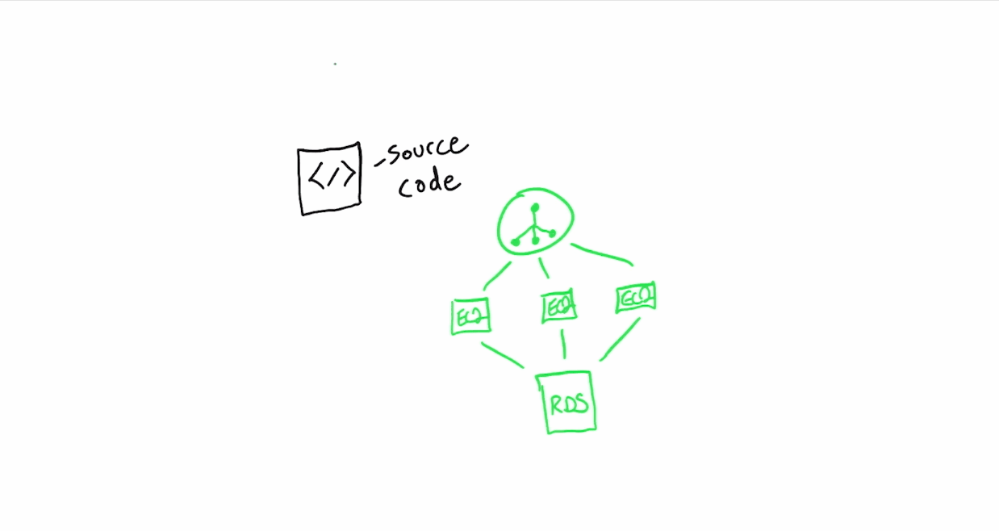
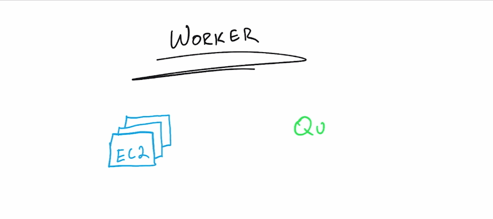
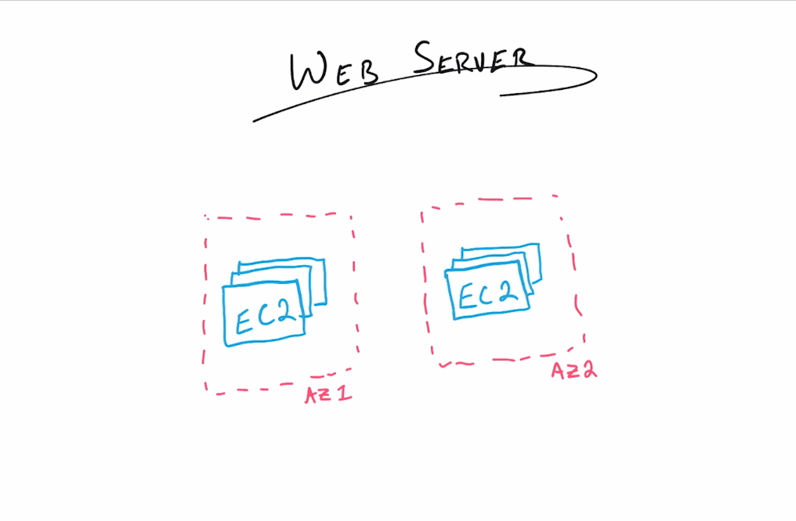
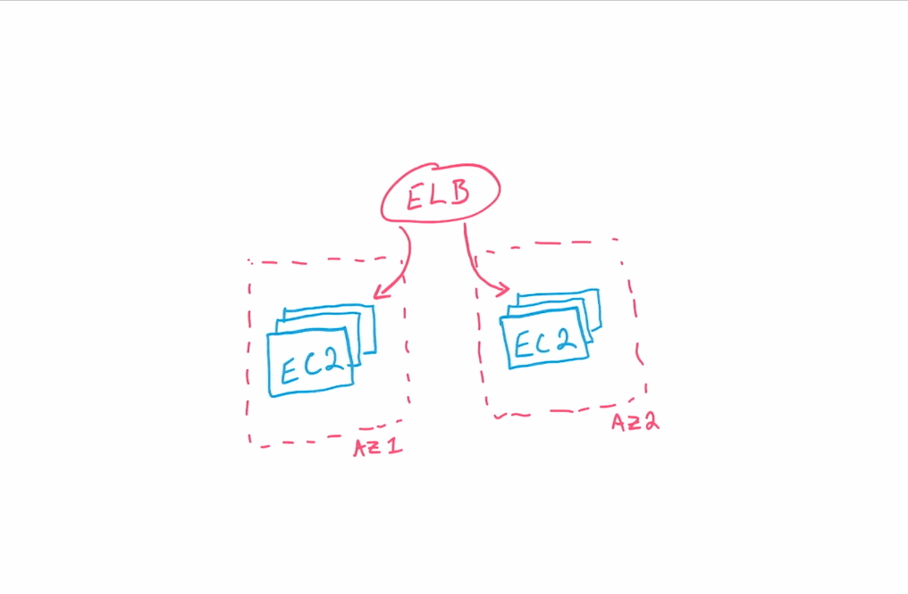

# Amazon Web Services
### Elastic Beanstalk

-
### Elastic Beanstalk
* In the last section, we introduced AWS Elastic Beanstalk, and talked about some of the features that you have with the service.
* In this section, we will get in to more detail about how Elastic Beanstalk works.
* To do this, we'll look at the parts of an Elastic Beanstalk application first, and then we'll look in to the types of environments that can be launched with Elastic Beanstalk.
* When building an Elastic Beanstalk application, there are several parts and some terminology that need to be configured and understood.

-
### Elastic Beanstalk Application
* An Elastic Beanstalk application, is not just referring to your source code.
* An EB Application is a collection of the Elastic Beanstalk components including
    * your source code
    * versions
    * environments
    * environment configurations

-
### Elastic Beanstalk Application Summarized
* Essentially, in Elastic Beanstalk, an application is just an organizational tool to help you group together all of the components utilized for your launch.

-
### Elastic Beanstalk Application Environment
* The environment includes the EC2 instances where your source code will be deployed and the other AWS resources utilized.
* To specify what resources will be supporting your application, you select the specific environment tiers, whether web or worker environments, that will be launched by Elastic Beanstalk.
* Further configurations to your environment can also be achieved by creating or modifying configuration templates through the Elastic Beanstalk command line utilities.

-
-
### Elastic Beanstalk Application Environment

-
### Elastic Beanstalk Application Source Code

-
-
### Source Code
* The last part of the Elastic Beanstalk application that we want to discuss here is the actual source code.
* When considering the source code in Elastic Beanstalk, there are actually two areas you need to be mindful of.
* The first is the actual source code you've developed.
* This is actually very simple to handle with Elastic Beanstalk.

-
-
### Uploading Source Code
* To give your source code to Elastic Beanstalk, all you have to do is bundle the code in to a zip file, and either upload it directly to the Elastic Beanstalk service, or upload to AWS S3, and direct Elastic Beanstalk to your bucket location containing your bundled source code zip file.

-
-
### Uploading Source Code

-
-
### Source Code Dependencies
* The second area concerning your source code is the platform needed for your source code to run.
* The platform selection tells Elastic Beanstalk what dependencies and supporting tools need to be installed on to the EC2 instances.
* Essentially, it prepares the instances for installation.

-
### Review
* To review, the parts of an Elastic Beanstalk application are
    1. the application details such as the application versions and environment variables.
    2. the environment and it's configuration
    3. the source code bundled in to a zip file.
* When it comes to the aforementioned environment tiers, you have two categories to work with.
    * Worker and web server.

-
-
### Worker Environment
* The worker environment allows you to launch an instance or instances in single or multiple availability zones, and the ability to create a queue for the instances to read from and put to.

-
### Worker Environment

-
-
### Web Server Environment
* The web server environment also gives the same options with the availability zones, but grants the ability to create an elastic load balancer to distribute traffic across your EC2 instances.

-
### Web Server Environment

-
-
### Both environments
* Both environments give you the ability to launch your Elastic Beanstalk application in to it's own network, or you can create a VPC and subnets to be utilized specifically for your application's use.
* Additionally, you can choose to add scaling and create back-end databases.

-
-
### VPC
