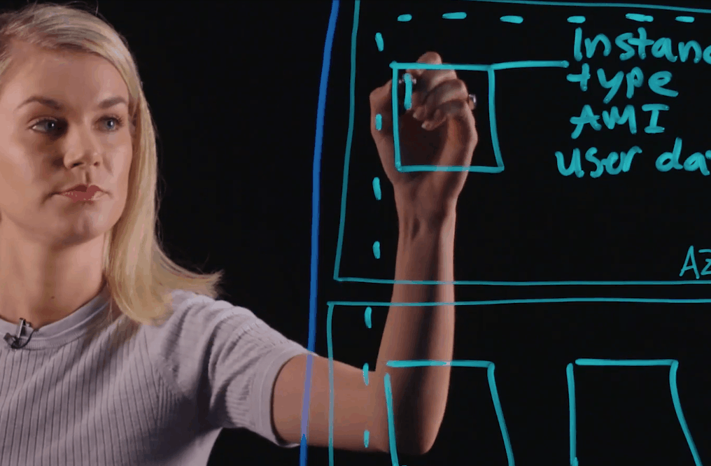

# Amazon Web Services
## AWS Fargate

-
* Running containers on top of EC2 as a hosting option can work for you.
* There are two different layers you need to manage when hosting containers.
    * You have to manage the EC2 instances for hosting,
    * as well as the containers that you place on top of those instances, otherwise known as your _cluster_.

-
### Process
* We are going to draw out this process to get a better idea.
* To get started, you will need to
    * provision, configure, and scale a cluster of EC2 instances.
* You will place your instances in subnets inside of your VPC across availability zones.

-
### Diagram

-
### EC2 Instances in Diagram
* We are gonna go ahead and draw some instances into our diagram.
* For provisioning, you will need to choose the EC2 instance type, the AMI, and provide any other EC2 configuration that may be needed, like user data for bootstrapping.

-
* EC2 instances will be used for hosting Docker containers
    * you'll want to ensure that installing Docker is a part of the bootstrapping process.
    * You'll also need to make sure that these instances are continually patched, updated, and evaluated for security.
        * They are going to need the latest and greatest software packages for hosting containers.

-

-
## Autoscaling
* Next, you will need to set up and configure EC2 auto scaling.
* Auto scaling will provision new EC2 instances when the demand on your containers goes up, and auto scaling will terminate instances as the containers are stopped, and therefore need less compute infrastructure to back it up.

-
-
## Autoscaling

-
### Clustering
* Once all of this is set up and functioning, you can run containers on top of this group of EC2 instances, or your cluster.
* Each EC2 instance will most likely have multiple container instances running inside it.
* Especially as you scale up the number of containers you need.
* So each of these here are just different container instances on top of each host.

-
-
### Clustering

-
-
### Clustering

-
### Orchestration
* So we have some EC2's drawn here, but how exactly do these container instances get placed on top of the hosts?
* This can be managed using an orchestration tool, like Amazon Elastic Container Service, or ECS, which we're going to represent over here.
* for now, just understand that ECS is the service you will be interacting with to run and manage your containers.
* You will not be interacting with the host directly.

-
-
### Orchestration

-
### Monitoring
* Now, over time, you will need to monitor using tools like, Amazon CloudWatch, to ensure that your cluster is scaling properly.
* And you can tweak it as needed to optimize cluster resources.

-
-
### Monitoring

-
### Abstracting Infrastructure
* So, taking a look at all of this here seems to be a lot of preliminary set up that's required to host containers on top of EC2.
* The question becomes, how can you run containers without having to first worry about setting up all of this infrastructure?
* This is where a service called AWS Fargate can be a tremendous help.

-
-
### AWS Fargate
* AWS Fargate is a serverless compute engine and hosting option for container-based workloads.
* What Fargate allows you to do is host your containers on top of a fully managed compute platform.
* That means no provisioning infrastructure, no setting up your clusters scaling, and no server management over time.
* AWS Fargate abstracts all of this away from you.

-
### AWS fargate

-
-
### Diagram
* You can see here, the containers are still spread across AZ's, and the container life cycle would still be managed by an orchestration tool, or in this case, Amazon ECS.

-
* However, there is no EC2 instance visible to you anywhere on this diagram.
* That is because it's abstracted from you, allowing you to focus your time and energy designing and building your applications and your containers, instead of managing the underlying infrastructure that runs those containers.
* When using Fargate, all you need to do is define what your containers need to run.

-
* So, what you need to configure is, first, what image do you want to use?
* You also need to configure how much memory and vCPU the container will need.
* You also configure networking, like what VBC to use, what subnets, and what security groups you will need.
* And finally, you can also configure any IAM permissions that are needed for your containers.

-

-
* So as you can see from this diagram, using AWS Fargate as a hosting platform lets you manage your containers and define what your containers need to run, without needing to worry about the underlying infrastructure.
* A few other things to note about AWS Fargate, are that you don't pay per instance hour or second, like you would with EC2.
* Instead, you only pay when your container is running, and when your container isn't running, you stop incurring charges.