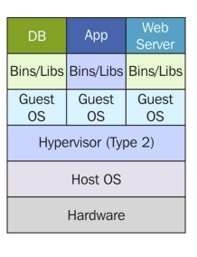
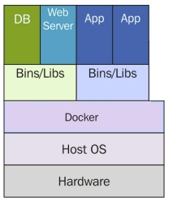

# Amazon Web Services
## Intro to Containerization

-
## Purpose
* The purpose of this lecture is to introduce containerization and the use of containers on AWS.
* we will focus on the basics of containers
    * Docker
    * Registries
    * Building Images
* In the exercise for this week you'll be
    * pushing your images into Amazon Elastic Container Registry
    * deploying to an AWS Elastic Beanstalk environment.

-
-
## Terminology
* container
    * overall package and virtualized environment that you'd be using.
* image
    * It's essentially a blueprint for your container.
* registry
    * a repository to `push` and `pull` images to and from.

-
### Containerization
* it is important that you first understand what differentiates containers from other types of virtualization.
* While virtual servers like Amazon Elastic Compute Cloud and containerization are both ways to decouple workloads from the underlying hardware, there are some key ways in which they differ.

-
### Virtual Machine

-
-
### Virtual Machine
#### What is?
* In a typical virtual machine or VM, such as EC2, the virtualization is mimicking a hardware environment.
* Each VM has its own operating system, resources, and all internal components needed by any tool or application that will be running on the VM.

-
-
### Virtual Machine
#### Wasted Resources
* While this provides a lot of control there is often a waste as each VM, even if running identical instances of the same application or tool, will need to have its own full operating system and hardware allocation shared from the host.

-
### Containers

-
-
### Containers
#### Reclaimed Resources
* Containerization has an additional layer of virtualization on top of the guest OS.
* The different virtualized containers can share an underlying OS and even additional things like binaries and drivers in order to cut operational overhead.
* Because of this, a container is able to run a much lighter instantiation of only the necessary components
* In turn has much less duplication and waste when compared to VMs.
* You are still able to obtain isolation of the application environment and dedication of underlying resources.

-
-
### Containers
#### Reclaimed Resources
* You have full control over how access to the individual containers is achieved and what level of resource utilization each container has access to.
* This also makes replication, backup and restoration, deployment and underlying resource utilization lighter and easier to manage as the images of the containers are more focused on just what they need instead of every underlying dependency.

-
### Container
* overall package and virtualized environment that you'd be using.
* Applications will run inside of the containers.
* Everything an application needs would be baked into the container from dependencies to environment variables.
* Very similar to using a virtual machine, like EC2, using a container allows you to isolate and set up the environment specifically for the application you want to run.

-
### Container (Continued)
* Each different application you want to isolate would have its own container.
* In order to launch a container, you first need to define everything you want inside of the container
    * dependencies, source code, and configurations.
* You capture this definition in something called a dockerfile.
    * You can then take this dockerfile and build it into an image.

-
### Image
* A container image is similar to an EC2 image, they're the packaged configuration that you're going to need for launching or deploying your running container.
    * It's essentially a blueprint to define your container.
* Often, your image will contain only the application, so that when it's deployed the container takes up a small amount of space on the disk and starts up quickly.
* The images that you build to run your containers will be stored in something called a registry.

-
### Registry
* The images that you build to run your containers will be stored in something called a registry.
* A registry is very similar to a source code repository.
* A registry is just specifically used to hold container images that are fully built out.
* That way when it comes time to run the container image, there's no need to build, it's already built and stored
in the registry.

-
### Registry (Continued)
* The registry options that you have with AWS
    * are Docker Hub, which allows you to store both private and public images that you want to utilize,
    * as well as ECR, or Amazon Elastic Container Registry.
* This will allow you to store your images with a managed service that you can rely on.
* You can share images with others in your organization, and you can deploy containers from the images in ECR.