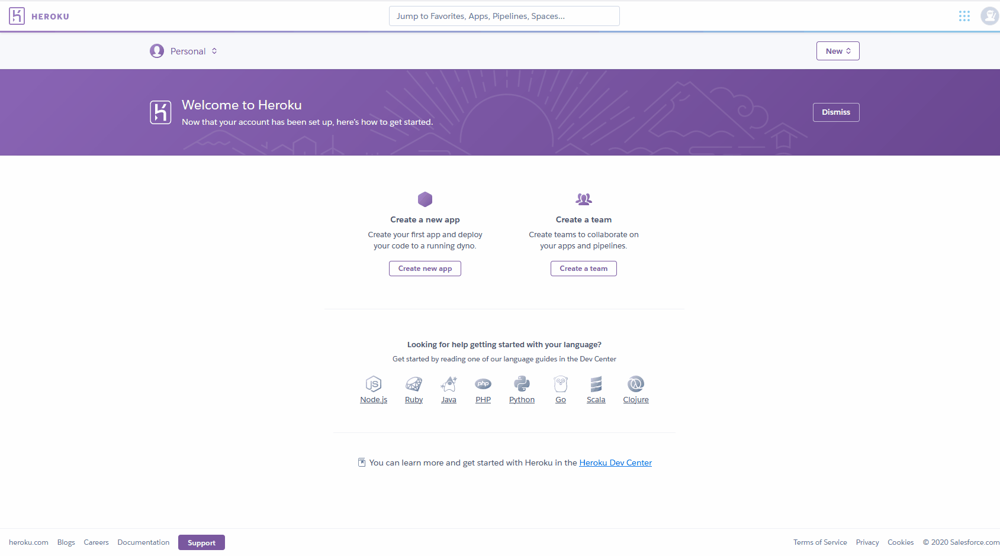
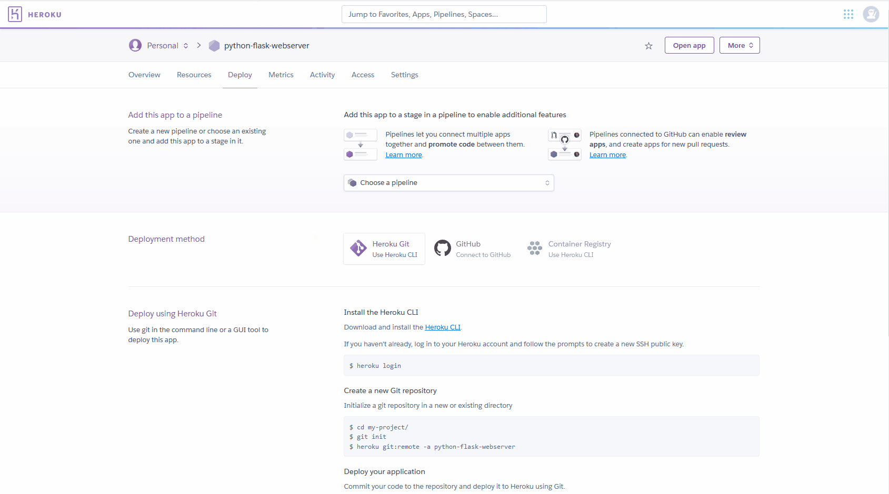

# Create Heroku Account & Probe its Web Interface

### 1. Create Heroku Account
* Navigate to [signup.heroku.com](https://signup.heroku.com/) to sign up for an account

### 2. Create Heroku Application
* From the Heroku Welcome page, click `Create New Application`

### 3. Connect Heroku Application to Github Account
* From the `Application Deploy` Tab of Heroku, connect Heroku application to Github.
* Ensure that automatic deployments for each `push` is enabled

### 4. Connect Heroku Application to Github Repository
* Upon connecting to github, search for a repository.

### 5. Configure Deployment from Heroku
* Applications can be configured by `touch`ing a file named `Procfile` to the root directory of the project.