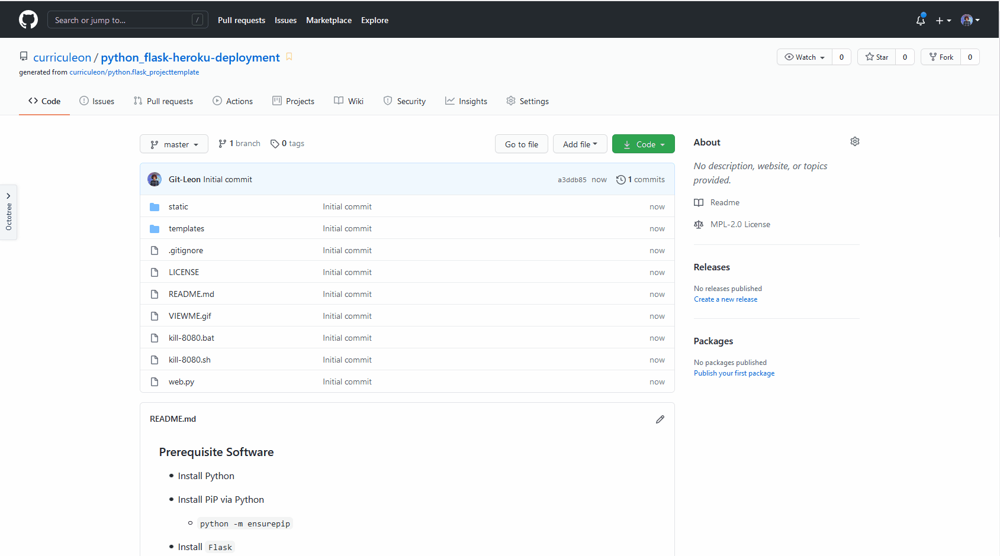
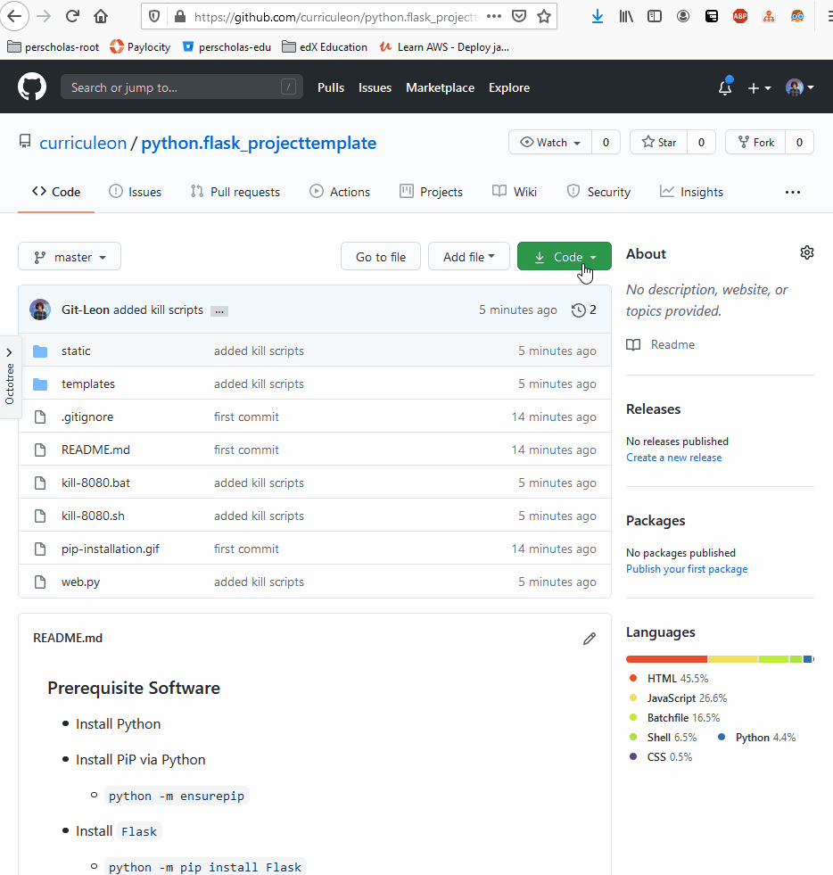
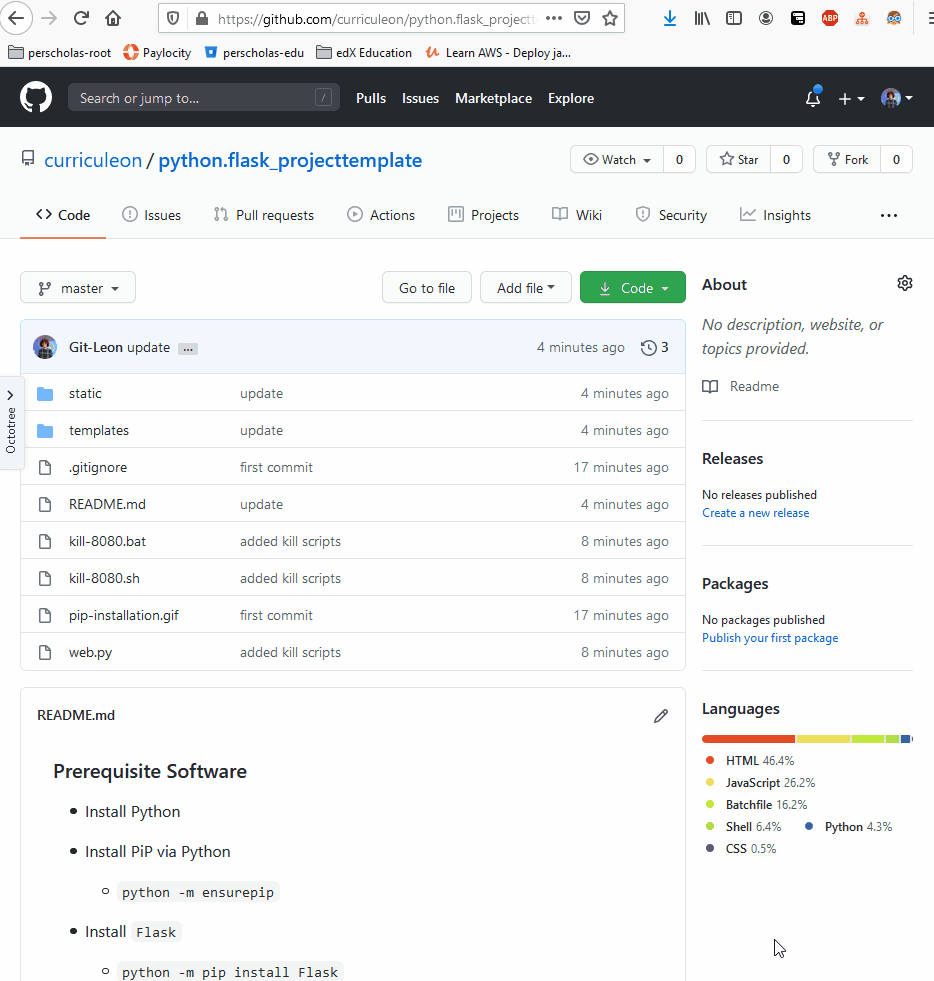
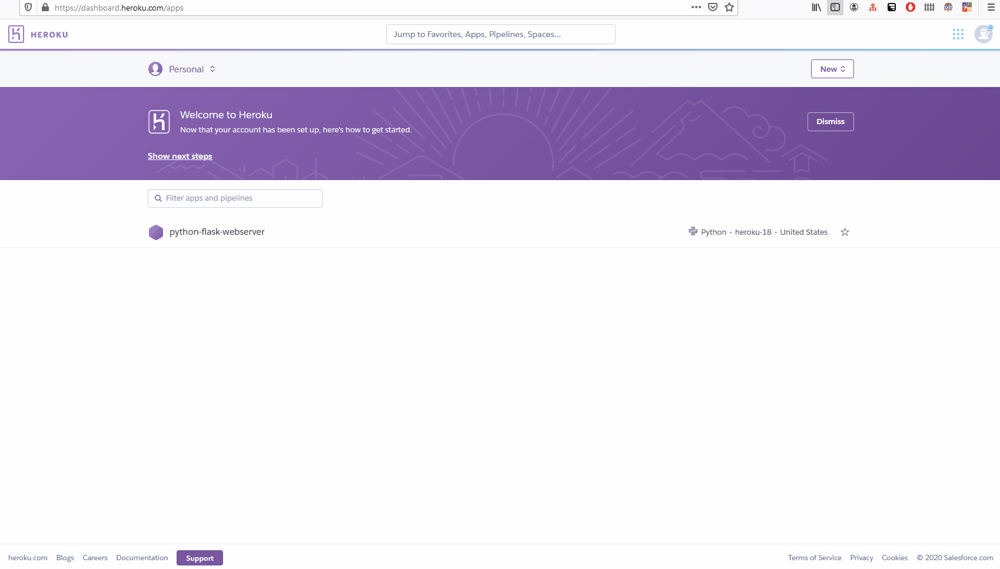

# Hosting Python Flask Webserver from Heroku Cloud Application Platform

### 1. Fork Flask WebServer Repository
* Navigate to [url](https://github.com/curriculeon/python_flask-heroku-deployment) to fork the Flask application

### 2. Create Heroku Account
* Navigate to [signup.heroku.com](https://signup.heroku.com/) to sign up for an account

### 3. Create Heroku Application
* From the Heroku Welcome page, click `Create New Application`

### 4. Connect Heroku Application to Github Account
* From the `Application Deploy` Tab of Heroku, connect Heroku application to Github.
* Ensure that automatic deployments for each `push` is enabled

### 5. Connect Heroku Application to Github Repository
* Upon connecting to github, search for the newly forked repository.

### 6. Clone The Forked Repository
* Navigate to your Github account to find the Forked Python Flask Webserver Repository
* Clone the repository onto your local machine
* Start the webserver by executing the command below from the root directory of the project
    * `python web.py`

### 7. View the Application Locally
* Verify that the application builds correctly on your local machine by navigating to `localhost:8080` to view the static HTML that is served by the Python Flask Webserver

### 8. `pip freeze` and _pipe_ dependencies to requirements.txt
* Execute `pip freeze > requirements.txt` from the root directory of your local project to _pipe_ the dependencies of the project to a `requirements.txt` file.
    * This file will allow Heroku to fetch and configure the respective dependencies and run the application on the cloud
* Execute the command below to append the `unicorn` requirement
    * `echo gunicorn==19.9.0 >> requirements.txt`
* `push` these changes to your _remote_ repository by executing the commands below from the root directory of your local project
    * `git add .`
    * `git commit -m "created 'requirements.txt'"`
    * `git push`

### 9. Configure Deployment from Heroku
* Execute the command below in a terminal from the root directory of the locally cloned project to create a `Procfile`
    * `echo web: gunicorn ${name_of_main_python_module}:app > Procfile`
        * replace `${name_of_main_python_module}` with the name of the main python module to be ran on the server
* `push` these changes to your _remote_ repository by executing the commands below from the root directory of your local project
    * `git add .`
    * `git commit -m "created 'Procfile'"`
    * `git push`
* view the live deployment from Heroku

### 10. View the Application Remotely
* From [`https://dashboard.heroku.com/apps`](https://dashboard.heroku.com/apps) navigate to the application's most recent build.
* At the bottom of the build log, copy and paste the URL that the application is hosted on.

