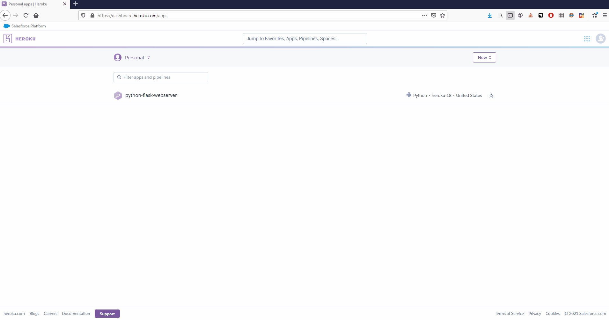
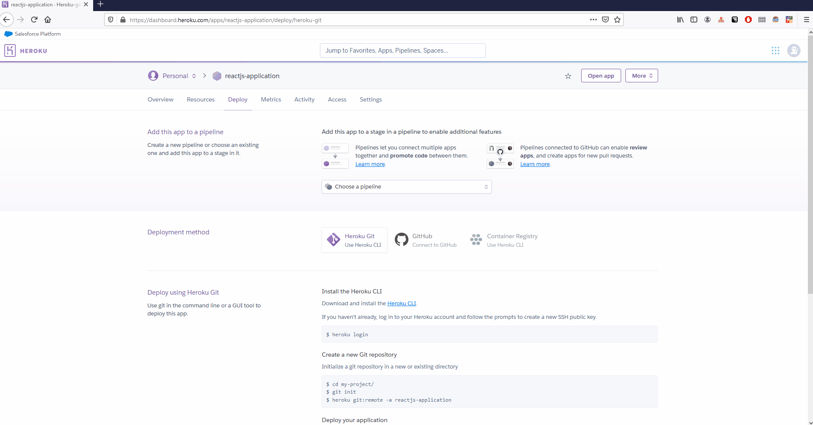
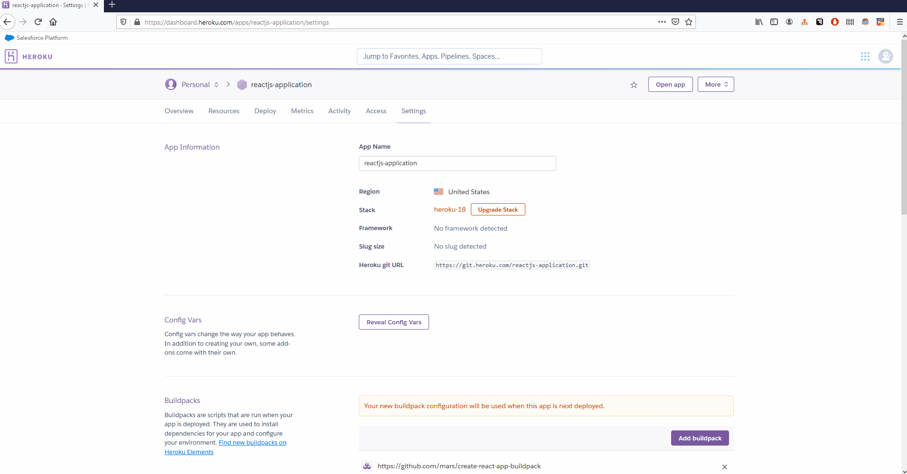
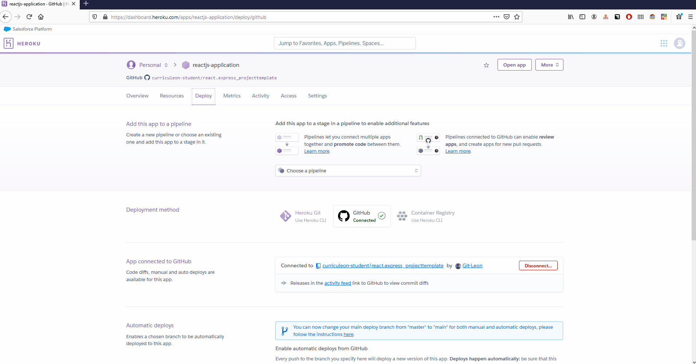
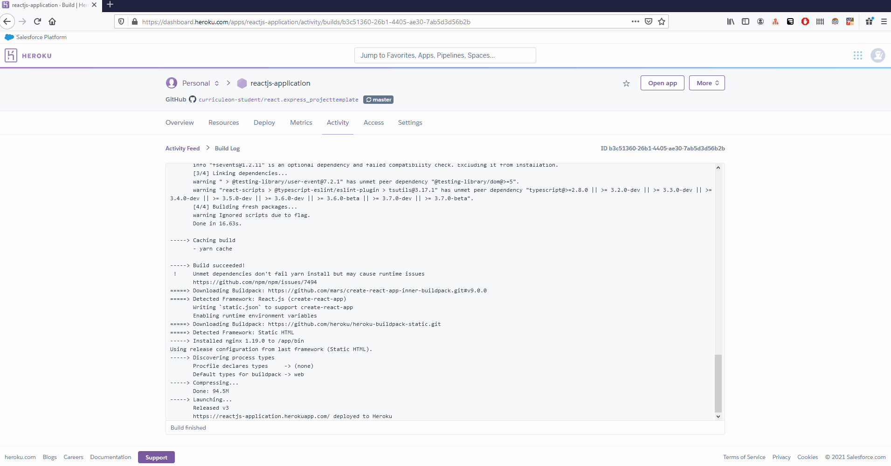

# Deploy ReactJS Application From Github to Heroku

## Overview
1. Prerequisites
2. Create Heroku Application
3. Add Mars Build Pack
4. Connect Heroku Application to remote Github Repository
5. Deploy Application
6. View Application

### Prerequisites
1. Install NodeJS
2. Create Local ReactJS Application
3. `push` Local ReactJS Application to remote Github Repository


### Create Heroku Application
* Click [here](https://dashboard.heroku.com/apps) to navigate to Heroku app dashboard
* Select `New` from the dashboard
* Ensure the `App Name` field has a unique value.
* Select `Create App`

[](./create-reactjs-application.gif)


### Add Mars Build Pack

* The build-pack url can be found below
    * `https://github.com/mars/create-react-app-buildpack`

[](./add-mars-build-pack.gif)


### Connect Heroku Application to remote Github Repository
* Click the `Deploy` tab.
* Select `Github` from the `Deployment Method` section.
* Search for repository by entering its name in the text box.
* Click `Connect`

[](./connect-github.gif)


###  Deploy Application

* Select `Enable Automatic Deploys` to ensure that Heroku re-deploys upon every `git push` to your remote repository.
* Select `Deploy Branch`
* Click `View Build Log`
* Upon completing deployment, heroku will display a log message resembling the text below.

```
https://${my-application-name}.herokuapp.com/ deployed to Heroku
```

[](./manual-deploy-application.gif)


###  View Application

* Click the `Open App` button to view the live deployment of your application

[](./view-application.gif) 