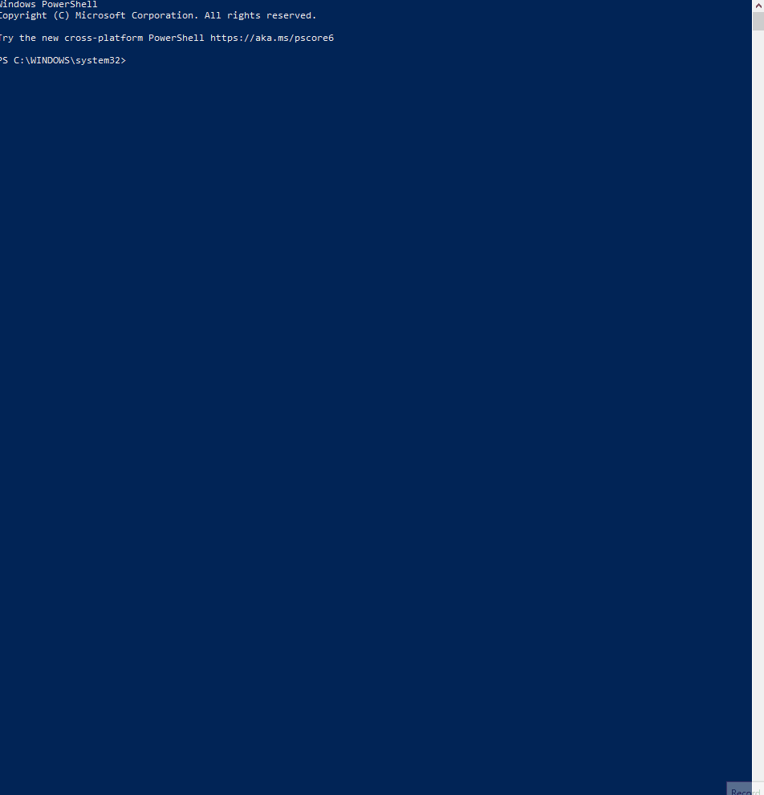
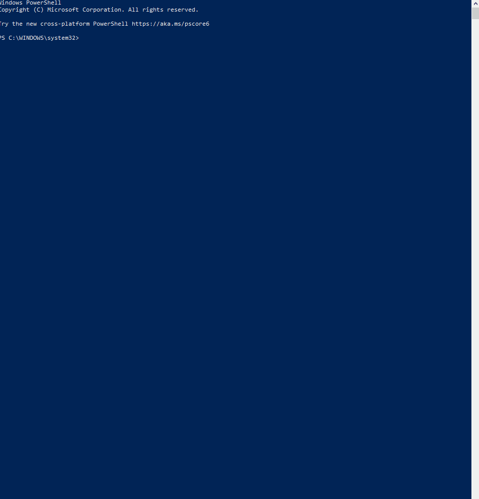

## Heroku CLI Installation

### Windows
* Execute the command below to install heroku-cli
    * `choco install heroku-cli -y`

### MacOS
* Execute the command below to install heroku-cli
    * `placeholder`

### Linux
* Execute the command below to install heroku-cli
    * `placeholder`

# Heroku CLI Login
* Execute the command below to log into heroku from cli
    * `heroku login`

