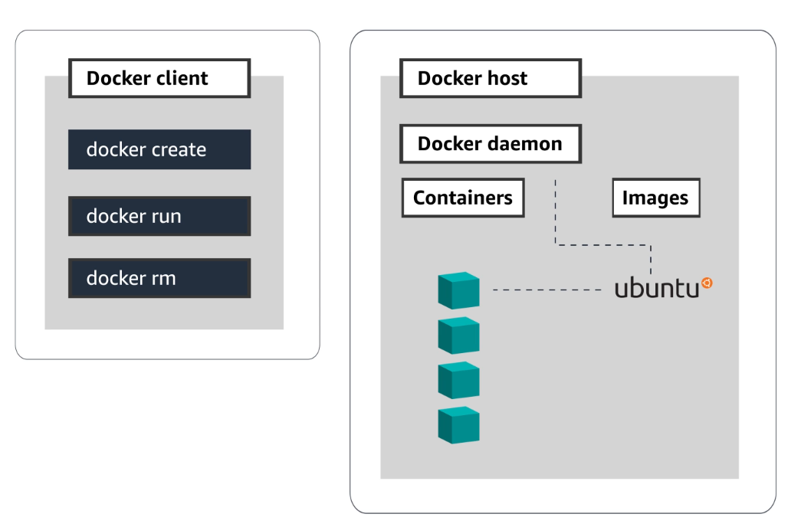

## Docker
we're going to take a look at the basic components of Docker to get a better idea of how it all works.

### Overview
* lets first quickly summarize this.
* a Docker file lists out everything needed for a container.
    * The operating system, the software, and any other necessary information.
* When you build a Docker file it results in an  _image_.
    * Which is just a lightweight executable package.
* When you run that executable using that `docker run` command it results in a _container_ on a Docker host.
    * Which is a running instance of an image

### Docker Components
* Docker has 3 main components.
    * The Docker daemon.
    * The Docker CLI.
    * And the image registry.

### Docker Components

### Docker Components
#### Client
* The Docker client provides developers a way to interact with Docker through a Command Line Interface or CLI.
* This is how you issue commands to Docker to build your containers, run your containers, or stop your containers.
* When you use the CLI you'll type a command into your terminal that starts with `Docker`.
* For instance, if you want to stop your containers you would run the `docker stop` command.

### Docker Components
#### Client (Continued)
* Through the Docker client, Docker provides commands to manage the complete lifecycle of your containers.
    * Such as `docker create`, that creates a container but does not start it.
    * `docker run`, which creates and starts a container in one operation.
    * And `docker rm`, that deletes a container.
* The next thing you need is for Docker to listen to those commands and perform them for you.
* This is where the second component, the Docker daemon comes into play.

### Docker Components
#### Daemon
* The Docker daemon is installed on a host machine and essentially acts as the brain of the Docker
    * that creates and manages your Docker images on your behalf.
* Its whole purpose is to perform the commands that the client issues.
* So, if you issue the Docker stop command for a particular container, the daemon will go ahead and find that container and stop it.

### Docker Components
#### Daemon (Continued)
* Also, any time your container needs access to
    network ports, storage volumes, or any other components at the operating system level,
* the Docker daemon will provide that.

### Docker Components
#### Image registry
* Finally, the third piece of the puzzle is the image registry.
* Just like a source code repository is a place to store your code,
    * the image registry is a place to store your Docker images.
* The image registry allows you to push and pull your container images as needed.

### Docker Components
#### Image registry (Continued)
* Registries can be either
    * public, where images are shared with the whole world.
    * Or, registries can be private. Where your images are only shared amongst members of an enterprise or a team.
* A registry makes it possible for the Docker daemon to retrieve and run your Docker images.

### Docker Image
* So, what is a Docker image you might ask?
* An image is a blueprint to instantiate a new container instance
* lightweight executable packages that include everything you need in it.
* All of your application code, software, dependencies, and config variables.
* They are considered read only artifacts.
* So once a container is built it cannot be changed unless you build a new image.
* And just as we mentioned earlier, you put these Docker images in image registries.

### Docker Commands
* So now that we have a Docker image that is stored in a registry, how do we get that image to be a container running on a Docker host?
* To do this you need to issue the command
* `docker run` through the Docker CLI.
* The Docker client will then delegate that command to the daemon.

### Docker Commands (Continued)
* `docker run` is a magical command that takes care of everything you need to start up a container.
* The first thing the daemon does, in response to the command, is check to see if the appropriate image exists on the Docker host.
* If it doesn't it downloads it from the image registry and spins up the Docker container on the Docker host, using that image.
* When you use the CLI to do a Docker run command on a particular image it results in a container.

### Docker Container
* A container is simply just a running instance of a Docker image.
* You can think of it as an encapsulated environment to run your applications that only has access to the resources that are provided in the Docker image.

### Docker File
* So how do we get the image in the first place?
* That would be through something called a Docker file.
* A Docker file is a plain text, standardized template, that you create with instructions that informs Docker how your Docker image should get built.
* It's a script that contains a list of commands that the Docker client will call when putting your image together.

### Docker File
* It includes instructions for
    * installing the operating system,
    * any other relevant software,
    * and making sure all the necessary dependencies
* are in place for your container to run properly.
* When you use the Docker build command through the CLI, on a particular Docker file, it results in a Docker image.

### Summary
* Now that we have all the pieces lets quickly summarize this.
* You start with a Docker file and list out everything you need for your container.
    * The operating system, the software, and any other necessary information.
* When you build a Docker file it results in a Docker image.
    * Which is just a lightweight executable package.
* When you run that executable using that Docker run command it then results in a container on a Docker host.