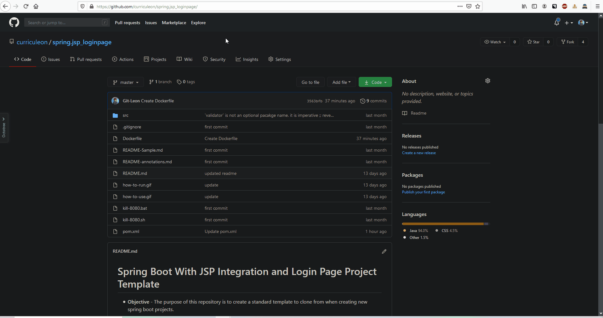

# Docker
## How to containerize a `.jar`


[](./dockerized-jar.gif)

```
git clone https://github.com/curriculeon/spring.jsp_loginpage my-containerized-application
cd my-containerized-application
mvn package
cat Dockerfile
docker image build -t image-name .
docker container run --name container-name -p 8080:8080 -d image-name
```