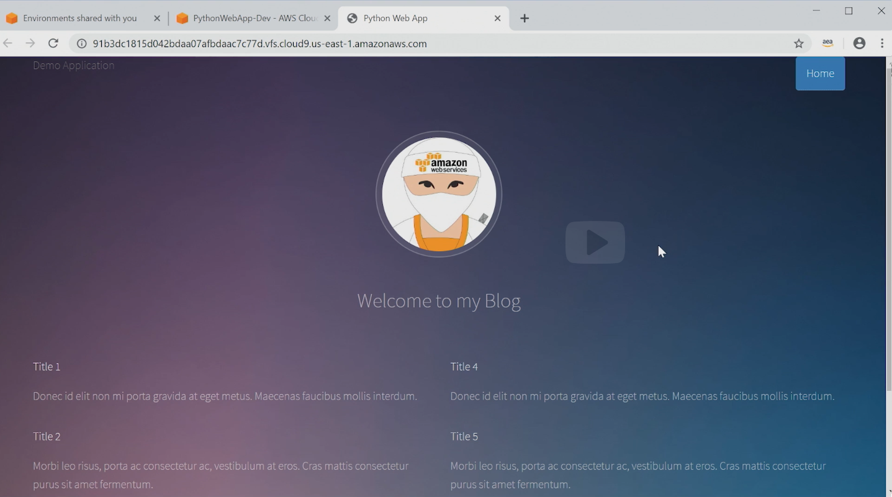

-
# Docker Files and Semantics

-
### Portable Self-Contained Execution Enviornment
* In order to create a portable and self contained execution environment for your app, like a Docker container, you need to capture everything the app needs and build it all into an image.
* To build an image, you need to create what is called a Docker file.

-
### Docker File
* A Docker file is essentially a set of instructions on how to build a container step by step.
* When it's time to build the container, each construction is executed in order to form an executable container image.
* There are a number of keywords that Docker uses for instructions.


-
### Getting started
* To start, I'm going to open up the cloud-based IDE called AWS Cloud9.
* You can see I'm already logged in to the AWS console and I'm going to navigate to Cloud9 and open up my existing environment that I have already created.
* So type in Cloud9, select that service, and from here I'm going to open up my existing IDE.
* There's some code that has already been written inside of this python-webapp folder, and this application is written in Python and all it does is render simple static HTML using a web server called Flask.


-
### Running Server
* The script that renders this HTML is found here in the app.py file.
* I'm going to quickly run this app.py file from the command line so that we can see the application we're trying to capture inside of this container.
* So I'm going to go ahead and run python3 app.py.
* And our application is now up and running.


-
### Previewing Application
* I can preview this application by selecting Preview,
* Preview Running Application, and from here I'm going to bump it out into a new window.
* And this is our static HTML file that has some dummy data.


-
### Capturing Image
* So, that's great but what I want to do is capture this source code, all of its dependencies, all of its configuration and build it into a container image.
* To do that, I need to create a Docker file which is where the instructions go.
* Let's go over this Docker file that I already have written that showcases a few of the keywords that you'll need to know.


-
### Docker File Example
* To get an idea of how this works and what keywords exist, let's take a look at a very simple Docker file.

```
FROM ubuntu:16.04

MAINTAINER Leon Hunter "leon@notarealemail.com"

RUN apt-get update -y && \
    apt-get install -y python-pip python-dev

COPY ./requirements.txt /app/requirements.txt

WORKDIR /app

RUN pip install -r requirements.txt

COPY . /app

EXPOSE 8080

ENTRYPOINT [ "python" ]
CMD [ "app.py" ]
```

-
### `FROM ubuntu:16.04`<br>Explained
* The first keyword that we have is the `FROM` instruction.
* `FROM` is the first non-common Docker instruction in any Docker file.
* The `FROM` instruction sets the base image from which we are going to build on top of.
* Docker images can be layered on top of one another, which we will discuss later.
* Ubuntu, which is an operating system.
* This allows us to have a container that has a minimal version of the operating system Ubuntu installed regardless of what the OS of the host machine is.

-
### `FROM ubuntu:16.04`<br>Explained
-
#### Continued
* In our example here, you can see the instruction states `FROM ubuntu:16.04`.
* The :16.04 is specifying the tag or version of that particular image.
* If you leave off the tag, when the Docker image is built, it will assume that you want the latest version of that image.
* An easy place to start is to pull a base image from a public repository that provides the minimal operating system or runtime that you need.

-
### `FROM ubuntu:16.04`<br>Explained
-
#### Continued
* However, you can also use custom images as a base image.
* The great thing about base images is that if you need the same set of tools across multiple containers, you can capture that in an image and then use it as a base image wherever needed.
* Thus reducing the need for duplicate instructions across all of your Docker files.


-
### `LABEL` (Formally `MAINTAINER`)<br>Explained
* Next is the `LABEL` (formally, aliased as `MAINTAINER` instruction).
    * `LABEL maintainer="leon@notarealemail.com" `
* This just allows you to set up who the author of the Docker file is.
* Which in this case, it's me, Leon.


-
### `RUN`<br>Explained
* Next on our Docker file we see the `RUN` instruction followed by some commands.
* The `RUN` instruction will execute whatever commands you define in a shell.
* The command we see here is running `apt-get update` and then `apt-get install`.
* To install both `pip` and Python which is needed because Python is the language the app is written in and pip is needed to download the dependencies for the Python app.

-
### `RUN`<br>Explained
-
#### Continued
* The `RUN` instruction is flexible as it allows you to run the commands that you need for your application and your container.
* So depending on what you're trying to do, you would need different commands to suit your use case.
* You also might use the Run instruction multiple times throughout a Docker file to achieve your desired outcome.

-
### `COPY`<br>Explained
* The next line has the `COPY` instruction.
* This will allow you to copy files from the machine the Docker file is being built on into the image.
* In this line, we are copying a text file called requirements.txt which is needed to specify dependencies for our web app.
* And we are copying this file into the app directory inside of the image.


-
### `WORKDIRECTORY`<br>Explained
* Next is the `WORKDIRECTORY` instruction which will set the working directory for any subsequent instructions that will be run.
* If the WORKING directory doesn't exist, it will be created.
* Here we are just changing the work directory to be the `/app` directory.


-
### `RUN`<br>Explained
* Next we have another RUN instruction.
* This time we are using `pip` to install the dependencies for our app.


-
### `COPY`<br>Explained
* Then we have another `COPY` instruction.
* This is going to copy all of the source code for our simple website into the `/app` directory.
* The next instruction we have is the EXPOSE instruction.
* This is going to expose a port for the container to communicate on.

-
### `COPY`<br>Explained
-
#### Continued
* If you want you container to be able to communicate with external entities like other containers or remote services, you will need to include the expose instruction to define what port your container will listen on.
* So in this example, I'm going to expose the port 8080 for the web app.


-
### `ENTRYPOINT`<br>Explained
* Onto the next one is the `ENTRYPOINT` instruction.
* This instruction lets you define what script or command you want to run when the container starts up.
* In our example, we are calling Python as the entry point.


-
### `COMMAND`<br>Explained
* Finally we have the `COMMAND` instruction.
* The `COMMAND` instruction is similar to the `ENTRYPOINT` instruction at a high level.
* This instruction allows you to execute commands or scripts at runtime.
* The difference is the `COMMAND` instruction allows you to provide default values, which in our case here we've defined as app.py which will execute the script that starts up our app.
* And you can then pass in values via the command line to override the default values at runtime.


-
### `COMMAND` vs `ENTRYPOINT`<br>Explained
* So the difference between `ENTRYPOINT` and `COMMAND` is `COMMAND` does give you the ability to override what gets executed at runtime.
* Whereas `ENTRYPOINT` cannot be overwritten at runtime and is static once it's been defined.
* There are other Docker keywords that will be useful to you depending on your desired outcome.