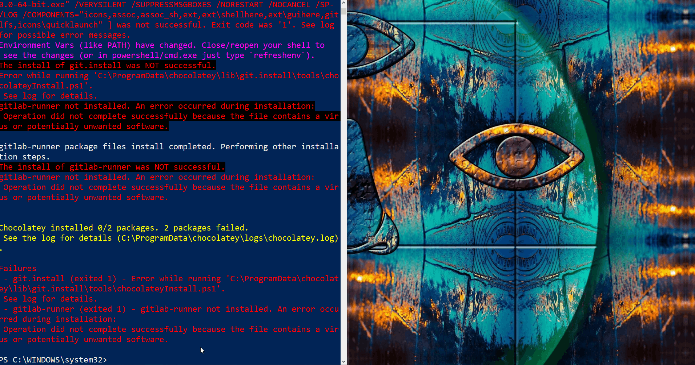
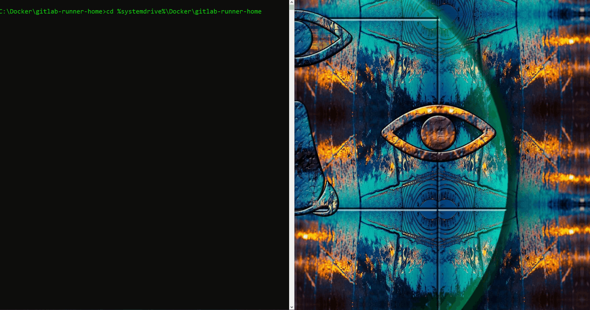

# Install gitlab-runner In Docker on Windows OS


## Inspiration
* Upon executing `choco install gitlab-runner`, the following exception is thrown

[](./choco-install-gitlab-runner-failed-cryptinject.gif)


## Installation
### Install Docker
* [Enable Virtualization, Install VirtualBox, Install Docker](../installation/content.md)


### Create Directory
* Create a new directory
    * `mkdir %systemdrive%\Docker\gitlab-runner-home`

[](./mkdir-docker-gitlab-runner-home.gif)


### Build docker image and run
* Execute the command below from the newly created directory.
* Be mindful that the `^` operator denotes a continuation onto a new line
    * _the command below should be executed as a single line with `^` removed, unless executed from a `.bat` file._

```bat
docker run ^
  -v "%systemdrive%/Docker/gitlab-runner-home":/var/gitlab-runner-home ^
  -v /var/run/docker.sock:/var/run/docker.sock ^
  --name gitlab-runner ^
  gitlab/gitlab-runner:latest
```

* Each flag from the above command is described more thoroughly below
    * `%systemdrive%/Docker/gitlab-runner-home` - my created directory
    * `-v /var/run/docker.sock:/var/run/docker.sock` - mount/bid docker sockets
    * `--name gitlab-runner` - alias for created container - _e.g. to be able login docker machine easily_
    * `gitlab/gitlab-runner:latest` - name of docker used to contain `gitlab-runner`

* Single line view below

```bat
docker run -v "%systemdrive%/Docker/gitlab-runner-home":/var/gitlab-runner-home -v /var/run/docker.sock:/var/run/docker.sock --name gitlab-runner gitlab/gitlab-runner:latest
```


[](./dockerized-gitlab-runner.gif)


### Register a runner
* `docker run gitlab/gitlab-runner register`

[](./docker-run-gitlab-runner-register.gif)


<hr><hr>


## How Docker Commands Translate<br>To GitLab Runner Commands
* According to `https://docs.gitlab.com/runner/install/docker.html`:
   * The general rule is that every GitLab Runner command that normally would be executed as:
      * `gitlab-runner [Runner command and options...]`
   * can be executed with:
      * `docker run [docker options...] gitlab/gitlab-runner [Runner command and options...]`


<hr><hr>


## Interacting with Container


### Running created container
* Execute the command below to run the newly created container.

```bat
docker container start gitlab-runner
```

### Listing running container

```bat
docker container ls --all
```

* Executing the command above should yield an output comparable to that below.

```bat
docker ps
```

```bat
CONTAINER ID        IMAGE                 COMMAND                  CREATED             STATUS              PORTS                                              NAMES
42e3edd6087b        gitlab/gitlab-runner:latest   "/sbin/tini -- /usr/…"   12 minutes ago      Up 12 minutes       0.0.0.0:8080->8080/tcp, 0.0.0.0:50000->50000/tcp   gitlab-runner
```


### Stop container

* Execute the command below to stop the container.
    * **Note:** You can also use Container ID instead alias name

```bat
docker container stop gitlab-runner
```

### Remove container

* Execute the command below to remove the container.
    * **Note:** Stopping and removing container is also required to be able rebuild docker (container)

```bat
docker container rm gitlab-runner
```


### Remove image

* Execute the command below to remove the image.

```bat
docker image rm gitlab/gitlab-runner:latest
``` 

<hr><hr>

### Bulk removing images and containers:

#### Windows:

```bat
@echo off
FOR /f "tokens=*" %%i IN ('docker ps -aq') DO docker rm %%i
FOR /f "tokens=*" %%i IN ('docker images --format "{{ID}}"') DO docker rmi %%i
```

#### Linux

```bash
#!/bin/bash
# Delete all containers
docker rm $(docker ps -a -q)
# Delete all images
docker rmi $(docker images -q)
```


<hr><hr>


## Sources
* [`https://docs.gitlab.com/runner/install/docker.html`](https://docs.gitlab.com/runner/install/docker.html)
* [`https://docs.gitlab.com/runner/register/#windows`](https://docs.gitlab.com/runner/register/#windows)
* [`https://curriculeon.github.io/Curriculeon/lectures/containerization/docker/dockerizing-jenkins/instructions.windows.html`](https://curriculeon.github.io/Curriculeon/lectures/containerization/docker/dockerizing-jenkins/instructions.windows.html)