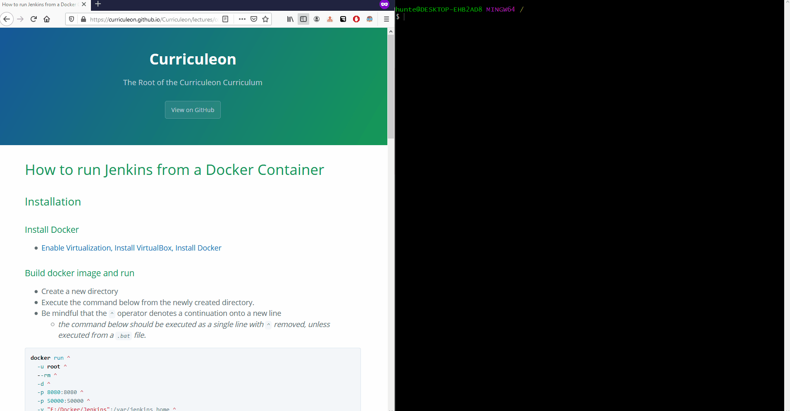
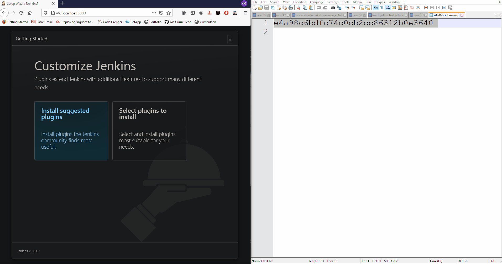

# How to run Jenkins from a Docker Container


## Installation
### Install Docker
* [Enable Virtualization, Install VirtualBox, Install Docker](../installation/content.md)


### Create Directory
* Create a new directory
    * `mkdir %systemdrive%\Docker\Jenkins`

[](./mkdir-docker-jenkins.gif)


### Build docker image and run
* Execute the command below from the newly created directory.
* Be mindful that the `^` operator denotes a continuation onto a new line
    * _the command below should be executed as a single line with `^` removed, unless executed from a `.bat` file._

```bat
docker run ^
  -u root ^
  --rm ^
  -d ^
  -p 8080:8080 ^
  -p 50000:50000 ^
  -v "%systemdrive%/Docker/Jenkins":/var/jenkins_home ^
  -v /var/run/docker.sock:/var/run/docker.sock ^
  --name jenkins ^
  jenkinsci/blueocean
```

* Each flag from the above command is described more thoroughly below
    * `-u root` - is needed to be able bind docker service with jenkins
    * `--rm` - is used to remove this container after finishing the `run`
    * `-d` - run as daemon, so you can detach console window
    * `-p 8080:8080` and `-p 50000:50000` - expose jenkins ports for main Jenkins and slave communication
    * `%systemdrive%/Docker/Jenkins` - my created directory
    * `-v /var/run/docker.sock:/var/run/docker.sock` - mount/bid docker sockets
    * `--name jenkins` - alias for created container - _e.g. to be able login docker machine easily_
    * `jenkinsci/blueocean` - name of docker used to create Jenkins - released every time when new blue ocean is released

* Single line view below

```bat
docker run -u root --rm -d -p 8080:8080 -p 50000:50000 -v "%systemdrive%/Docker/Jenkins":/var/jenkins_home -v /var/run/docker.sock:/var/run/docker.sock --name jenkins jenkinsci/blueocean
```


[](./dockerized-jenkins.gif)


### Jenkins configuration
* Open web browser and type address `localhost:8080`
* The `/var/jenkins_home/secrets/initialAdminPassword` file is located under mounted place.
    * For example if `/var/jenkins_home` is "mapped" to `C:/Docker/Jenkins`, then file is located at `C:/Docker/Jenkins/secrets/initialAdminPassword`

[](./initial-password.gif)

### Starting Jenkins

[](./jenkins-startup.gif)


<hr><hr>


## Interacting with Container

### Running created container
* Execute the command below to run the newly created container.

```bat
docker container start jenkins
```

### Listing running container

```bash
docker container ls --all
```

* Executing the command above should yield an output comparable to that below.

```bash
docker ps
```

```bash
CONTAINER ID        IMAGE                 COMMAND                  CREATED             STATUS              PORTS                                              NAMES
42e3edd6087b        jenkinsci/blueocean   "/sbin/tini -- /usr/…"   12 minutes ago      Up 12 minutes       0.0.0.0:8080->8080/tcp, 0.0.0.0:50000->50000/tcp   jenkins
```


### Stop container

* Execute the command below to stop the container.
    * **Note:** You can also use Container ID instead alias name

```bash
docker container stop jenkins
```

### Remove container

* Execute the command below to remove the container.
    * **Note:** Stopping and removing container is also required to be able rebuild docker (container)

```bash
docker container rm jenkins
```


### Remove image

* Execute the command below to remove the image.

```bash
docker image rm jenkinsci/blueocean
``` 

<hr><hr>

### Bulk removing images and containers:

#### Windows:

```bat
@echo off
FOR /f "tokens=*" %%i IN ('docker ps -aq') DO docker rm %%i
FOR /f "tokens=*" %%i IN ('docker images --format "{{ID}}"') DO docker rmi %%i
```

#### Linux

```bash
#!/bin/bash
# Delete all containers
docker rm $(docker ps -a -q)
# Delete all images
docker rmi $(docker images -q)
```


<hr><hr>


## Sources
* [`https://github.com/auriuki/jenkins-docker`](https://github.com/auriuki/jenkins-docker)