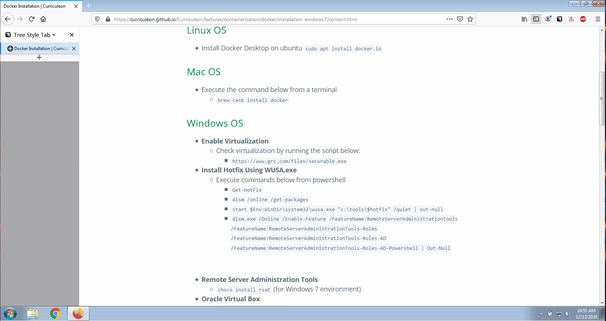
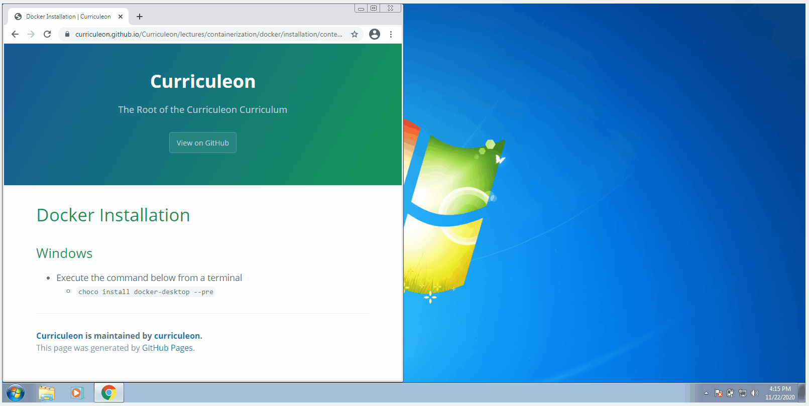

# Docker Installation - Windows OS

### Enable Hyper-V using PowerShell
* To **enable Hyper-V**, execute the command below from an administrative powershell window
    * `Enable-WindowsOptionalFeature -Online -FeatureName Microsoft-Hyper-V -All`

### Install Windows Subsystem for Linux 2
* To **install Windows subsystem for linux**, execute the command below from an administrative powershell window
    * `choco install wsl2`

### Check Virtualization
* To **ensure virtualization has been enabled**, execute [script below](./securable.exe) 
    * [https://www.grc.com/files/securable.exe](https://www.grc.com/files/securable.exe)

### Install Oracle Virtual Box
* To **install oracle virtualbox**, execute the command below from an administrative powershell window
    * `choco install virtualbox`

### Install Docker Command Line Interface
* To **install Docker Command Line Interface**, execute the command below from an administrative powershell window
    * `choco install docker-cli`

### Install Docker Oracle Virtual Machine
* To **install Docker Oracle Virtual Machine** execute the command below from an administrative powershell window
    * `choco install docker-machine`

### Install Docker Desktop IDE
* To **install Docker Desktop IDE** execute the command below from an administrative powershell window
    * `choco install docker-desktop --pre`

### Restart Machine
* To **restart the machine** execute the command below from an administrative powershell window
    * `Restart-Computer -Confirm`