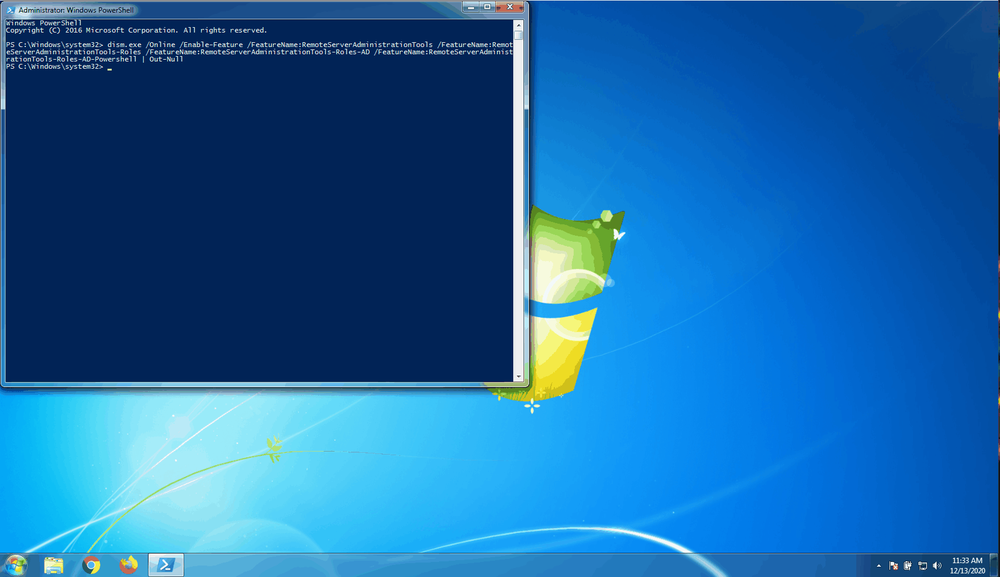
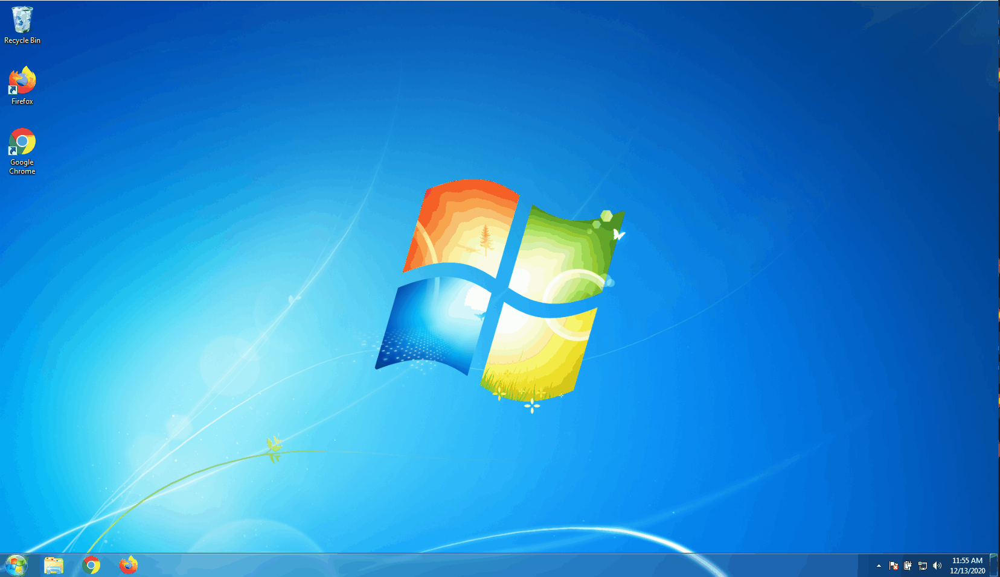
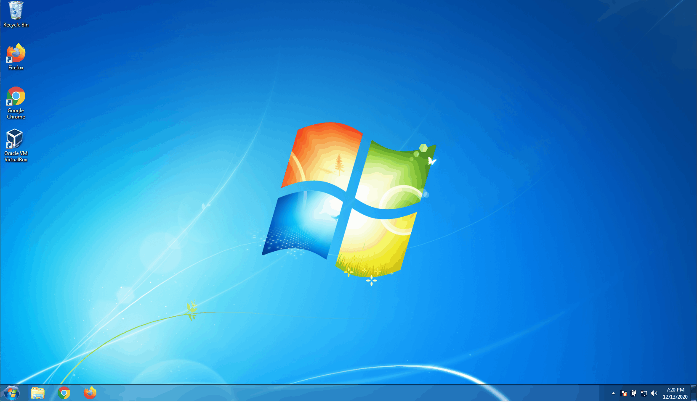

# Docker Installation - Windows 7

### Enable Virtualization
* Check virtualization by running the script below:
    * [`https://www.grc.com/files/securable.exe`](https://www.grc.com/files/securable.exe)

[](./check-virtualization-isenabled.gif)


### Install WUSA.exe
* Execute commands below from powershell
    * `choco install chocolatey-windowsupdate.extension`


### Install Hotfix
* Execute commands below from powershell
    * `Get-HotFix`
    * `dism /online /get-packages`

[](./dism-get-packages-and-hotfix.gif)


### Install Hotfix Using WUSA.exe
* Execute commands below from powershell

```ps1
start $Env:WinDir\system32\wusa.exe "c:\tools\$hotfix" /quiet | out-null
dism.exe /Online /Enable-Feature /FeatureName:RemoteServerAdministrationTools /FeatureName:RemoteServerAdministrationTools-Roles /FeatureName:RemoteServerAdministrationTools-Roles-AD /FeatureName:RemoteServerAdministrationTools-Roles-AD-Powershell | Out-Null
```


[](./dism-enable-rsat.gif)


### Remote Server Administration Tools
* `choco install rsat` (for Windows 7 environment)


[](./failed.choco-install-rsat.gif)


### Verify RSAT is installed

```ps1
powershell.exe -command "&{If ((Get-WmiObject -class win32_optionalfeature | Where-Object { $_.Name -eq 'RemoteServerAdministrationTools'}) -ne $null) {Exit 0} else {If ((Get-Module -Name ActiveDirectory -ListAvailable) -ne $null) {Exit 0} else {Exit 1}}}
```

[](./verify-rsat.gif)


### Oracle Virtual Box
* `choco install virtualbox`

[](virtualbox-install.gif)


### Docker Command Line Interface
* `choco install docker-cli`

[](docker-cli-install.gif)


### Docker Oracle Virtual Machine
* `choco install docker-machine`

[](docker-machine-install.gif)


### Docker ToolBox
* `choco install docker-toolbox`

[](./choco-install-docker-toolbox.gif)


### Launch and View Default Docker Image
* `docker-machine create default`

[](./docker-machine-create-default.gif)


<!-- 
https://social.technet.microsoft.com/wiki/contents/articles/7900.automate-remote-server-administration-tools-rsat-deployment-using-powershell.aspx
-->