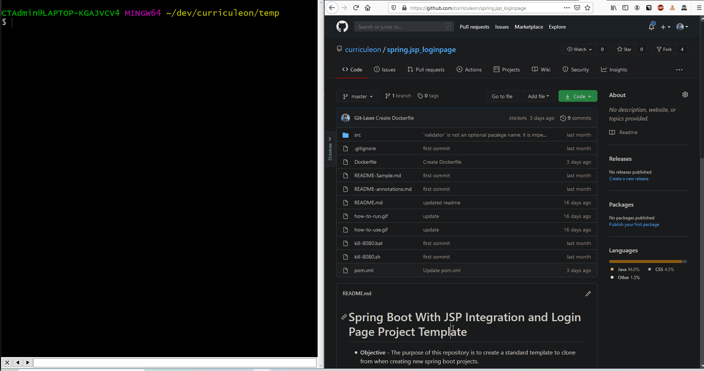

# How to SSH Into a Docker Container

[](./ssh-into-docker-container.gif)

```
git clone https://github.com/curriculeon/spring.jsp_loginpage my-containerized-application
cd my-containerized-application
mvn package
cat Dockerfile
docker image build -t image-name .
docker container run --name container-name -p 8080:8080 -d image-name
docker exec -it container-name bash
# winpty docker exec -it container-name bash # (from windows terminal)
```