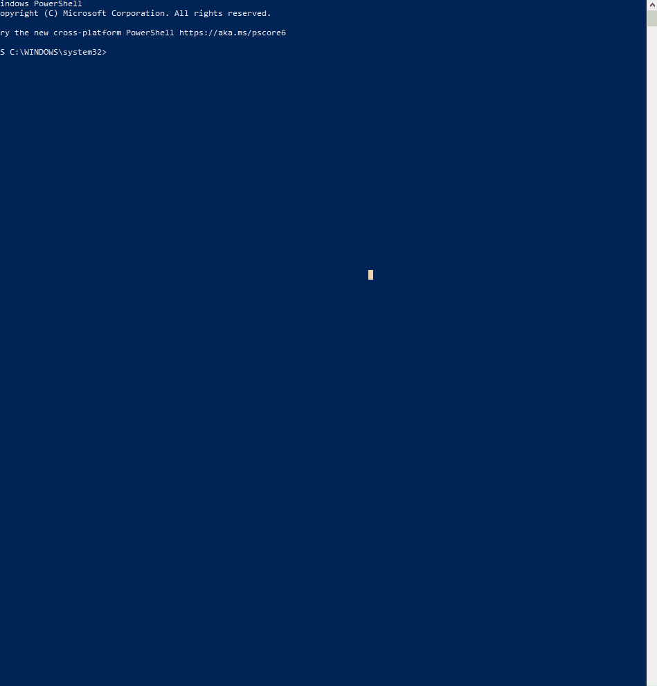

# Install MySQL


## Windows OS
* Execute the command below to install mysql
    * `choco install mysql -y`

[](./install-mysql.gif)


* From an administrative powershell execute the commands below to connect to the database

```bash
mysqld -u root restart
net stop MySQL
net start MySQL
mysql -uroot
```

* Execute the command below to change the root password from `''` to a new password

```sql
ALTER USER 'root'@'localhost' IDENTIFIED BY 'new_password';
```