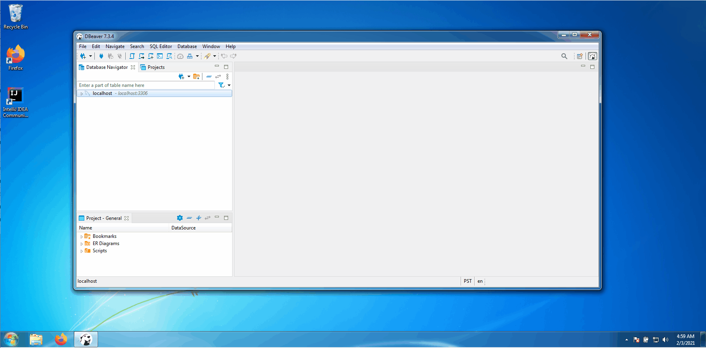
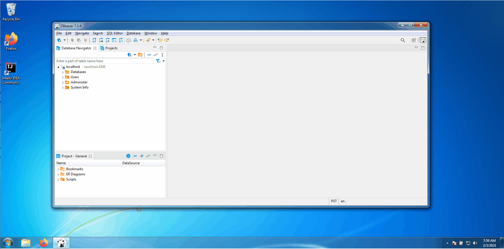
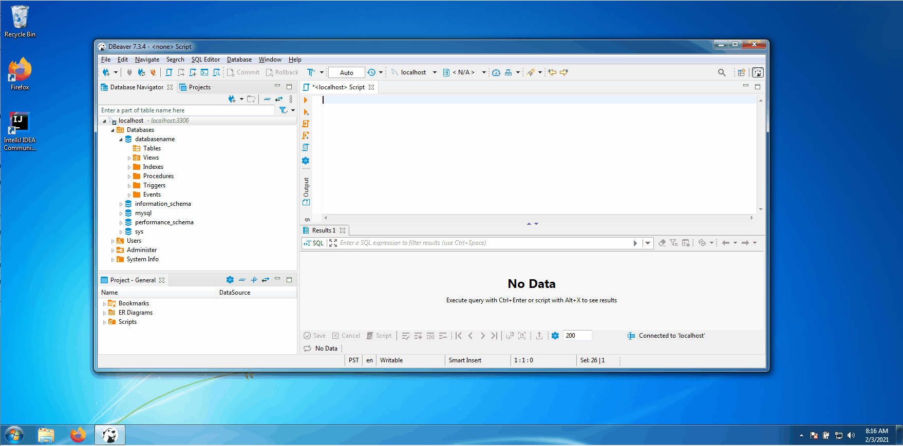

# My First Database

### Overview
* Prerequisites
* Create Database Connection
* Create Database within Database Connection
* Create Table within Database
* Create Record within Table


### Prerequisites
* [Install DBeaver](../install-dbeaver/content.md)


### Create MySQL Connection

[](./create-mysql-connection.gif)


### Install MySQL Driver

[](./install-mysql-driver.gif)


### Create Database

* Execute the command below to create a new database named `databaseName`

```sql
CREATE DATABASE IF NOT EXISTS databaseName;
```


[](./create-database.gif)


### Create Table

* Execute the command below to create a new table within the database named `tableName`.
    * The table will have a column representative of its `primary key`, named `id` of type `integer` which `auto increments` upon record insertion.
    * The table will have a column representative named `name` of type `text` which `auto increments` upon record insertion.


```sql
CREATE TABLE IF NOT EXISTS databaseName.tableName(
	id INT AUTO_INCREMENT PRIMARY KEY,
	name TEXT NOT NULL,
	name_abbreviation VARCHAR(3));
```


[](./create-table.gif)


### Insert Records

```sql
INSERT INTO databaseName.tableName(id, name, name_abbreviation) VALUES
    (1, "Leon", "LEO");

INSERT INTO databaseName.tableName(id, name, name_abbreviation) VALUES
    (2, "Christopher", "CRS");

INSERT INTO databaseName.tableName(id, name, name_abbreviation) VALUES
    (3, "Hunter", "HNT");
```

[](./insert-records.gif)


### Select All Records

```sql
SELECT * FROM databaseName.tableName
```


[](./select-all-records.gif)


### Select All Records Where


```sql
SELECT * FROM databaseName.tableName WHERE id > 1
```

[](./select-all-records.gif)