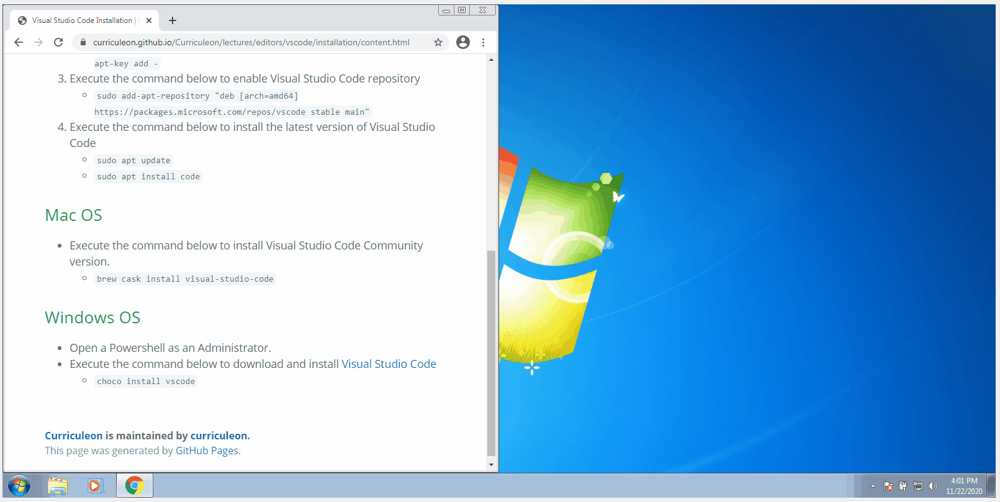
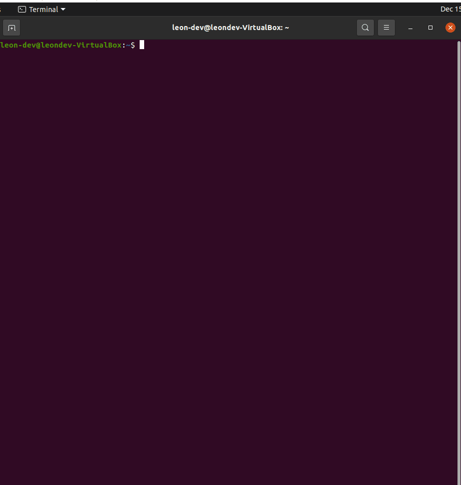

# Visual Studio Code Installation

## Mac OS
* Execute the command below to install Visual Studio Code Community version.
    * `brew install --cask visual-studio-code`

## Windows OS
* Open a Powershell as an Administrator.
* Execute the command below to download and install [Visual Studio Code](https://code.visualstudio.com/download)
    * `choco install vscode`

## Linux OS
1. Execute the commands below to update package index and install the dependencies
    * `sudo apt update`
    * `sudo apt install software-properties-common apt-transport-https wget`

2. Execute the command below to import the Microsoft GPG key
    * `wget -q https://packages.microsoft.com/keys/microsoft.asc -O- | sudo apt-key add -`

3. Execute the command below to enable Visual Studio Code repository
    * `sudo add-apt-repository "deb [arch=amd64] https://packages.microsoft.com/repos/vscode stable main"`

4. Execute the command below to  install the latest version of Visual Studio Code
    * `sudo apt update`
    * `sudo apt install code`

