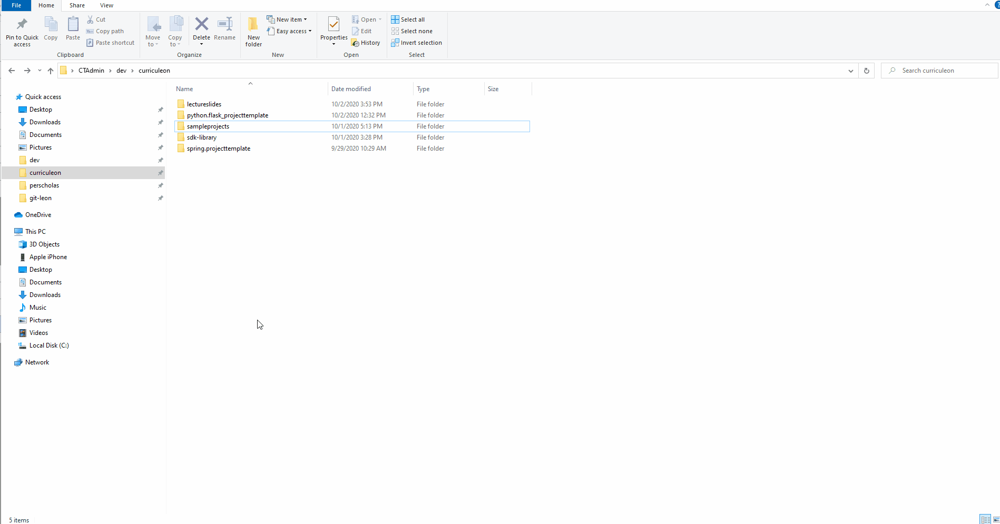

# Tables - Basic Definitions


## Overview
* Brief Demo
* Defining a table
* Naming the table
* Creating and naming columns
* Creating rows


### Demonstration
[](./my-first-table.gif)


### Defining a Table
* _HTML tables_ enable the arrangement of data in rows and columns.

```html
    <table>
    </table>
```


### Naming the Table
* The `<caption>` tag is declared to set the display-name of the table.
* The `<caption>` tag is declared immediately after `<table>` tag.

```html
    <table>
      <caption>Title of Table</caption>
    </table>
```


### Creating and Naming Columns
* The `<table>` tag declares an HTML table
* Rows are declared using the tag `<tr>`
* Columns are named using the table header `<th>` opening and closing tags

```html
    <table>
      <caption>My Table Title</caption>
      <tr>
        <th>Column header 1</th>
        <th>Column header 2</th>
      </tr>
    </table>
```

### Creating columns
* Table rows are divided into table columns(table data)
* Columns are created using the `<td>` opening and closing tags

```html
  <table>
    <caption>My Table Title</caption>
    <tr>
        <th>Column header 1</th>
        <th>Column header 2</th>
    </tr>
    <tr>
        <td>Data 1</td>
        <td>Data 2</td>
    </tr>
  </table>
```


### Example

```HTML
    <table>
      <caption>My Table Title</caption>
        <tr>
          <th>Column header 1</th>
          <th>Column header 2</th>
        </tr>
        <tr>
          <td>Data 1</td>
          <td>Data 2</td>
        </tr>
        <tr>
          <td>Data 3</td>
          <td>Data 4</td>
        </tr>
    </table>
```


## Demonstration
[](./my-first-table.gif)