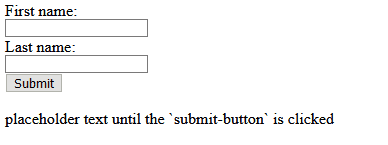

# Working with Basic Form Elements


## Lecture Overview
* HTML Forms
* Input Elements
* Response Forms


## HTML Forms
* The `<form>` element is used to retrieve data from a user.
* A `form` can contain different types of input elements.

```HTML
  <body>
    <form> </form>
  </body>
```


## The `<input>` Element
* Input elements are child elements of the `form` element.
* Input elements are displayed depending on the `type` attribute-value.
* There are 4 types of Input 
  * Text Input Field
  * Text Input Submit Button
  * Radio Button Input
  * Checkbox Input Button


### Text Input Field
* `<input type = "text">`
* Specifies a one-line input field for text input

```HTML
  <form>
    First name:
      <br>
        <input type="text" id="firstname">
      <br>
    Last name:
      <br>
        <input type="text" id="lastname">
  </form>
```


### Text Input Submit Button
* `<input type="submit">`
* Defines a button for submitting form data to a form-handler
* Form-handler is usually a server page with a script for processing input data
* The form-handler is specified in the `form`'s `action` attribute

```HTML
<form id="myform" action="JavaScript:myFunctionName()">
  First name:<br>
  <input type="text" id="firstname" ><br>
  Last name:<br>
  <input type="text" id="lastname" ><br><br>
  <input type="submit" value="Submit">
</form>
```

[](./html-form-object.gif)


### Responsive Forms
* Buttons written in `HTML` can perform actions defined in `JavaScript`.
* Ensuring that the `onClick` event `return false` will prevent the `DOM` from refreshing after the function is called.
* The code snippet written below is JavaScript written within the same file between the `<script>` tags.
  * It should be noted that JavaScript does not have to be written explicitly within the same file.
  * JavaScript can be written in external files, then added into HTML using an expression like the example below
    * `<script type="text/javascript" src="./app.js"><script>`

```html
 <html lang="en">
    <head>
        <meta charset="UTF-8">
        <meta http-equiv="X-UA-Compatible" cont`ent="IE=edge">
        <meta name="viewport" content="width=device-width, initial-scale=1.0">
        <title>Name Echoer</title>

        <script type="text/javascript">
            function evaluateUserInput(){
                let userInputFirstName = document.getElementById("first_name").value;
                let userInputLastName = document.getElementById("last_name").value;
                let outputDisplay = "Your name is: " + userInputFirstName + " " + userInputLastName;
                document.getElementById("output").innerHTML = outputDisplay;
                return false;
            }
        </script>
    </head>
    
    <body>
        <form id="myform">
          First name:<br><input id="first_name" type="text"><br>
          Last name:<br><input id="last_name" type="text"><br>
          <button id="submit_button" onClick="return evaluateUserInput();">Submit</button>
        </form> 
        <p id="output">placeholder text until the `submit_button` is clicked</p>
    </body>
</html>
```

[](./flat-fullstack.gif)


* Below is another example of a responsive form that uses a dropdown menu


```html
<html lang="en">
    <head>
        <meta charset="UTF-8">
        <meta http-equiv="X-UA-Compatible" content="IE=edge">
        <meta name="viewport" content="width=device-width, initial-scale=1.0">
        <title>Favorite Fruit Selector</title>

        <script type="text/javascript">
            function evaluateUserInput(){
                let userName = document.getElementById("user_name").value;
                let selectedFruit = document.getElementById("fruit_select").value;
                let outputDisplay = "Hello, " + userName + "! Your favorite fruit is: " + selectedFruit;
                document.getElementById("output").innerHTML = outputDisplay;
                return false;
            }
        </script>
    </head>
    
    <body>
        <form id="myform">
          <!-- Label for the text input -->
          <label for="user_name">Enter your name:</label><br>
          <input id="user_name" type="text" /><br><br>

          <!-- Label for the select dropdown -->
          <label for="fruit_select">Choose your favorite fruit:</label><br>
          <select id="fruit_select">
            <option value="Apple">Apple</option>
            <option value="Banana">Banana</option>
            <option value="Cherry">Cherry</option>
          </select><br><br>

          <!-- Button to trigger the action -->
          <button id="submit_button" type="submit" onClick="return evaluateUserInput();">Submit</button>
        </form> 
        <p id="output">placeholder text until the `submit_button` is clicked</p>
    </body>
</html>
```


### Key Elements:
* Label element for the text input:
  * The label `"Enter your name:"` is tied to the text input element via the for attribute.
* Text input element:
  * The `<input id="user_name" type="text">` allows the user to enter their name.
* Select element with options:
  * The dropdown created by `<select id="fruit_select">` includes three options: `Apple`, `Banana`, and `Cherry`. 
* Button element of type `"submit"`:
  * The `<button>` with `type="submit"` allows the user to trigger the form submission, which will call the `evaluateUserInput()` function.