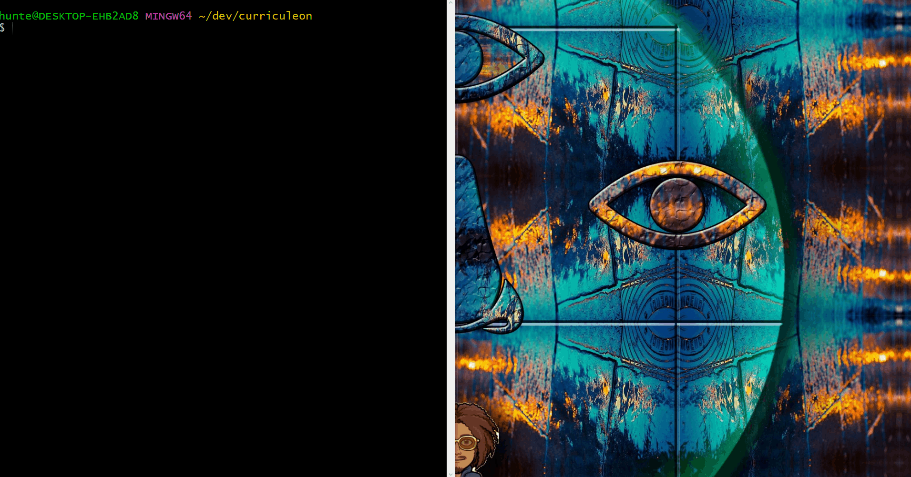
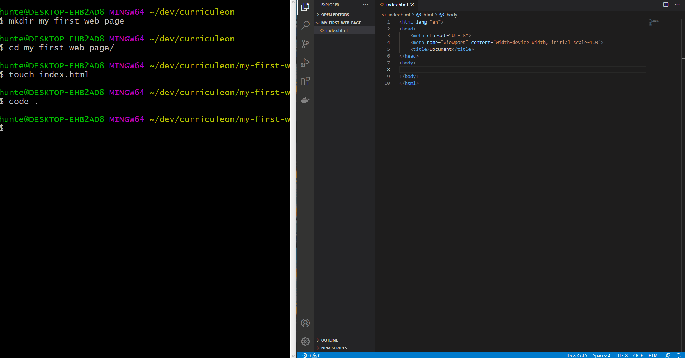
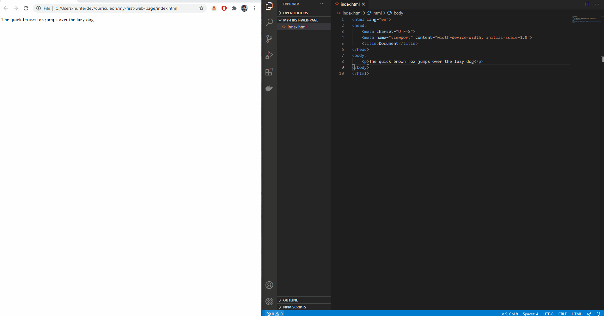
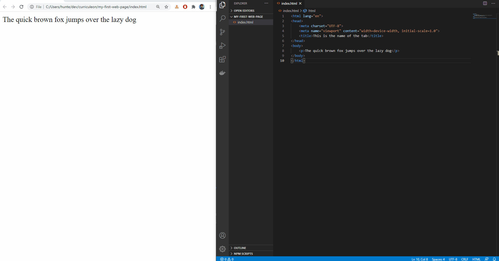
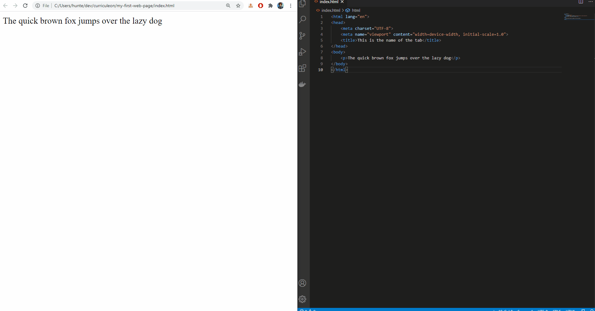
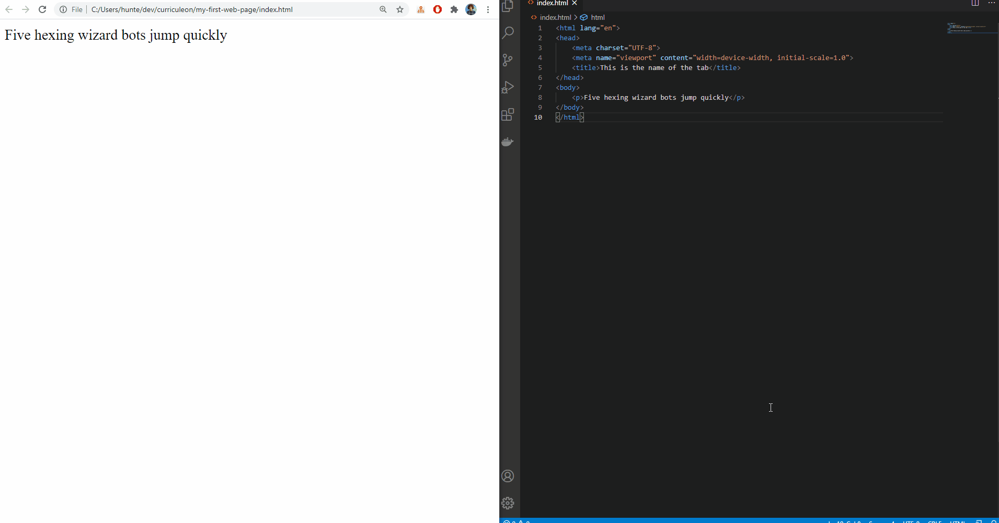
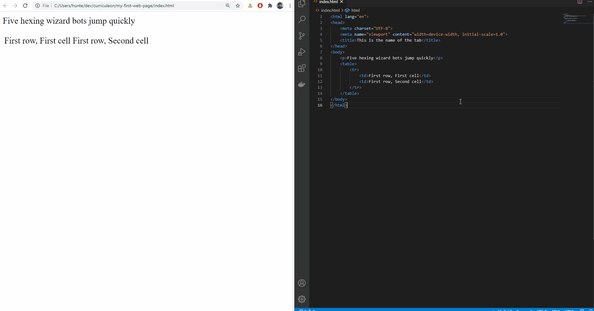
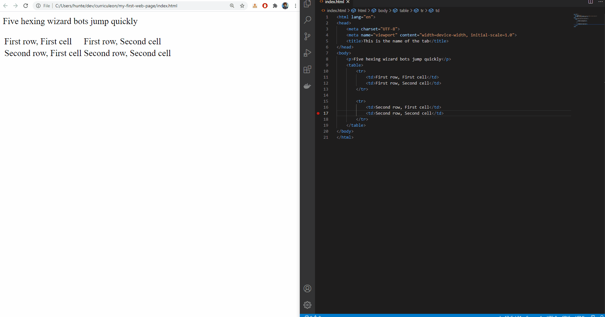
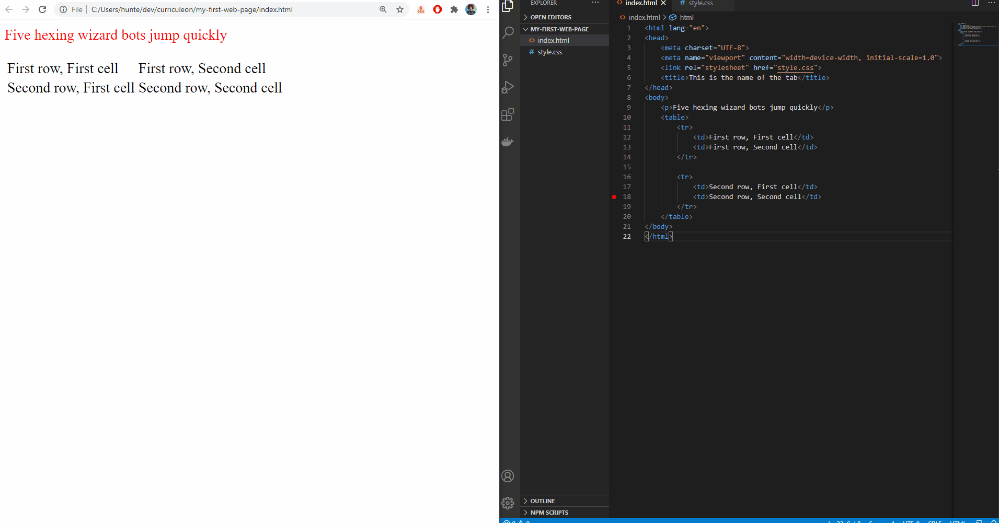

# My First WebPage

## Overview
1. Prerequisites
2. Create Project
3. Changing Tab-Name
4. Creating Paragraphs
5. typographical emphasis

### Pre Requisites
* [Introductory Command Line Scripting](https://curriculeon.github.io/Curriculeon/lectures/terminal/bash/commandline-walkthrough/content.html)
* [Install Visual Studio Code](https://curriculeon.github.io/Curriculeon/lectures/editors/vscode/installation/content.html)


### Create Project

* Create Project Structure and files
    * `mkdir ~/dev`
    * `cd ~/dev`
    * `mkdir my-first-webpage`
    * `cd my-first-webpage`
    * `touch index.html`
    * `code .`

#### Use `emmet` to Create HTML Boilerplate Code

* Execute the command below from VSCode editor to use `emmet` to auto-generate HTML code.
    * `doc`

```html
<html lang="en">
<head>
    <meta charset="UTF-8">
    <meta name="viewport" content="width=device-width, initial-scale=1.0">
    <title>Document</title>
</head>
<body>
    
</body>
</html>
```

[](./img/emmet-expression-doc.gif)

### Add Paragraph

* The `p` tag is used to set a _paragraph_ of text.

    ```html
    <p>The quick brown fox jumps over the lazy dog</p>
    ```

* Open `index.html` with a browser to view the webpage

[](./img/emmet-expression-p.gif)


### Change Title

* The `title` tag is used to set the name of the tab in the browser.

[](./img/change-tab-name.gif)


### Typographical Emphasis
* The `b` tag is used to typographically emphasize text with **bold** styling
* The `i` tag is used to typographically emphasize text with _italic_ styling
* The `u` tag is used to typographically emphasize text with <u>underline</u> styling

```html
<p>The <i>quick</i> <b>brown</b> <u>fox</u> jumps over the lazy dog</p>
```

[](./img/emmet-expression-bold-italics-underline2.gif)


### Line Break
* The `br` tag is used to create a _line break_, or _new line_ on the page.

[](./img/html-line-break.gif)


### Tables

* The `table` tag is used to start a new _table_
* The `tr` tag is used to start a new _row_ within a table
* The `td` tag is used to start a new _data_ cell within a row.

#### Table Example 1
* 1 Row, 2 Cells per row

```html
<table>
    <tr>
        <td>First row, First cell</td>
        <td>First row, Second cell</td>
    </tr>
</table>
```

[](./img/table-1row-2cells.gif)


#### Table Example 1
* 2 Rows, 2 Cells per row

```html
<table>
    <tr>
        <td>First row, First cell</td>
        <td>First row, Second cell</td>
    </tr>

    <tr>
        <td>Second row, First cell</td>
        <td>Second row, Second cell</td>
    </tr>
</table>
```


[](./img/table-2rows-2cells.gif)


### Styling
* `CSS` is used to _style_ an `HTML` document
* Create a new file named `style.css` and add a `link` with a `href` set to the `style.css` path.
* Style the `.css` document by stating a _selector_, followed by the specified _styling_ to apply.


#### Styling Example 1
* Here, we change the `p` style to have a `color` of `red`

```css
p {
    color: red
}
```

[](./img/style-p-tag-with-color.gif)


#### Styling Example 2
* In the animation below we
    1. change the `table` style to have a `border-style` of `solid`
    2. refresh the browser
    3. change the `tr` style to have a `border-style` of `solid`
    4. refresh the browser

```css
td {
    border-style: solid;
}
```

[](./img/table-border.gif)


### Creating a repository
* Ensure this project is _pushed_ to github.
* Follow the article below a guide for how to create a repository
  * https://curriculeon.github.io/Curriculeon/lectures/version-control-systems/git/my-first-repository/content.html