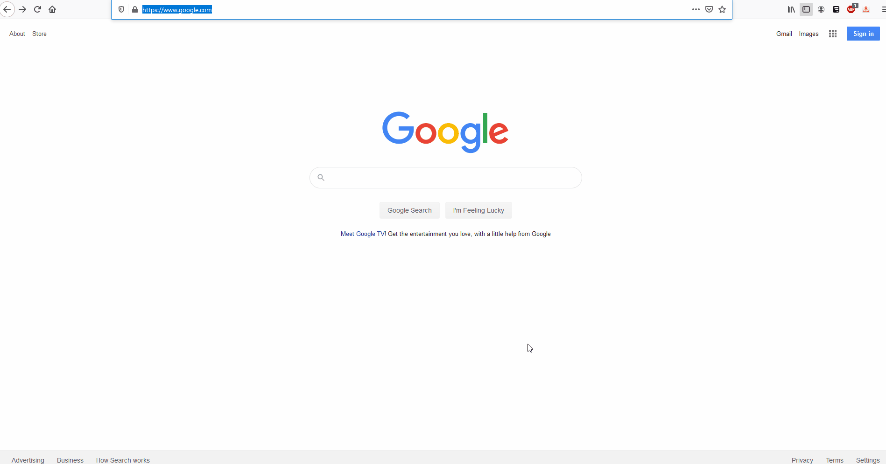
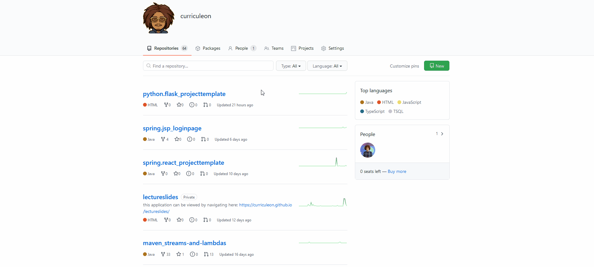

# HTML Element

## Overview
* What is a markup language?
* What is HTML?
* What is a tag in a markup language?
* What is an example of a tag being used in HTML?
* Making Changes With Browser Developer Tools
* Viewing Network Requests


### What is a markup language?
* A markup language is a way of annotating text or other content with additional information that can be understood by computers.
* Markup languages use tags and other types of markup to annotate text and other content, allowing computers to process and interpret the information in a specific way.
* Some common examples of markup languages include HTML, XML, and LaTeX.


### What is HTML?

* HTML is a markup language used to structure and organize content on the web.
* It stands for _Hypertext Markup Language_
* HTML is used to create the structure and layout of web pages by using a series of tags and elements.
* HTML allows you to create paragraphs, lists, and other types of content, (like links and images) to your web pages.
* It is the foundation of most websites and plays a crucial role in the design and development of web pages.


### What is a tag in a markup language?

* In a markup language, a tag is a piece of code that is used to annotate text or other content.
* Tags are typically enclosed in angle brackets, and they are used to indicate the start and end of an element.
* For example, in HTML, the `<p>` tag is used to indicate the start of a paragraph, and the `</p>` tag is used to indicate the end of a paragraph.
* Tags can also have attributes, which are additional pieces of information that provide additional details about the element.
* For example, the `<a>` tag, which is used to create a link, has an href attribute that specifies the URL of the link.

### What is an example of a tag being used in HTML?

* Here is an example of a tag being used in HTML:

```html
<p>This is a paragraph of text.</p>
```

* In this example, the `<p>` tag is the starting tag, and the `</p>` tag is the ending tag.
* These tags indicate that the text between them is a paragraph, and they tell the web browser how to display the text.
* The starting tag indicates the beginning of the element, and the ending tag indicates the end of the element.


* Here is another example of a tag being used in HTML:

```html
<h1>This is a heading</h1>
```

* In this example, the `<h1>` tag is the starting tag, and the `</h1>` tag is the ending tag.
* These tags indicate that the text between them is a level-1 heading, and they tell the web browser how to display the text.
* Headings are used to create a hierarchy of information on a web page, with level-1 headings being the most important and level-6 headings being the least important.
* The `<h1>` tag is used for the most important heading, `<h2>` is used for the second-most important heading, and so on.
* In general, tags in HTML are used to annotate text and other content with additional information that specifies how the content should be displayed by a web browser.
* This allows web browsers to interpret and display the content of a web page in a consistent and predictable way.


### Making Changes With Browser Developer Tools
* Most modern web browsers have built-in developer tools that allow you to edit an HTML web page and see the changes in real-time.
* To access the developer tools in your web browser, you can use the following steps:
    1. Open the web page you want to edit in your web browser.
    2. Right-click on the web page and select the "Inspect" or "Inspect Element" option from the context menu. This will open the developer tools panel in your web browser.
    3. In the developer tools panel, you will see the HTML code for the web page on the left side, and a preview of the web page on the right side.
    4. To edit the HTML code, simply click on the code on the left side and make the changes you want. As you make changes, you will see the preview of the web page on the right side update in real-time.
    5. When you are finished making changes, you can close the developer tools panel and refresh the web page to see the changes you made.
* Keep in mind that these changes are only temporary and will not be saved when you close the web page or your web browser.
* To make permanent changes to an HTML web page, you would need to edit the HTML code directly and save the changes to the web page.

[](./dom-inspector.edit-html.gif)


### Viewing Network Requests

* Most modern web browsers have built-in developer tools that allow you to view network requests made by a web page.
* To view network requests with the developer tools in your web browser, you can use the following steps:
    1. Open the web page you want to view network requests for in your web browser.
    2. Right-click on the web page and select the "Inspect" or "Inspect Element" option from the context menu. This will open the developer tools panel in your web browser.
    3. In the developer tools panel, click on the "Network" tab to view network requests.
    4. As you browse the web page, you will see network requests appear in the network panel. You can click on a network request to view details about the request, such as the URL, method, status, and response time.
* This can be useful for debugging and optimizing a web page, as you can see which resources are being loaded and how long they take to load.
* You can also use the network panel to simulate slow network conditions and see how the web page behaves in those conditions.

[](./dom-inspector.view-requests.gif)