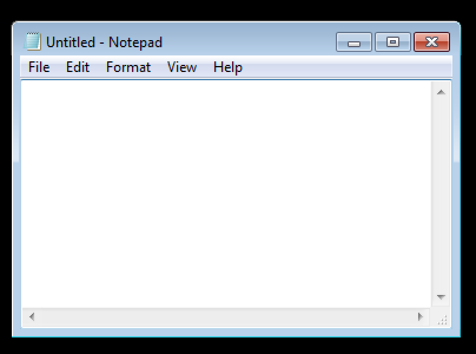
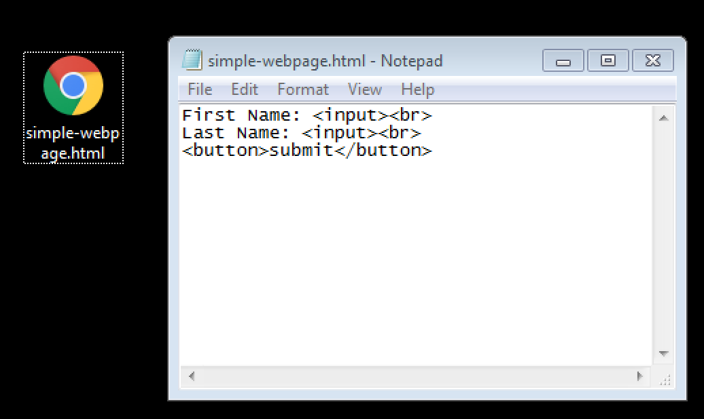
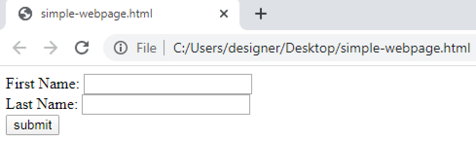
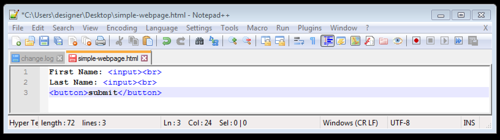

# Integrated Development Environments (IDEs)
## What is an IDE?

-
-
### Lecture Overview

What is a text editor?

Text Editor examples

What is an IDE?

IDE Examples

-
-
### What is a text editor?
* A text editor is a computer program that edits _plain text_.
* A text editor can be used to change the content of **arbitrary** file-types. 
* `Notepad` and `Notepad++` are examples of text editors in the Windows operating system environment

-
#### Text Editor Example
##### Notepad
* Edits a SINGLE file
* Great tool for micro-edits up to 20 lines
* Bad tool for editing large amounts of text
* Terrible tool for formatting text (no formatting support)

-
#### Notepad View

-
#### Notepad
##### Creating a simple webpage
* A very simple webpage can be created with the following code

-
#### A very simple webpage

-
#### Notepad Takeaways
* While this is a highly effective way of demonstrating how to create a minimum-viable-product, it does not translate well to how things are handled on-the-job.
* Typically, developing a webpage will require many more intermediate instructions to be injected in the code.
* Thus, Notepad is not a suitable tool for developing large applications

-
-
### Notepad++
* Edits several files; Has a tab-view
* Great tool for managing several micro-edits up to 20 lines.
* Great tool for syntax-highlighting; a feature that color-codes common programming-keywords
* Very difficult to manage folders of information
* Bad tool for editing large amounts of text
* Terrible tool for formatting text (no formatting support)
* Overall a superior tool to Notepad

-
-
### Notepad++ View

-
#### Integrated Development Environment
* Discussion point 2A.1
* Discussion point 2A.2
* Discussion point 2A.3

-
#### Sub-topic 2B
* Discussion point 2B.1
* Discussion point 2B.2
* Discussion point 2B.3

-
#### Sub-topic 2C
* Discussion point 2C.1
* Discussion point 2C.2
* Discussion point 2C.3

-
-
### Topic 3
* Sub-topic 3A
* Sub-topic 3B
* Sub-topic 3C

-
#### Sub-topic 3A
* Discussion point 3A.1
* Discussion point 3A.2
* Discussion point 3A.3

-
#### Sub-topic 3B
* Discussion point 3B.1
* Discussion point 3B.2
* Discussion point 3B.3

-
#### Sub-topic 3C
* Discussion point 3C.1
* Discussion point 3C.2
* Discussion point 3C.3

-
-
## Lecture Summary
* Topic 1 Summary
* Topic 2 Summary
* Topic 3 Summary
