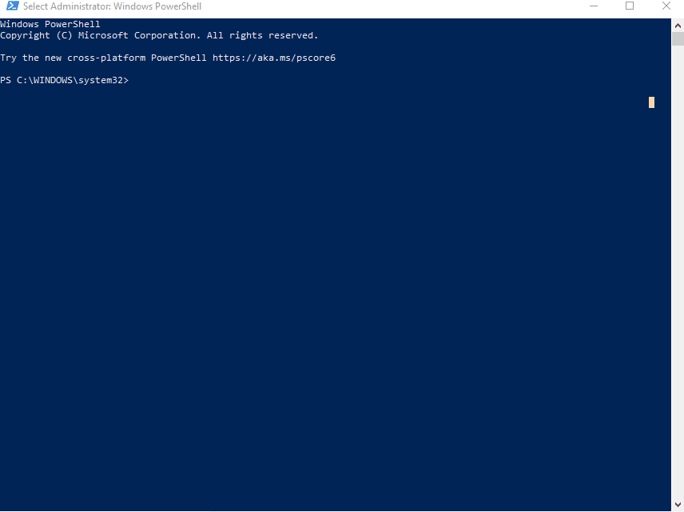

# Uploading `.jar` to `packagecloud.io` for Private/Custom Dependency Imports
## Install Ruby

## Install `package_cloud` Ruby gem
1. Execute the command below to install `package_cloud`
  * `sudo gem install package_cloud `
2. Execute the command below to echo the local installation directory of `package_cloud`
  * `gem which package_cloud`
3. Execute the command below to echo the local installation directory of `RubyGems Environment`
  * `gem env`
  * Copy the `EXECUTABLE DIRECTORY` to a clipboard.
4. Execute the command below to append `RubyGems Environment` to your `PATH` variable
  * `export PATH="$PATH:EXECUTABLE_DIRECTORY"`
  * replace `EXECUTABLE_DIRECTORY` with the directory copied from step `3`

[](./install-packagecloud.gif)


## Create `package_cloud` account
* Navigate to [packagecloud.io](https://packagecloud.io/users/new) to create a new account.
  * **DO NOT** click _Sign Up With Github_
  * **DO NOT** click _Sign Up With Bitbucket_
* Ensure that you create a new account using <u>email and password</u>.


## Push the `.jar` to your repository
* Navigate to the directory of your `.jar`
* Push the `.jar` to your repository.


### Generified command:
* **Multi-line view:**

```
package_cloud push
username/repositoryname
jar-name.jar-coordinates=groupid:artifactid:version
```
* **Single-line view:**

```
package_cloud push username/repositoryname jar-name.jar --coordinates=groupid:artifactid:version
```

### Sample command:
* **Multi-line view:**

```
package_cloud push
git-leon/utils
project-assembly-generator-1.0.jar-coordinates=com.github.git-leon:project-assembly-generator:1.0
```

* **Single-line view**

```
package_cloud push git-leon/utils project-assembly-generator-1.0.jar --coordinates=com.github.git-leon:project-assembly-generator:1.0
```


### Troubleshooting
#### Cloud Deployment Platform Receives Jar, but exposes War
* Java projects often include javadocs, an HTML overview of the project structure and classes that make up the application.
* If a Java project is `mvn package`d with its respective `javadocs` included in the `.jar`, then upon deployment, the platform which receives the `.jar` may interpret and expose it as a `.war`, assuming it is a _web application archived java resource_.
* Resolve this issue by removing the respective `javadocs` from the application prior to generating the `.jar` via `mvn package`.