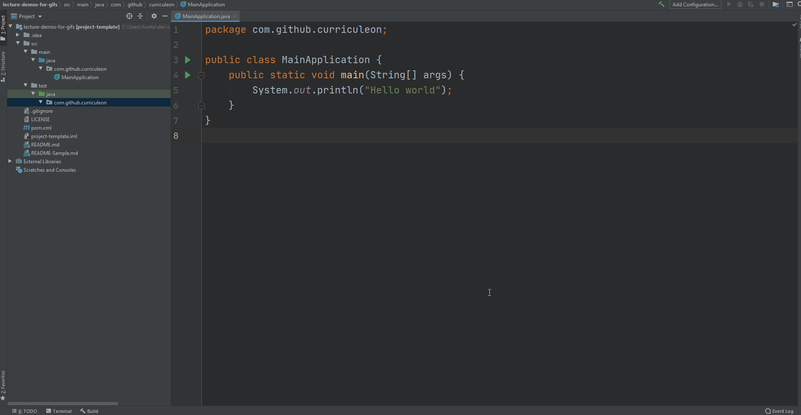

# Types


<!-- supertopic -->
## Overview
* Data Types
* Object-type
* Variable Initialization / Assignment Statements
* Variable Declaration
* Variable Instantation
* Casting


<!-- supertopic -->
### Data Types
* In Object Oriented Programming (OOP) languages, "Everything is an _Object_".
* The simplest program one could write is named the ["Hello, World!" program](https://en.wikipedia.org/wiki/%22Hello,_World!%22_program).
* This program states three essential things:
    1. There will be a _classification_ of an Object named `ApplicationRunner`.
    2. The `ApplicationRunner` has one _static_ behavior named `main`.
    3. The _behavior_ of the `main` method is to print, "Hello, World!" to the console.

```java
public class ApplicationRunner {
    public static void main(String[] args) {
        System.out.println("Hello, World!");
    }
}
```

[](./hello-world-program.gif)


<!-- subtopic -->
### Object Type
* In Object Oriented Programming, an _object_ is _any value in memory referenced by an identifier_.
* An object can be a
    * variable
    * data structure
    * function
    * method
* Because "everything is an object", all variables can be _assigned_ to the `Object` _type_.
* A _type_ is the name of the _class_ of an object.
* A _class_ is a template, or blueprint from which objects are created
	* it is the cookie-cutter to a cookie
	* it is the _classification_ of an object.
* An _object_ is an instance of a class.
* All objects have the following three traits:
    * objects have a state
    * objects have behaviors
    * objects have an identity


<!-- subtopic -->
```java
public class ApplicationRunner {
    public static void main(String[] args) {
        Object age = 27;
        Object ageGreeting = "My age is ";        
        Object ageOutput = ageGreeting + age;

        System.out.println(nameOutput);
    }
}
```

* Output

```
My age is 27
```


<!-- supertopic -->
### Variable Initialization
* Any expression which states a _variable type_, a _variable name_, an equal operator (`=`), followed by a _variable value_, is considered an **assignment statement**.
* All _assignment statements_ result in variable initialization or reinitialization.
    * General Syntax: `VariableType variableName = ${some-value-here};`
    * Example 1: `Object age = 27;`
    * Example 2: `Object name = "Leon Hunter";`
    * Example 3: `Object accountBalance = 999999.99;`


<!-- subtopic -->
### Variable Declaration
* Any expression which states a _variable type_ and a _variable name_, but omits the equal operator (`=`) followed by a variable value, is considered a **variable declaration**.
    * General Syntax: `VariableType variableName;`
    * Example 1: `Object age;`
    * Example 2: `Object name;`
    * Example 3: `Object accountBalance;`

<!-- subtopic -->
### Variable Instantiation
* Any expression which states a _variable type_, a _variable name_, an equal operator (`=`), followed by the keyword `new`, is considered a **variable instantiation**.
    * General Syntax: `VariableType variableName = new VariableType();`
    * Example 1: `Object age = new Integer(27);`
    * Example 2: `Object name = new String("Leon Hunter");`
    * Example 3: `Object accountBalance = new Double(99999.9);`


<!-- supertopic -->
### Why is Type relevant?
* The declared type of a variable determines which behaviors it will be able to perform.
* In OOP, _methods_ denote behavior.
* _Methods_ are functions defined within the scope of a class.
* In pure OOP languages, all functionality is achieved through _methods_, not _functions_.

<!-- subtopic -->
### Notable Object Behaviors
* The two most notable object behaviors are `.toString()` and `.equals()`

<!-- subtopic -->
#### .toString()
* An `Object` can convert to string

```java
public class ApplicationRunner {
    public static void main(String[] args) {
        Object ageAsInteger = 27;
        Object ageAsString = age.toString();
    }
}
```

<!-- subtopic -->
#### .equals()
* An Object can compare its equivalence


```java
public class ApplicationRunner {
    public static void main(String[] args) {
        Object ageAsInteger = 27;
        Object ageAsString = age.toString();
        Object areObjectsEqual = ageAsInteger.equals(ageAsString);
    }
}
```


<!-- supertopic -->
### What is Casting?
* Because [the declared type of a variable determines which behaviors it will be able to perform](#why-is-type-relevant), assigning variables to `Object` gives access to very few behaviors.
* An `Object` can be treated as a more-specific type through a mechanism called _down-casting_.
    * Downcasting gives access to more behaviors.
* An `Object` can be treated as a less-specific type through a mechanism called _up-casting_.
    * Upcasting restricts access to more-specific behaviors.


<!-- subtopic -->
### How to Cast
* To cast a Type to another Type, _wrap_ the desired type in parenthesis, and _associate_ it with the  _value_.

* **General Syntax:**

```java
VariableType variableName = new VariableType();
DesiredType newVariableName = (DesiredType)variableName;
```

* **Example 1:**

```java
public class ApplicationRunner {
    public static void main(String[] args) {
        Object ageAsObject = 27;
        Integer ageAsInteger = (Integer)ageAsObject;
    }
}
```


* **Example 2:**

```java
public class ApplicationRunner {
    public static void main(String[] args) {
        Object isMaleObject = true;
        Boolean isMaleBoolean = (Boolean)ageAsObject;
    }
}
```


* **Example 2:**

```java
public class ApplicationRunner {
    public static void main(String[] args) {
        Object nameAsObject = "Leon Hunter";
        String nameAsString = (String)nameAsObject;
    }
}
```


<!-- subtopic -->
### When to Cast
* Avoid casting at all times.
* Generally, variables should be declared as their desired type upon initialization


* **Example 1:**

```java
public class ApplicationRunner {
    public static void main(String[] args) {
        Integer ageAsInteger = 27;
    }
}
```


* **Example 2:**

```java
public class ApplicationRunner {
    public static void main(String[] args) {
        Boolean isMaleBoolean = true;
    }
}
```


* **Example 2:**

```java
public class ApplicationRunner {
    public static void main(String[] args) {
        String nameAsString = "Leon Hunter";
    }
}
```

