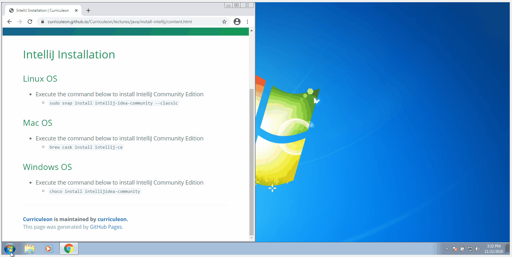

# IntelliJ Installation

## Linux OS
* Execute the command below to install IntelliJ Community Edition
    * `sudo snap install intellij-idea-community --classic`

## Mac OS
* Execute the command below to install IntelliJ Community Edition
    * `brew install --cask intellij-idea-ce`

## Windows OS
* Execute the command below to install IntelliJ Community Edition
    * `choco install intellijidea-community`

