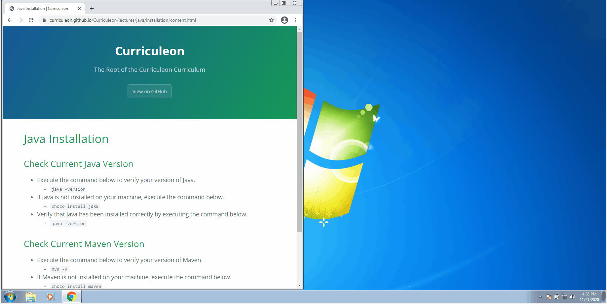

# Java Installation

## Linux OS
* If Java is not installed on your Linux machine execute the command below.
    * `sudo apt-get install openjdk-8-jdk`

## Mac OSX
* If Java is not installed on your OSX machine, execute the command below.
    * `brew tap adoptopenjdk/openjdk`
    * `brew cask install adoptopenjdk8`

## Windows
* Execute the command below to verify your version of Java.
    * `java -version`
* If Java is not installed on your Windows machine, execute the command below.
    * `choco install jdk8`

