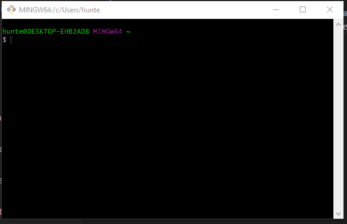

1. Check current java version
2. Check current maven version
1. Java Installation for OSX
  * Install HomeBrew
  * Install Java
2. Java Installation for Windows
  * Download Java
  * Set Path Variables

## Check If java Is Installed On Your Machine
* Execute `java -v` from the commandline to verify that you Java 8 or is higher is installed on your machine.

##

-
-
## Java Installation for OSX

-
## Java Installation for OSX
### Install Homebrew
* Execute the following command to install `Homebrew`
  * `/bin/bash -c "$(curl -fsSL https://raw.githubusercontent.com/Homebrew/install/master/install.sh)"`

-
## Java Installation for OSX
### Install Java
* Execute the following command to install `Java`
  * `brew cask install java8`

-
-
# Java Installation for Windows

-
### Download `Java8`
* Download Java directly by navigating to the link below or clicking [here](https://download.java.net/openjdk/jdk8u41/ri/openjdk-8u41-b04-windows-i586-14_jan_2020.zip).
  * https://download.java.net/openjdk/jdk8u41/ri/openjdk-8u41-b04-windows-i586-14_jan_2020.zip
  * https://jdk.java.net/java-se-ri/8-MR3

-
## Move to proper directory
* Upon extracting the files, locate the parent folder of the `bin` folder and move the parent somewhere you feel comfortable
  * For example, `C:\Program Files\Java\jdk-8`

-
## Add Java Home to System Environment
* Add your Java to your `PATH` variable
* Execute `SystemPropertiesAdvanced.exe` from the `run` window, or a command prompt.
  * Add the new Java path with the key `JAVA_HOME` variable, and the path of the jdk.
    * For example, `C:\Program Files\Java\jdk-8`

-
## Add Java to `PATH`
* Add your Java to your `PATH` variable
* Execute `SystemPropertiesAdvanced.exe` from the `run` window, or a command prompt.
  * Append the new Java path to the `PATH` variable, by wrapping the Java path with a semicolon `;`.
    * For example, `;C:\Program Files\Java\jdk-8\bin;`
  * (In Windows 8+, this can be done by clicking the `new` button)

-
## Verify installation
* Upon finishing coniguration, from a command prompt execute the following command
  * `java -version`

- 
## Trouble shooting
* Navigate [here](https://stackoverflow.com/a/45204402/2414323)
