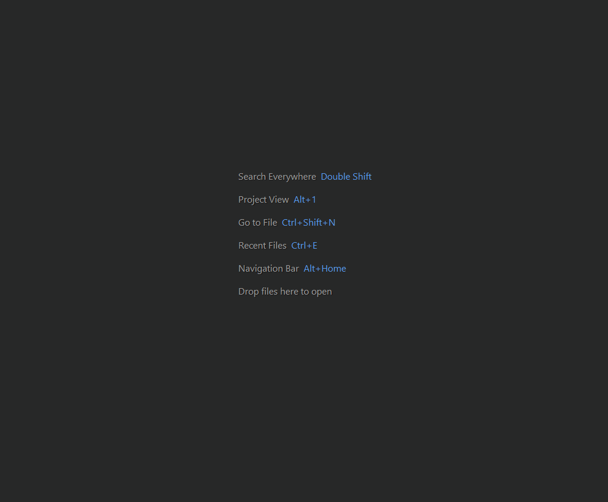

# Set IntelliJ Java Compiler

## Windows
* Open `Settings` window using `Ctrl+Alt+s`.
* Open `Preferences` window using `Ctrl+Alt+Shift+s`

## MacOS
* Open `Settings` window using `Command+,`.
* Open `Preferences` window using `Command+;`

