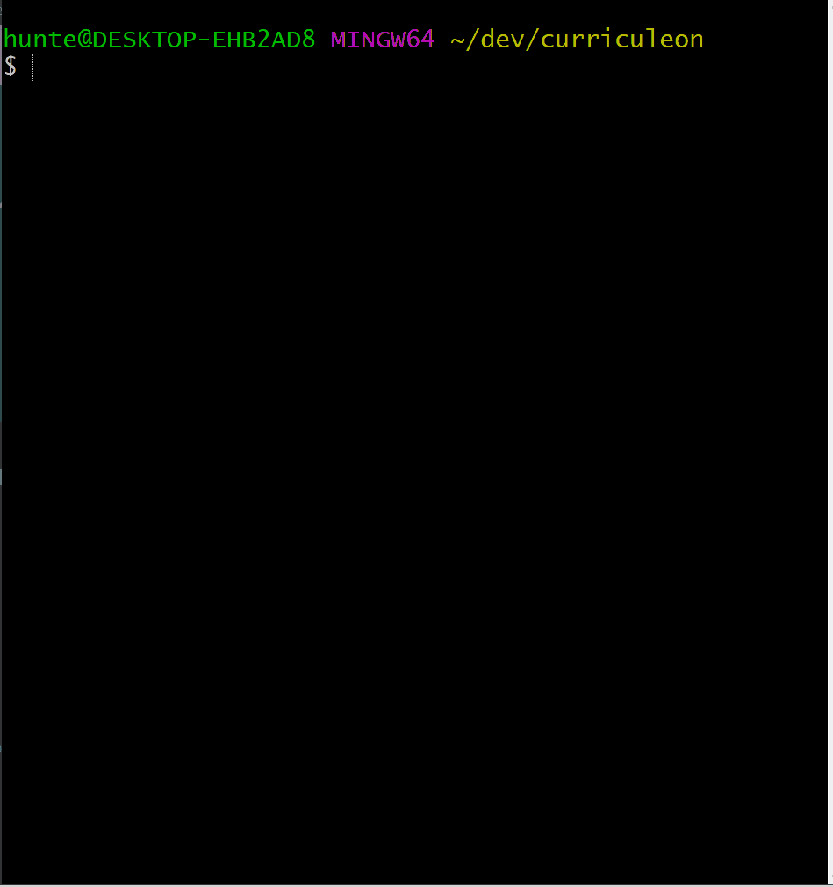

# Exporting and Migrating Data

* Below is a link to a Spring Boot Application with an in-memory [H2 Database]() to test against.
    * [`https://github.com/curriculeon/sql.my-first-query`](https://github.com/curriculeon/sql.my-first-query)

* Upon downloading the project project, execute the command below from the parent directory of the project to run the application
    * `mvn spring-boot:run`

* Navigate to the link  below to log into and view the Database.
    * [`localhost:8080/h2-console`](http://localhost:8080/h2-console)

* Upon accessing the [H2-Console](), execute the command below to export the database schemas along with the data in each respective table
    * `SCRIPT TO 'dump.sql';`

* Execute the command below to export just the database schemas
    * `SCRIPT SIMPLE TO 'dump.txt';`

* Navigate to the root directory of the project to view the output of the exported data.

