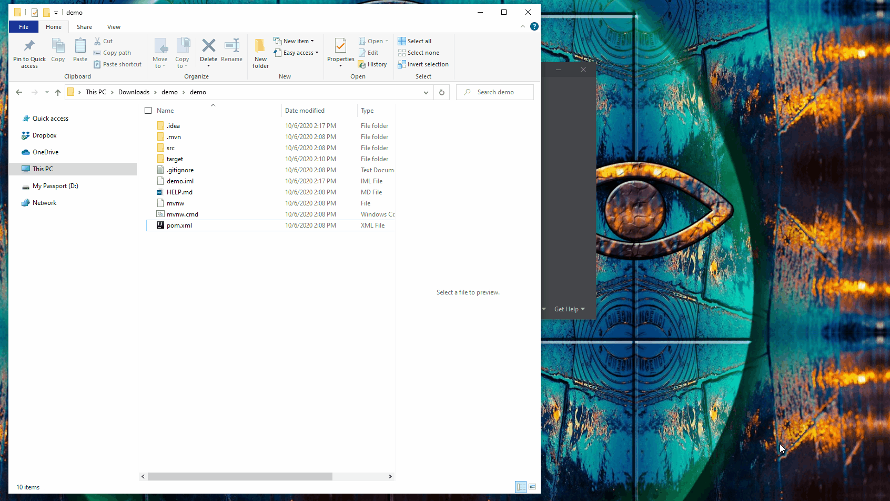
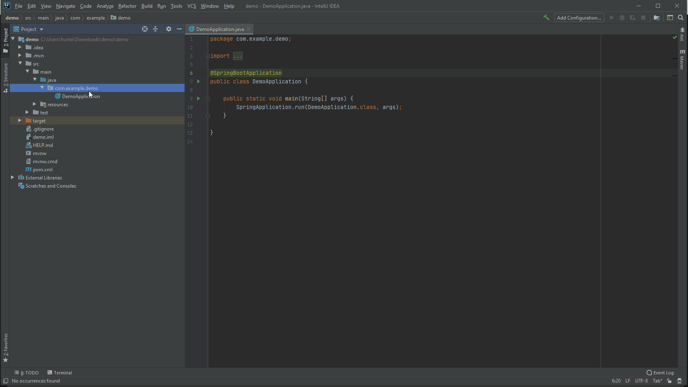
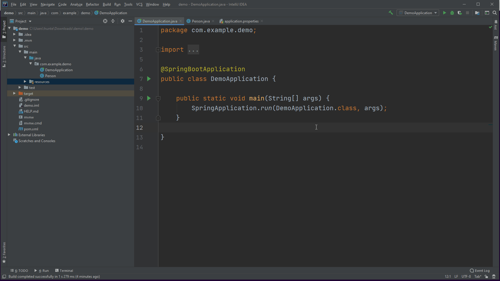

# My First Full Stack Spring Boot / JQuery Application
## Part 1 - Creating an Entity


<video width="device-width" height="480" style="border:1px solid green" controls>
  <source type="video/mp4" src="./videos/1_spring-jquery.mp4">
</video>


_Click [here](../spring-annotations/content.md) to view details about Spring annotations_.

### Generate Project
* Navigate to [`start.spring.io`](https://start.spring.io/)
* Select the following dependencies:
    * `Web Tools`
    * `Spring Data JPA`
    * `H2 Database`
* Press the `Download` button
* Navigate to the `~/Downloads` directory view the newly downloaded `demo.zip` file.
* _Unzip_ the `demo.zip` directory to extract the contents of the newly downloaded file to a folder named `demo`.
* Navigate to the newly extracted `demo` folder.
* Execute `mvn spring-boot:run` from the root directory of `demo` folder to verify that the application can be built by maven
* Navigate to `localhost:8080` from a browser to ensure that the `Whitelabel Page` is displayed.

[](./img/generate-project.gif)


### Open In IDE
* Open the newly downloaded project in IntelliJ
* Ensure that the project is opened via the `pom.xml`.
* Ensure that the `pom.xml` is _opened as a project_, not _as a file_.

[](./img/open-maven-in-intellij.gif)


### Create an Entity
* Create a `Person` Entity.

```java
@Entity
public class Person {
    @Id
    @GeneratedValue
    private Long id;

    private String firstName;
    private String lastName;
    private Date birthDate;

    public Person() {
    }

    public Person(Long id, String firstName, String lastName, Date birthDate) {
        this.id = id;
        this.firstName = firstName;
        this.lastName = lastName;
        this.birthDate = birthDate;
    }

    public Long getId() {
        return id;
    }

    public void setId(Long id) {
        this.id = id;
    }

    public String getFirstName() {
        return firstName;
    }

    public void setFirstName(String firstName) {
        this.firstName = firstName;
    }

    public String getLastName() {
        return lastName;
    }

    public void setLastName(String lastName) {
        this.lastName = lastName;
    }

    public Date getBirthDate() {
        return birthDate;
    }

    public void setBirthDate(Date birthDate) {
        this.birthDate = birthDate;
    }
}
```

[](./img/create-entity.gif)


### View the Entity
* Modify the `/resources/application.properties` file by adding the following configurations

```
server.port=8080
spring.h2.console.enabled=true
spring.h2.console.view=/h2-console
spring.datasource.url=jdbc:h2:mem:testdb
```
* Run the application
* Navigate to `localhost:8080/h2-console` to view the data-layer of the application

[](./img/view-h2console-entity-empty.gif)