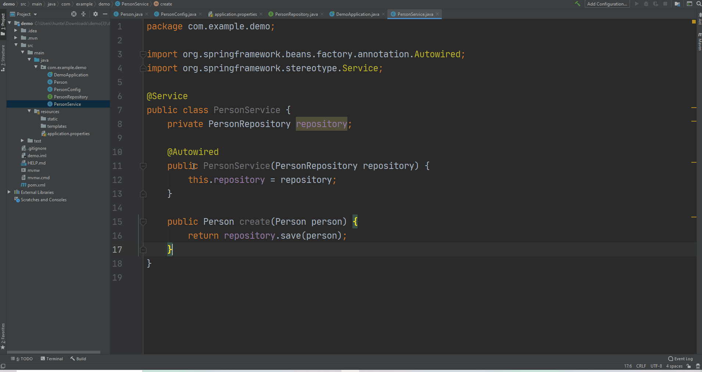

# My First Full Stack Spring Boot / JQuery Application
## Part 3 - Creating a Service

<video width="device-width" height="480" style="border:1px solid green" controls>
  <source type="video/mp4" src="./videos/3_spring-jquery.mp4">
</video>


### Create a Service

```java

@Service
public class PersonService {
    private PersonRepository repository;

    @Autowired
    public PersonService(PersonRepository repository) {
        this.repository = repository;
    }

    public Person create(Person person) {
        return repository.save(person);
    }

    public Person readById(Long id) {
        return repository.findById(id).get();
    }

    public List<Person> readAll() {
        Iterable<Person> allPeople = repository.findAll();
        List<Person> personList = new ArrayList<>();
        allPeople.forEach(personList::add);
        return personList;
    }

    public Person update(Long id, Person newPersonData) {
        Person personInDatabase = this.readById(id);
        personInDatabase.setFirstName(newPersonData.getFirstName());
        personInDatabase.setLastName(newPersonData.getLastName());
        personInDatabase.setBirthDate(newPersonData.getBirthDate());
        personInDatabase = repository.save(personInDatabase);
        return personInDatabase;
    }

    public Person deleteById(Long id) {
        Person personToBeDeleted = this.readById(id);
        repository.delete(personToBeDeleted);
        return personToBeDeleted;
    }
}
```


##### constructor

* Set's the service's repository

```java
@Autowired
public PersonService(PersonRepository repository) {
    this.repository = repository;
}
```

[](./img/service/constructor.gif)


###### `create` Method


* Adds a new record to the table the service's repository is accessing.

```java
public Person create(Person person) {
    return repository.save(person);
}
```

[](./img/service/create.gif)


##### `readById` Method

* Returns the record with the specified ID from the table the table that the service's repository is accessing.

```java
public Person readById(Long id) {
    return repository.findById(id).get();
}
```

[](./img/service/readById.gif)


##### `readAll` Method

* Returns all records from the table the service's repository is accessing.

```java
public List<Person> readAll() {
    Iterable<Person> allPeople = repository.findAll();
    List<Person> personList = new ArrayList<>();
    allPeople.forEach(personList::add);
    return personList;
}
```

[](./img/service/readAll.gif)


##### `updateById` Method

* Updates the record in the database with the specified `id` with the specified `newData`

```java
public Person update(Long id, Person newPersonData) {
    Person personInDatabase = this.readById(id);
    personInDatabase.setFirstName(newPersonData.getFirstName());
    personInDatabase.setLastName(newPersonData.getLastName());
    personInDatabase.setBirthDate(newPersonData.getBirthDate());
    personInDatabase = repository.save(personInDatabase);
    return personInDatabase;
}
```


[](./img/service/updateById.gif)


##### `deleteById` Method

* Deletes the record in the database with the specified `id`

```java
public Person deleteById(Long id) {
    Person personToBeDeleted = this.readById(id);
    repository.delete(personToBeDeleted);
    return personToBeDeleted;
}
```


[](./img/service/deleteById.gif)


