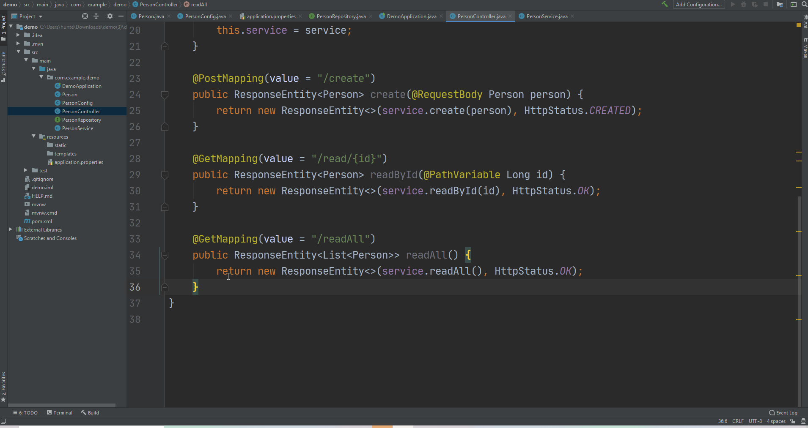

# My First Full Stack Spring Boot / JQuery Application
## Part 4 - Creating a Controller

<video width="device-width" height="480" style="border:1px solid green" controls>
  <source type="video/mp4" src="./videos/4_spring-jquery.mp4">
</video>

### Create a Controller
* _Controllers_ define how to handle _incoming requests_ from and _outgoing responses_ to a client. 
* Controllers provides all of the necessary [endpoints](https://en.wikipedia.org/wiki/Web_API#Endpoints) to access and manipulate respective domain objects.
	*  REST resources are identified using URI endpoints.
* The aggregate of all controller endpoints exposed by a webserver is known as the webserver's [web API](https://en.wikipedia.org/wiki/Web_API).

```java
@Controller
public class PersonController {
    private PersonService service;

    @Autowired
    public PersonController(PersonService service) {
        this.service = service;
    }

    @PostMapping(value = "/create")
    public ResponseEntity<Person> create(@RequestBody Person person) {
        return new ResponseEntity<>(service.create(person), HttpStatus.CREATED);
    }

    @GetMapping(value = "/read/{id}")
    public ResponseEntity<Person> readById(@PathVariable Long id) {
        return new ResponseEntity<>(service.readById(id), HttpStatus.OK);
    }

    @GetMapping(value = "/readAll")
    public ResponseEntity<List<Person>> readAll() {
        return new ResponseEntity<>(service.readAll(), HttpStatus.OK);
    }

    @PutMapping(value = "/update/{id}")
    public ResponseEntity<Person> updateById(
            @PathVariable Long id,
            @RequestBody Person newData) {
        return new ResponseEntity<>(service.update(id, newData), HttpStatus.OK);
    }

    @DeleteMapping(value = "/delete/{id}")
    public ResponseEntity<Person> deleteById(@PathVariable Long id) {
        return new ResponseEntity<>(service.deleteById(id), HttpStatus.OK);
    }
}
```


##### constructor
[](./img/controller/constructor.gif)


##### `create` Method

* The `POST` verb functionality in a `create` method allows us to add a new `Person` record.
* Take note that the method
	* has a parameter of type `@RequestBody Person person`
		* `@RequestBody` tells Spring that the entire request body needs to be converted to an instance of `Person`
	* delegates the `Person` persistence to `PersonRepository`’s save method called by the `PersonService`'s `create` method.

```java
@PostMapping(value = "/create")
public ResponseEntity<Person> create(@RequestBody Person person) {
    return new ResponseEntity<>(service.create(person), HttpStatus.CREATED);
}
```


[](./img/controller/create.gif)


##### `readById` Method

* The code snippet below allows us to access an individual `Person`.
* The _value attribute_ in `@GetMapping` takes a URI template `/read/{id}`.
* The placeholder `{id}` along with `@PathVarible` annotation allows Spring to examine the request URI path and extract the `pollId` parameter value.
* Inside the method, we use the `PersonService`’s `readById` finder method to retrieve the respective `Person` from the `PersonRepository` and pass the result to a `ResponseEntity`.

```java
@GetMapping(value = "/read/{id}")
public ResponseEntity<Person> readById(@PathVariable Long id) {
    return new ResponseEntity<>(service.readById(id), HttpStatus.OK);
}
```

[](./img/controller/readById.gif)


##### `readAll` Method

* The code snippet below allows us to access all `Person` records.
* The _value attribute_ in `@GetMapping` takes a URI template `/read/{id}`.
* The placeholder `{id}` along with `@PathVarible` annotation allows Spring to examine the request URI path and extract the `pollId` parameter value.
* Inside the method, we use the `PersonService`’s `readById` finder method to retrieve the respective `Person` from the `PersonRepository` and pass the result to a `ResponseEntity`.

```java
@GetMapping(value = "/readAll")
public ResponseEntity<List<Person>> readAll() {
    return new ResponseEntity<>(service.readAll(), HttpStatus.OK);
}
```

[](./img/controller/readAll.gif)


##### `update` Method

* The code snippet below enables us to update a `Person` with new data.

```java
@PutMapping(value = "/update/{id}")
public ResponseEntity<Person> updateById(
        @PathVariable Long id,
        @RequestBody Person newData) {
    return new ResponseEntity<>(service.update(id, newData), HttpStatus.OK);
}
```

[](./img/controller/updateById.gif)


##### `deleteById` Method

* The code snippet below enables us to delete a `Person`

```java
@DeleteMapping(value = "/delete/{id}")
public ResponseEntity<Person> deleteById(@PathVariable Long id) {
    return new ResponseEntity<>(service.deleteById(id), HttpStatus.OK);
}
```

[](./img/controller/deleteById.gif)