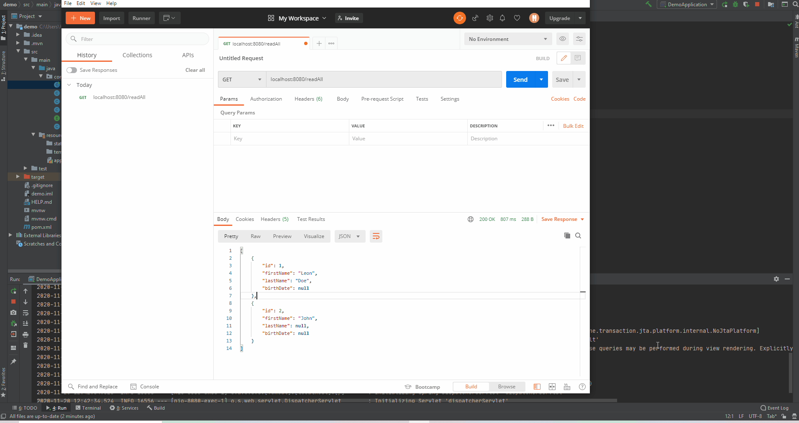
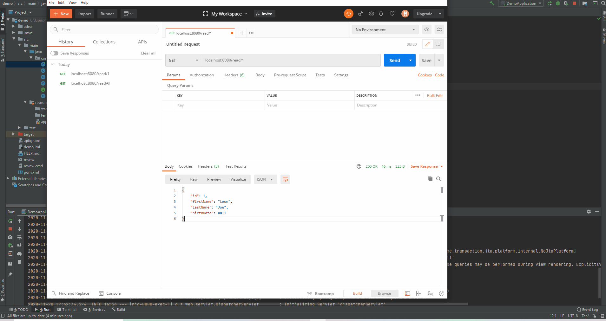
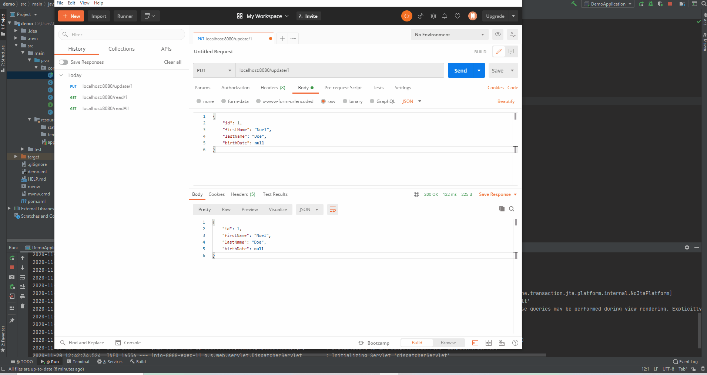
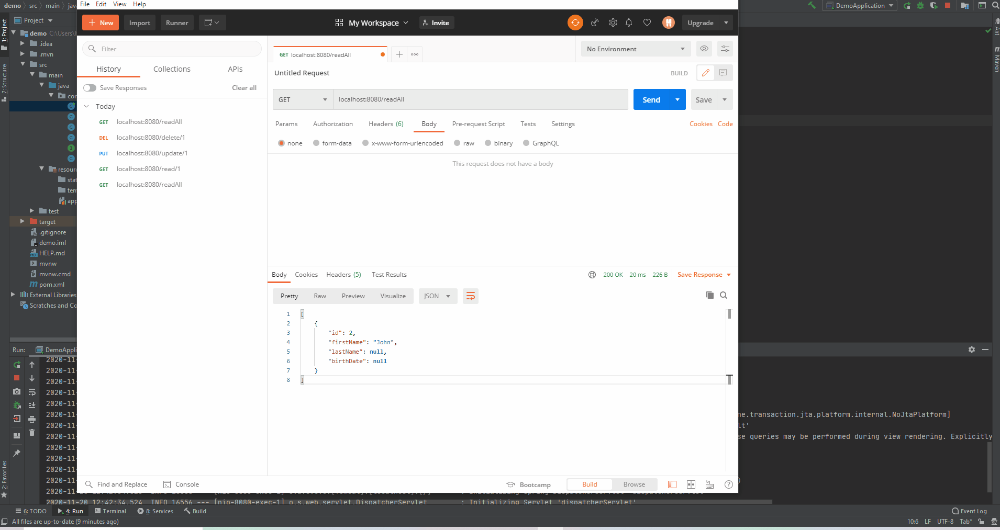

# My First Full Stack Spring Boot / JQuery Application
## Part 5 - Testing With Postman

<video width="device-width" height="480" style="border:1px solid green" controls>
  <source type="video/mp4" src="./videos/5_spring-jquery.mp4">
</video>

### Test Controller

* Launch the [Postman](https://chrome.google.com/webstore/detail/postman/fhbjgbiflinjbdggehcddcbncdddomop?hl=en) app and enter the URI `http://localhost:8080/` and hit Send.
* If your application cannot run because something is occupying a port, use this command with the respective port number specified:
	* ``kill -kill `lsof -t -i tcp:8080` ``

##### `readAll` Method

##### `readById` Method

##### `update` Method

##### `deleteById` Method

##### `create` Method
