# SpringBoot - My First CRUD Web Server

_Click [here](../spring-annotations/content.md) to view details about Spring annotations_.

## Generate Project
* Navigate to [`start.spring.io`](https://start.spring.io/)
* Select the following dependencies:
    * `Web Tools`
    * `Spring Data JPA`
    * `H2 Database`
* Press the `Download` button
* Navigate to the `~/Downloads` directory view the newly downloaded `demo.zip` file.
* _Unzip_ the `demo.zip` directory to extract the contents of the newly downloaded file to a folder named `demo`.
* Navigate to the newly extracted `demo` folder.
* Execute `mvn spring-boot:run` from the root directory of `demo` folder to verify that the application can be built by maven
* Navigate to `localhost:8080` from a browser to ensure that the `Whitelabel Page` is displayed.

[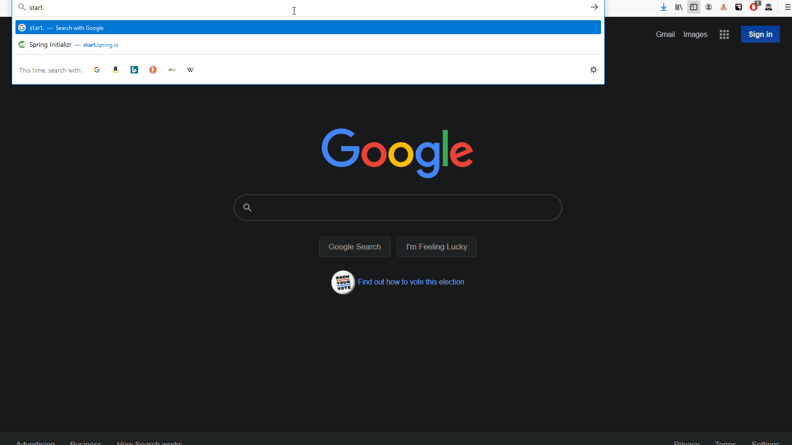](./img/generate-project.gif)


## Open In IDE
* Open the newly downloaded project in IntelliJ
* Ensure that the project is opened via the `pom.xml`.
* Ensure that the `pom.xml` is _opened as a project_, not _as a file_.

[](./img/open-maven-in-intellij.gif)


## Create an Entity
* Create a `Person` Entity.

```java
@Entity
public class Person {
    @Id
    @GeneratedValue
    private Long id;

    private String firstName;
    private String lastName;
    private Date birthDate;

    public Person() {
    }

    public Person(Long id, String firstName, String lastName, Date birthDate) {
        this.id = id;
        this.firstName = firstName;
        this.lastName = lastName;
        this.birthDate = birthDate;
    }

    public Long getId() {
        return id;
    }

    public void setId(Long id) {
        this.id = id;
    }

    public String getFirstName() {
        return firstName;
    }

    public void setFirstName(String firstName) {
        this.firstName = firstName;
    }

    public String getLastName() {
        return lastName;
    }

    public void setLastName(String lastName) {
        this.lastName = lastName;
    }

    public Date getBirthDate() {
        return birthDate;
    }

    public void setBirthDate(Date birthDate) {
        this.birthDate = birthDate;
    }
}
```

[](./img/create-entity.gif)


## View the Entity
* Modify the `/resources/application.properties` file by adding the following configurations

```
server.port=8080
spring.h2.console.enabled=true
spring.h2.console.view=/h2-console
spring.datasource.url=jdbc:h2:mem:testdb
```
* Run the application
* Navigate to `localhost:8080/h2-console` to view the data-layer of the application

[](./img/view-h2console-entity-empty.gif)


## Create Repository
* [Data Access Objects (DAOs)](https://en.wikipedia.org/wiki/Data_access_object) provide an abstraction for interacting with _datastores_.
* In the Spring framework, _repositories_ act as a specific type of _DAO_ which can access a respective database table.
    * For example, `PersonRepository` can access a respective `PERSON` database table.
* Typically DAOs include an interface that provides
    1. a set of finder methods for retrieving data such as `readById`, `readAll`
    2. and methods to persist and delete data such as `create`, `updateById`, and `deleteById`
* It is customary to have one `Repository` per `model` object.

```java
public interface PersonRepository extends CrudRepository<Person, Long> {
}
```

[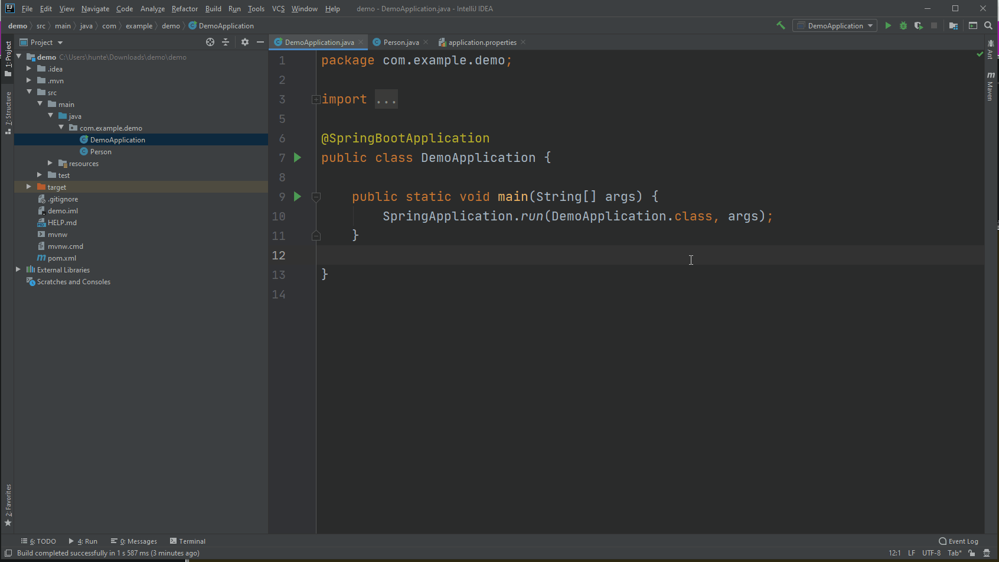](./img/create-repository.gif)


## Prepopulate The Entity

* Populates the `Person` table in H2 with entities before the Web Server begins serving.

```java
@Configuration
public class PersonConfig {
    @Autowired
    private PersonRepository repository;

    @PostConstruct
    public void setup() {
        Person person1 = new Person();
        person1.setFirstName("Leon");
        person1.setLastName("Hunter");

        Person person2 = new Person();
        person2.setFirstName("John");
        person1.setLastName("Doe");

        repository.saveAll(Arrays.asList(
                person1,
                person2
        ));
    }
}
```

[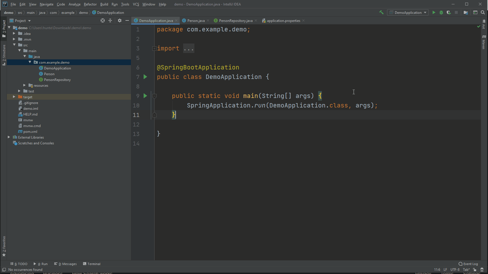](./img/person-config.gif)


* View the newly added records by
    1. restarting the application
    2. navigating to `localhost:8080/h2-console`
    3. Executing query `SELECT * FROM PERSON` in the `H2-Console`


[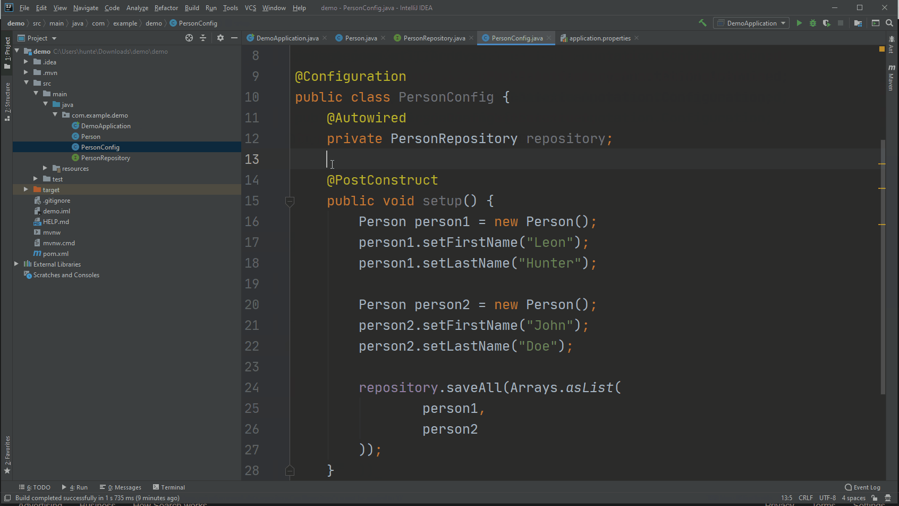](./img/view-h2console-entity-populated.gif)


## Create a Service

```java

@Service
public class PersonService {
    private PersonRepository repository;

    @Autowired
    public PersonService(PersonRepository repository) {
        this.repository = repository;
    }

    public Person create(Person person) {
        return repository.save(person);
    }

    public Person readById(Long id) {
        return repository.findById(id).get();
    }

    public List<Person> readAll() {
        Iterable<Person> allPeople = repository.findAll();
        List<Person> personList = new ArrayList<>();
        allPeople.forEach(personList::add);
        return personList;
    }

    public Person update(Long id, Person newPersonData) {
        Person personInDatabase = this.readById(id);
        personInDatabase.setFirstName(newPersonData.getFirstName());
        personInDatabase.setLastName(newPersonData.getLastName());
        personInDatabase.setBirthDate(newPersonData.getBirthDate());
        personInDatabase = repository.save(personInDatabase);
        return personInDatabase;
    }

    public Person deleteById(Long id) {
        Person personToBeDeleted = this.readById(id);
        repository.delete(personToBeDeleted);
        return personToBeDeleted;
    }
}
```


#### constructor

* Set's the service's repository

```java
@Autowired
public PersonService(PersonRepository repository) {
    this.repository = repository;
}
```

[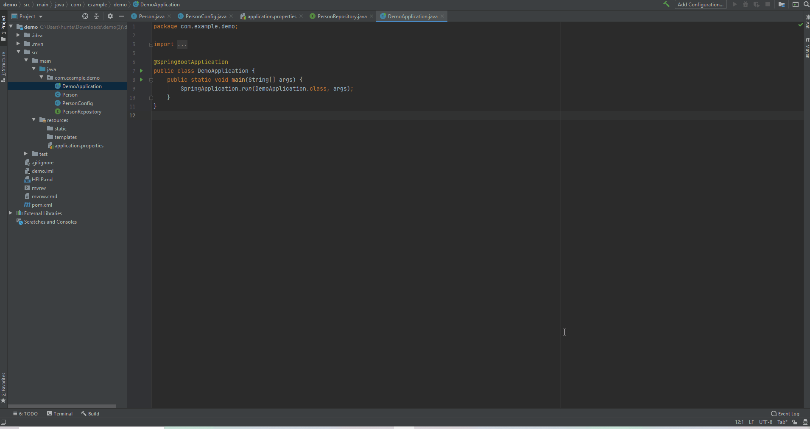](./img/service/constructor.gif)


##### `create` Method


* Adds a new record to the table the service's repository is accessing.

```java
public Person create(Person person) {
    return repository.save(person);
}
```

[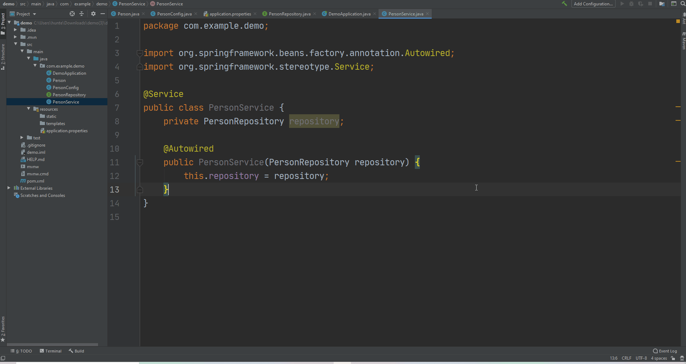](./img/service/create.gif)


#### `readById` Method

* Returns the record with the specified ID from the table the table that the service's repository is accessing.

```java
public Person readById(Long id) {
    return repository.findById(id).get();
}
```

[](./img/service/readById.gif)


#### `readAll` Method

* Returns all records from the table the service's repository is accessing.

```java
public List<Person> readAll() {
    Iterable<Person> allPeople = repository.findAll();
    List<Person> personList = new ArrayList<>();
    allPeople.forEach(personList::add);
    return personList;
}
```

[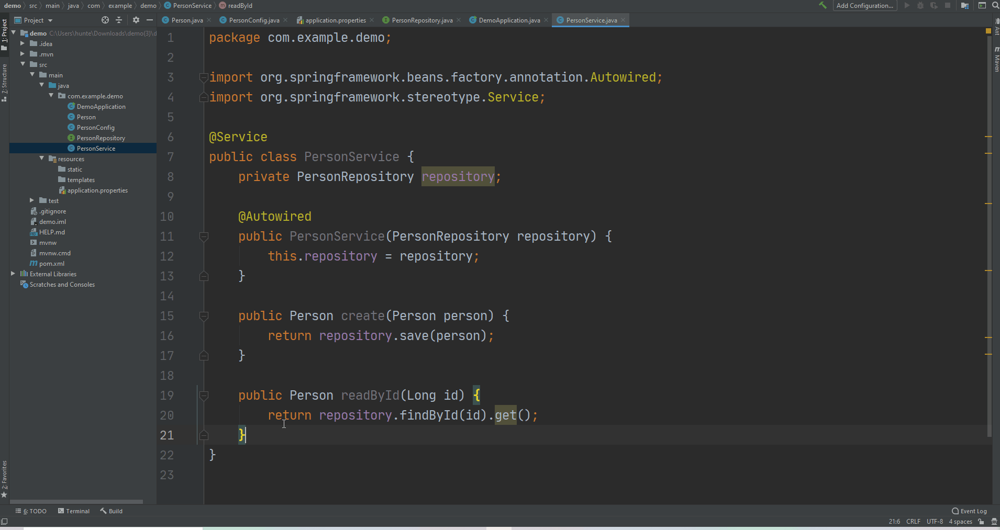](./img/service/readAll.gif)


#### `updateById` Method

* Updates the record in the database with the specified `id` with the specified `newData`

```java
public Person update(Long id, Person newPersonData) {
    Person personInDatabase = this.readById(id);
    personInDatabase.setFirstName(newPersonData.getFirstName());
    personInDatabase.setLastName(newPersonData.getLastName());
    personInDatabase.setBirthDate(newPersonData.getBirthDate());
    personInDatabase = repository.save(personInDatabase);
    return personInDatabase;
}
```


[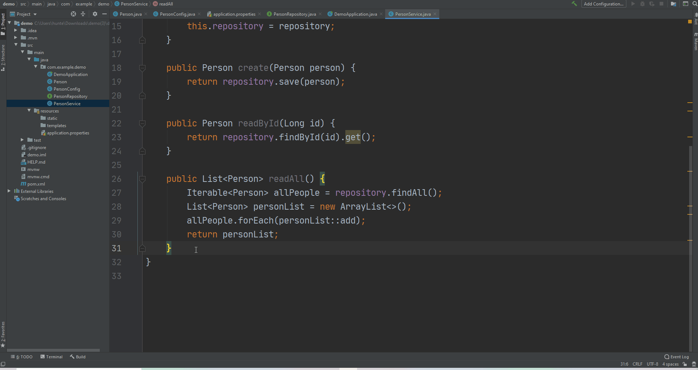](./img/service/updateById.gif)


#### `deleteById` Method

* Deletes the record in the database with the specified `id`

```java
public Person deleteById(Long id) {
    Person personToBeDeleted = this.readById(id);
    repository.delete(personToBeDeleted);
    return personToBeDeleted;
}
```


[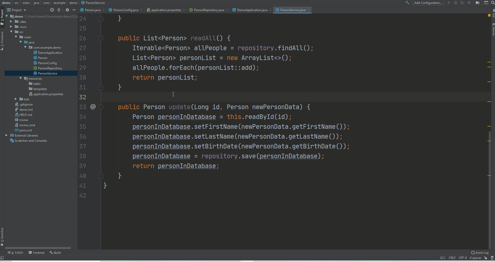](./img/service/deleteById.gif)


## Create a Controller
* _Controllers_ define how to handle _incoming requests_ from and _outgoing responses_ to a client. 
* Controllers provides all of the necessary [endpoints](https://en.wikipedia.org/wiki/Web_API#Endpoints) to access and manipulate respective domain objects.
	*  REST resources are identified using URI endpoints.
* The aggregate of all controller endpoints exposed by a webserver is known as the webserver's [web API](https://en.wikipedia.org/wiki/Web_API).

```java
@Controller
public class PersonController {
    private PersonService service;

    @Autowired
    public PersonController(PersonService service) {
        this.service = service;
    }

    @PostMapping(value = "/create")
    public ResponseEntity<Person> create(@RequestBody Person person) {
        return new ResponseEntity<>(service.create(person), HttpStatus.CREATED);
    }

    @GetMapping(value = "/read/{id}")
    public ResponseEntity<Person> readById(@PathVariable Long id) {
        return new ResponseEntity<>(service.readById(id), HttpStatus.OK);
    }

    @GetMapping(value = "/readAll")
    public ResponseEntity<List<Person>> readAll() {
        return new ResponseEntity<>(service.readAll(), HttpStatus.OK);
    }

    @PutMapping(value = "/update/{id}")
    public ResponseEntity<Person> updateById(
            @PathVariable Long id,
            @RequestBody Person newData) {
        return new ResponseEntity<>(service.update(id, newData), HttpStatus.OK);
    }

    @DeleteMapping(value = "/delete/{id}")
    public ResponseEntity<Person> deleteById(@PathVariable Long id) {
        return new ResponseEntity<>(service.deleteById(id), HttpStatus.OK);
    }
}
```


#### constructor
[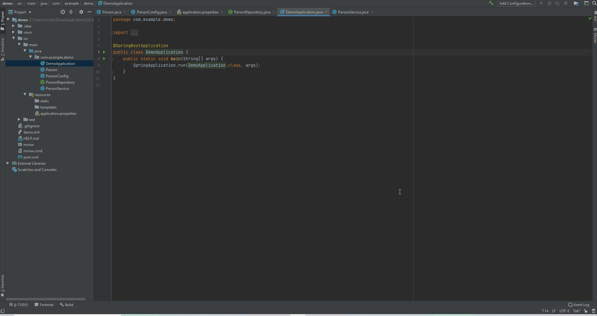](./img/controller/constructor.gif)


#### `create` Method

* The `POST` verb functionality in a `create` method allows us to add a new `Person` record.
* Take note that the method
	* has a parameter of type `@RequestBody Person person`
		* `@RequestBody` tells Spring that the entire request body needs to be converted to an instance of `Person`
	* delegates the `Person` persistence to `PersonRepository`’s save method called by the `PersonService`'s `create` method.

```java
@PostMapping(value = "/create")
public ResponseEntity<Person> create(@RequestBody Person person) {
    return new ResponseEntity<>(service.create(person), HttpStatus.CREATED);
}
```


[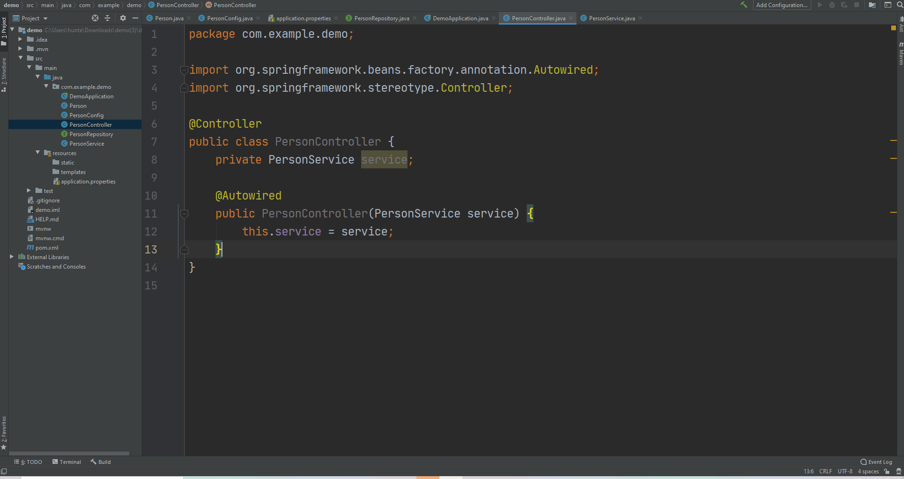](./img/controller/create.gif)


#### `readById` Method

* The code snippet below allows us to access an individual `Person`.
* The _value attribute_ in `@GetMapping` takes a URI template `/read/{id}`.
* The placeholder `{id}` along with `@PathVarible` annotation allows Spring to examine the request URI path and extract the `pollId` parameter value.
* Inside the method, we use the `PersonService`’s `readById` finder method to retrieve the respective `Person` from the `PersonRepository` and pass the result to a `ResponseEntity`.

```java
@GetMapping(value = "/read/{id}")
public ResponseEntity<Person> readById(@PathVariable Long id) {
    return new ResponseEntity<>(service.readById(id), HttpStatus.OK);
}
```

[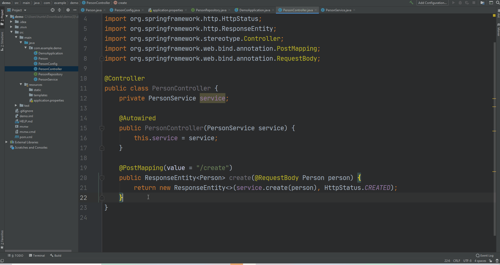](./img/controller/readById.gif)


#### `readAll` Method

* The code snippet below allows us to access all `Person` records.
* The _value attribute_ in `@GetMapping` takes a URI template `/read/{id}`.
* The placeholder `{id}` along with `@PathVarible` annotation allows Spring to examine the request URI path and extract the `pollId` parameter value.
* Inside the method, we use the `PersonService`’s `readById` finder method to retrieve the respective `Person` from the `PersonRepository` and pass the result to a `ResponseEntity`.

```java
@GetMapping(value = "/readAll")
public ResponseEntity<List<Person>> readAll() {
    return new ResponseEntity<>(service.readAll(), HttpStatus.OK);
}
```

[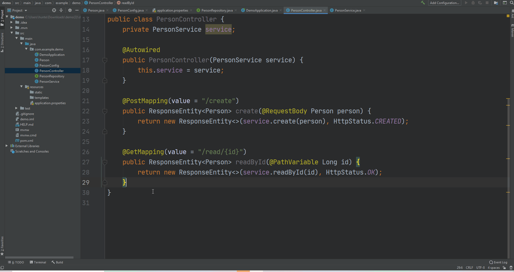](./img/controller/readAll.gif)


#### `update` Method

* The code snippet below enables us to update a `Person` with new data.

```java
@PutMapping(value = "/update/{id}")
public ResponseEntity<Person> updateById(
        @PathVariable Long id,
        @RequestBody Person newData) {
    return new ResponseEntity<>(service.update(id, newData), HttpStatus.OK);
}
```

[](./img/controller/updateById.gif)


#### `deleteById` Method

* The code snippet below enables us to delete a `Person`

```java
@DeleteMapping(value = "/delete/{id}")
public ResponseEntity<Person> deleteById(@PathVariable Long id) {
    return new ResponseEntity<>(service.deleteById(id), HttpStatus.OK);
}
```

[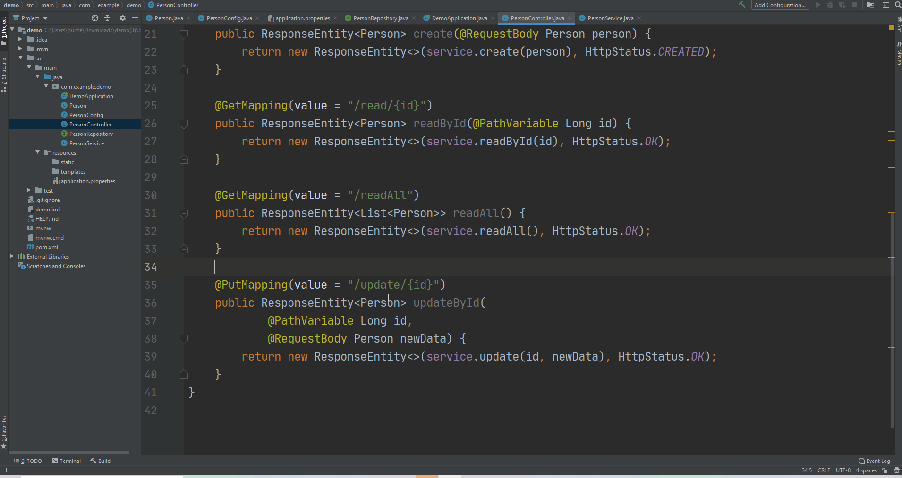](./img/controller/deleteById.gif)


## Test Controller

* Launch the [Postman](https://chrome.google.com/webstore/detail/postman/fhbjgbiflinjbdggehcddcbncdddomop?hl=en) app and enter the URI `http://localhost:8080/` and hit Send.
* If your application cannot run because something is occupying a port, use this command with the respective port number specified:
	* ``kill -kill `lsof -t -i tcp:8080` ``


#### `readAll` Method
[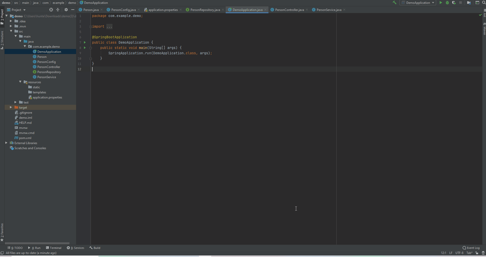](./img/test-controller/readAll.gif)


#### `readById` Method

[](./img/test-controller/readById.gif)


#### `update` Method
[](./img/test-controller/update.gif)


#### `deleteById` Method
[](./img/test-controller/delete.gif)


#### `create` Method
[](./img/test-controller/create.gif)


