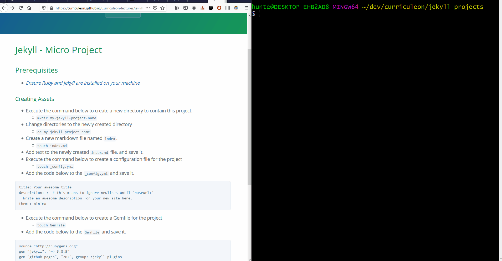

# Jekyll - Micro Project

## Prerequisites
* [_Ensure Ruby and Jekyll are installed on your machine_](../installation/content.md)

### Creating Assets
* Execute the command below to create a new directory to contain this project.
    * `mkdir my-jekyll-project-name`
* Change directories to the newly created directory
    * `cd my-jekyll-project-name`
* Create a new markdown file named `index`.
    * `touch index.md`
* Add text to the newly created `index.md` file, and save it.
* Execute the command below to create a configuration file for the project
    * `touch _config.yml`
* Add the code below to the `_config.yml` and save it.

```
title: Your awesome title
description: >- # this means to ignore newlines until "baseurl:"
  Write an awesome description for your new site here.
theme: minima
```

* Execute the command below to create a Gemfile for the project
    * `touch Gemfile`
* Add the code below to the `Gemfile` and save it.

```
source "http://rubygems.org"
gem "faraday", "~> 0.17.3"
gem "jekyll", "~> 3.8.5"
gem "github-pages", "202", group: :jekyll_plugins 
group :jekyll_plugins do
  gem "jekyll-feed", "~> 0.11"
end
platforms :mingw, :x64_mingw, :mswin, :jruby do
  gem "tzinfo", "~> 1.2"
  gem "tzinfo-data"
end
gem "wdm", "~> 0.1.1", :platforms => [:mingw, :x64_mingw, :mswin]
```


### Serving Project
* From the root directory of the Jekyll project execute the command below
    * `bundle install`
    * `bundle update --bundler`
    * `bundle update faraday`
    * `bundle exec jekyll serve --watch`
* The application should serve on [`localhost:4000`](http://localhost:4000/) by default.
* The github repository for this project can be found [here](https://github.com/curriculeon/jekyll.micro-projecttemplate)


[](./demonstration.gif)