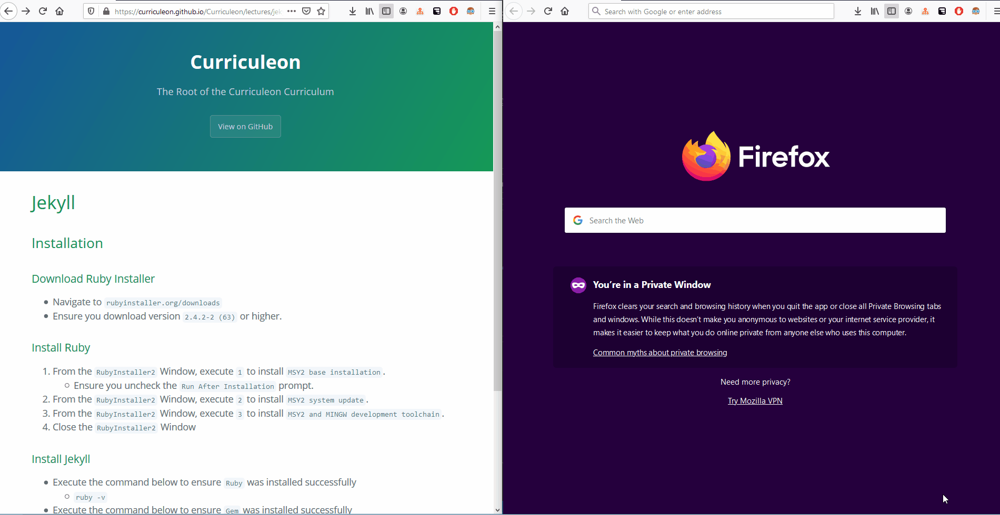
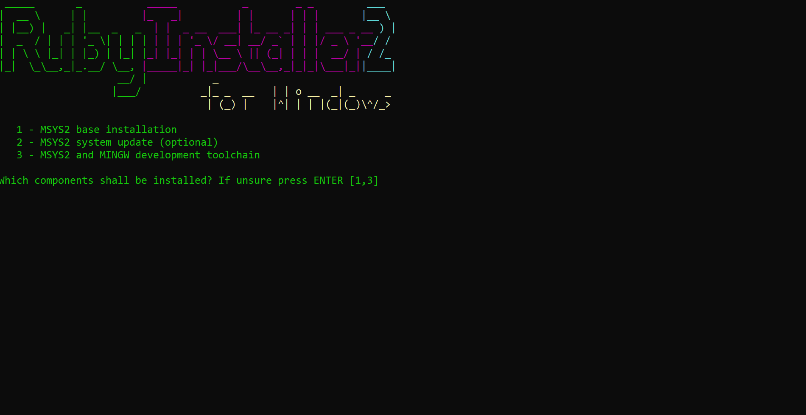
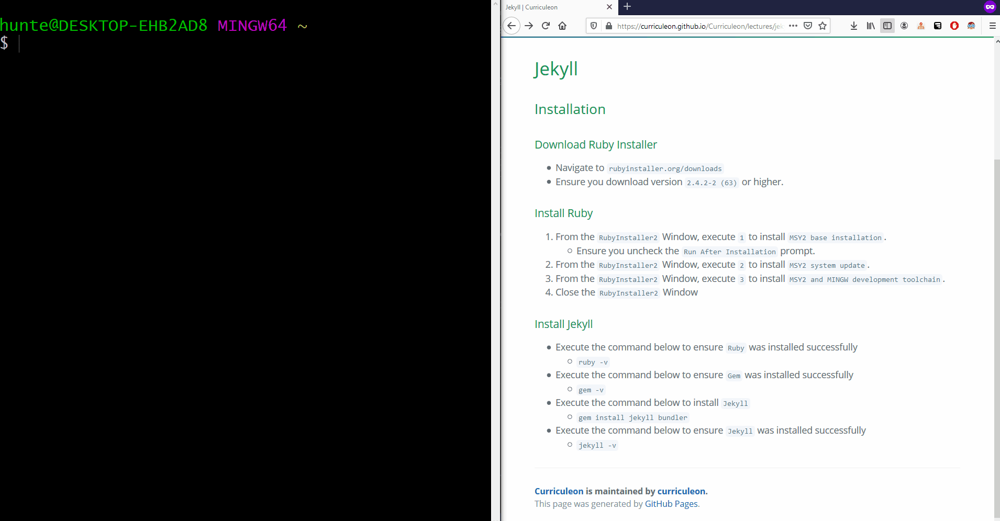

# Jekyll

## Installation

### Install msys2
* From an administrative powershell, execute the command below to install msys2
	* `choco install msys2`

### Download Ruby Installer Wizard
* Navigate to [`rubyinstaller.org/downloads`](https://rubyinstaller.org/downloads)
* Ensure you download version [`2.7.2-2 (x64)`](https://github.com/oneclick/rubyinstaller2/releases/download/RubyInstaller-2.7.2-1/rubyinstaller-devkit-2.7.2-1-x64.exe)

### Install Ruby
1. From the `RubyInstaller2` Window, execute `1` to install `MSY2 base installation`.
2. From the `RubyInstaller2` Window, execute `2` to install `MSY2 system update`.
3. From the `RubyInstaller2` Window, execute `3` to install `MSY2 and MINGW development toolchain`.
4. Close the `RubyInstaller2` Window

### Install Jekyll
* Execute the command below to ensure `Ruby` was installed successfully
	* `ruby -v`
* Execute the command below to ensure `Gem` was installed successfully
	* `gem -v`
* Execute the command below to install `Jekyll`
	* `gem install jekyll bundler`
* Execute the command below to ensure `Jekyll` was installed successfully
	* `jekyll -v`

